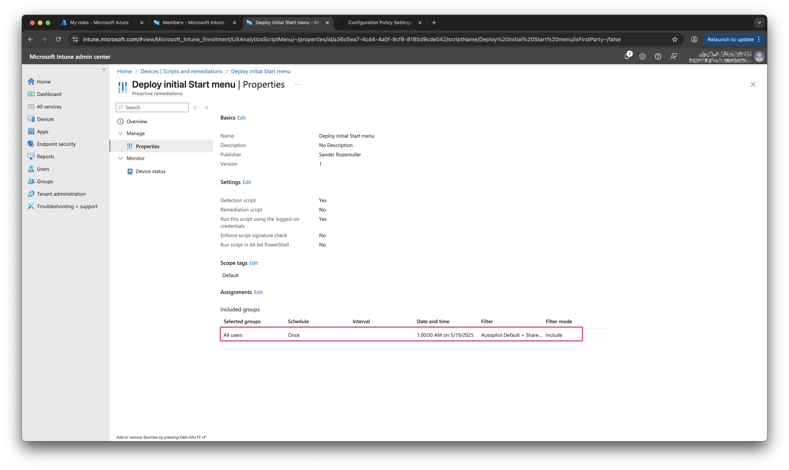
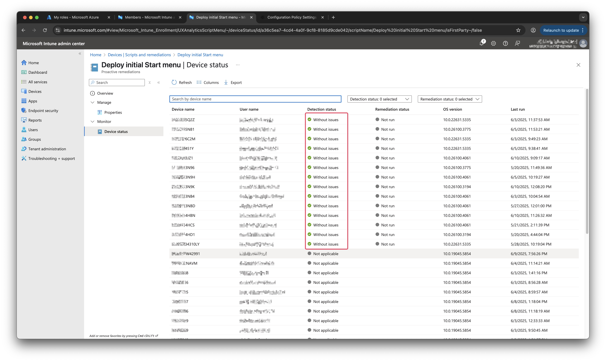

A while ago, I got asked to preconfigure an start menu for end users.  
My first approach was deploying a start menu using the settings catalog in Intune. This works great but disadvantage using the settings catalog is that a user has no option to create an own start menu.  
The start menu will be overwritten by the Intune policy. That was not the goal for our project. 

I found documented solutions that where executing detection scripts to write the start2.bin file. Something that could work out for me as well. 
However, that solutions work, for me it was not the solution I was looking for.  

In this blog, I show a more simple way to get a start menu configured on a Windows 11 device using Intune without all the download complexity.



## Main idea
The idea is to execute a detection script once at a device targeted at users. When users checks in the detection script executes the needed commands on the device. That means the script saves the start menu (start2.bin) file at the correct location and restart the Start Menu Experience Host service.  
Main difference is that my solution don't need to download the start menu file from a public location.

## On script fits all
As mentioned, many documented solutions rely on the start2.bin file that is stored elsewhere.  
For example a public Azure Storage account or web server, and is downloaded at runtime. Biggest concern for me was the complexity around getting the start menu file on the machine.  
I don't want to configure a public location, upload files and hopeing that is downloaded correctly. Especially because there is a script already running on a machine that can do things for me.  

While straightforward, this approach has drawbacks:

- Network Dependency: If the device is offline or blocked by corporate firewalls, the download will fail.
- Security Exposure: Publicly hosting your corporate Start layout makes it accessible to anyone with the URL.
- Operational Overhead: You need to manage and rotate storage credentials or SAS tokens.

### How do we get that correct start2.bin file on the machine? 
To avoid the download we need to get the data from an another place. That brought me to save the whole start2.bin content into the detection script as well.  

What did I do?   
I read the start2.bin file content and converted it to BASE64.  

- By converting the start2.bin to a Base64 string and embedding it directly into your PowerShell script, you gain:
- Offline Reliability: Embedded content always “comes with” the script—no external calls required.
- Security by Obscurity: The layout is not exposed via a public endpoint.
- Simplicity: One script file, self-contained, easy to version and audit.

## How the Deployment Script Works
The script has 3 main parts. 
- Converting the BASE64 string that is the start2.bin file back to a binary file
- Write back the file to the correct location
- Restart Start Menu Experience Host

Below is a high-level overview of the key sections in our PowerShell detection/remediation script.

### Start Transcript for logging
At the top of the script I create a few variables that I use to start a transcript.  
The Start-Transcript cmdlet creates a record of all or part of a PowerShell session to a text file.  

```powershell
$datetime   = Get-Date -Format 'yyyyMMddHHmmss'
$filename   = "Transcript-deploy-startmenu-${datetime}.txt"
$Transcript = Join-Path -Path . -ChildPath $filename
Start-Transcript -Path $Transcript
```

### Base64-Encoded start2.bin content
This is the part where the BASE64 string is stored. In the example below you see a small part of the whole string. The BASE64 string is converted back to its original bytes. Bytes that are used to write back the start2.bin file. 
```powershell
# Start menu start2.bin in base64 format
$startMenuBase64 = "4nrhSwH8TRucAIEL3m5RhU5aX0cAW7FJilySr5CE+V50wMaX37/bAdAOAA..." #<VERY_LONG_BASE64_STRING_HERE>
# Decode and write the file
$bytes = [Convert]::FromBase64String($startMenuBase64)
```

### Define the Destination Path
`$ENV:LOCALAPPDATA` is a local system PowerShell variable that is at every machine.  
When the destination path is there, I write back all the bytes into that file.  

```powershell
# Define your destination path—adjust as needed per your environment:
$dest = Join-Path $ENV:LOCALAPPDATA '\Packages\Microsoft.Windows.StartMenuExperienceHost_cw5n1h2txyewy\LocalState\start2.bin'

# Ensure the directory exists
New-Item -ItemType Directory -Path (Split-Path $dest) -Force | Out-Null

# Write the bytes
[IO.File]::WriteAllBytes($dest, $bytes)
```

### Restart the Start Menu Host
To effect the new start menu, the `StartMenuExperienceHost` service needs a restart.  
Stop-Process: Forces a restart of the Start Menu Experience Host, so your new layout is picked up immediately without reboot. 
```powershell
try {
    Stop-Process -Name StartMenuExperienceHost -Force
    Write-Host "start2.bin deployed to $dest"
    exit 0
}
catch {
    Write-Output "Initial Start-menu configuration failed: $($_)"
    exit 1
}
```
Exit codes:  
- `0` for success (Intune knows the remediation passed).
- `1` for failure (Intune flags the script, and you can review the transcript).

# Generating Your Own Base64 String
Generating your own initial start menu is quite simple.  
Configure your Start menu on a reference Windows 11 device exactly as you want your users to see it.  
Then, locate the start2.bin file:
`%LOCALAPPDATA%\Packages\Microsoft.Windows.StartMenuExperienceHost_cw5n1h2txyewy\LocalState\start2.bin`

Open PowerShell as the user who customized the layout, then run:

```powershell
$bytes = [IO.File]::ReadAllBytes("$ENV:LOCALAPPDATA\Packages\Microsoft.Windows.StartMenuExperienceHost_cw5n1h2txyewy\LocalState\start2.bin")
$base64String = [Convert]::ToBase64String($bytes)
$base64String | Out-File -FilePath .\start2-base64.txt -Encoding ASCII
``` 

Copy the resulting start2-base64.txt content and paste it into your Intune deployment script in place of `<VERY_LONG_BASE64_STRING_HERE>`. The part we discussed above. 

# Integrating with Microsoft Intune
Create a PowerShell script in your Intune portal:
- Navigate to Devices > Scripts > Windows 10 and later.
- Click Add, choose Windows PowerShell script, and upload your .ps1.

## Assign the script
I want to assign the script a user level and to run `ONCE`. The reason for choosing once is because the script just need to run once during enrollment. 
This in the case if there is a shared device as well. When targeting the script at device level, Intune will 



## Detection vs. Remediation
You can set up the script as a discovery script (checking for the presence and contents of start2.bin) and then as a remediation script (deploying it if missing or outdated).
I have choosen to keep it as simple as possible. The script MUST run and is not depended on anything. No remedition is needed, just deploy the initial start menu.

## Monitoring
Review the success/failure count under the Intune script overview.



# How to deal with legacy?
I had the luck that we started over with new device. So I targeted it at all users with a filter that holds all new autopilot devices. During new enrollment, every user needed an initial start menu from scratch. So, it was easy to set the script to all users and run once. Intune manages the rest in the background. But how to deal with this if you want to start now? You only want to effect the new incoming users, not the 'old' onces.

## Regkey test
To be honest, a solid way avoiding this is not in place. An option is to add a register key test in the detection script that checks if the script needs to be executed. If so, then execute, otherwise don't.
The check small snippet below on how to check if a register key exists.

```powershell
$regPath = "HKCU:\Scripts\InitialStartMenuHasRun"
$value = Test-Path $regPath
if($value){
        Write-host "Reg Key already Exists. No Action Required"
        exit 0
 }
Else{
        Write-host "Reg Key does not exist"
        exit 1
}
```

## Extend detection script
To avoid effecting existing users, run a separate script that creates that key first. If you know for sure this script has run succesfully, then configure the detection script. 
You also can use this code to add to you initial start menu detection script. When the script has run succesfully, it creates also the regkey. 
In fact it is not necessary because Intune handles if a script has ran once or not, but just in case. 

## Detection vs. Remediation
Now detection vs remediation comes up again. Because we now have a test and a remediate, you could choose to use remediation as well. First test if the regkey exists, if not, then remediate.
But on the other side, it still needs to run at all users. So it is always a balance between using remediation or not. If you know for sure the script must run at any situation, just make a detection only and build a check in there. This avoids a heavy load on the Intune platform. 

# What happens when applications are not on the machine?
If an application is not available on the system the icon is not shown in the start menu. When you don't change the start menu and the application comes in later, it will be placed to the start menu.

The whol script is stored at my [GitHub](https://github.com/srozemuller/IntuneAutomation/tree/main/RemediationScripts)  

