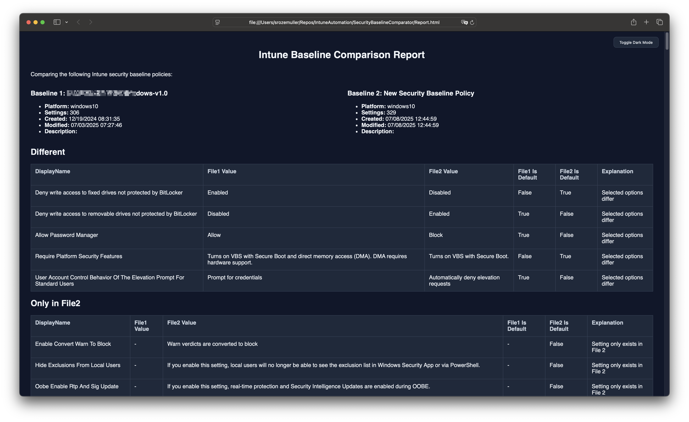

Microsoft Intune's security baselines are a cornerstone for enforcing consistent security settings across devices. However, as new baselines are released or existing ones are updated, administrators often face the challenge of identifying differences between their current baseline and the new one. This process becomes even more critical when customizations are involved, as highlighted in [this Microsoft blog post](https://techcommunity.microsoft.com/blog/intunecustomersuccess/known-issue-customizations-not-saved-with-security-baseline-policy-update/4428588).

To address this challenge, I created a PowerShell script that automates the comparison of Intune security baselines and generates a detailed HTML report. This blog will explain why I built this script, the problems it solves, and how it can help you.



## Why Compare Security Baselines?

When Microsoft updates a security baseline, it often includes new recommendations, deprecated settings, or changes to default values. If you're still using an older baseline, you might miss out on these updates. However, simply switching to a new baseline can overwrite customizations you've made.

By comparing baselines, you can:

- **Preserve Customizations**: Identify settings you've customized and ensure they are carried over to the new baseline.
- **Adopt New Recommendations**: See what’s new in the updated baseline and decide if it aligns with your security goals.
- **Avoid Overwriting**: Prevent accidental overwrites of critical settings.

## The Problem

Manually comparing two baselines is a tedious and error-prone process. Each baseline can have hundreds of settings, and identifying differences requires going through each setting one by one. This is not scalable, especially for organizations managing multiple baselines.

## The Solution: A PowerShell Script

To simplify this process, I created a PowerShell script that:

1. **Fetches Baseline Data**: Retrieves baseline settings directly from Intune using the Microsoft Graph API.
2. **Compares Settings**: Identifies differences, similarities, and unique settings between two baselines.
3. **Generates an HTML Report**: Provides a clear, categorized overview of the comparison.

---

## How the Script Works

### Fetching Baseline Data

The script uses the Microsoft Graph API to fetch baseline data. It retrieves all settings, including their descriptions, default values, and selected options.

```powershell
function Get-PolicyAndConvertToJson {
    param (
        [Parameter(Mandatory)]
        [string]$Name
    )

    $filter = @"
(templateReference/TemplateId eq '66df8dce-0166-4b82-92f7-1f74e3ca17a3_1' or 
 templateReference/TemplateId eq '66df8dce-0166-4b82-92f7-1f74e3ca17a3_3' or 
 templateReference/TemplateId eq '66df8dce-0166-4b82-92f7-1f74e3ca17a3_4') 
 and templateReference/TemplateFamily eq 'Baseline'
"@ -replace "`r`n", ""

    $encodedFilter = [System.Web.HttpUtility]::UrlEncode($filter)
    $uri = "https://graph.microsoft.com/beta/deviceManagement/configurationPolicies?`$filter=$encodedFilter"
    $response = Invoke-MgGraphRequest -Method GET -Uri $uri

    $policy = $response.value | Where-Object { $_.name -ieq $Name }

    if (-not $policy) {
        throw "Policy with name '$Name' not found in baseline search."
    }

    $fullUri = "https://graph.microsoft.com/beta/deviceManagement/configurationPolicies/$($policy.id)" +
    "?`$expand=assignments,settings(`$expand=settingDefinitions)"

    $fullResponse = Invoke-MgGraphRequest -Method GET -Uri $fullUri
    return $fullResponse
}
```
This function retrieves the full details of a baseline, including its settings and metadata.

### Comparing Settings
The script compares the settings from both baselines and categorizes them into three groups:

Same: Settings that are identical in both baselines.
Different: Settings that exist in both baselines but have different values.
Only in Baseline 1/Baseline 2: Settings that exist in one baseline but not the other.

```powershell
function Compare-Baselines($baseline1, $baseline2) {
    $report = @()

    foreach ($setting1 in $baseline1) {
        $setting2 = $baseline2 | Where-Object { $_.SettingId -eq $setting1.SettingId }

        if ($null -eq $setting2) {
            $report += [PSCustomObject]@{
                SettingId       = $setting1.SettingId
                DisplayName     = $setting1.DisplayName
                Status          = "Only in File1"
                File1_Value     = $setting1.SelectedOptionLabel
                File2_Value     = "-"
            }
        }
        elseif ($setting1.SelectedOption -ne $setting2.SelectedOption) {
            $report += [PSCustomObject]@{
                SettingId       = $setting1.SettingId
                DisplayName     = $setting1.DisplayName
                Status          = "Different"
                File1_Value     = $setting1.SelectedOptionLabel
                File2_Value     = $setting2.SelectedOptionLabel
            }
        }
        else {
            $report += [PSCustomObject]@{
                SettingId       = $setting1.SettingId
                DisplayName     = $setting1.DisplayName
                Status          = "Same"
                File1_Value     = $setting1.SelectedOptionLabel
                File2_Value     = $setting2.SelectedOptionLabel
            }
        }
    }

    return $report
}
```

## Generating an HTML Report
The script generates an HTML report that summarizes the comparison and provides detailed information for each setting.

```powershell
function Export-HtmlReport {
    param (
        [Parameter(Mandatory)]
        $report,
        [string]$path = "./BaselineComparisonReport",
        [Parameter(Mandatory)]
        [object]$Policy1Meta,
        [Parameter(Mandatory)]
        [object]$Policy2Meta
    )

    $html = @"
<!DOCTYPE html>
<html>
<head>
    <title>Baseline Comparison Report</title>
</head>
<body>
    <h1>Baseline Comparison Report</h1>
    <p>Baseline 1: $($Policy1Meta.name)</p>
    <p>Baseline 2: $($Policy2Meta.name)</p>
    <table>
        <tr>
            <th>Setting</th>
            <th>File1 Value</th>
            <th>File2 Value</th>
            <th>Status</th>
        </tr>
        $($report | ForEach-Object {
            "<tr>
                <td>$($_.DisplayName)</td>
                <td>$($_.File1_Value)</td>
                <td>$($_.File2_Value)</td>
                <td>$($_.Status)</td>
            </tr>"
        })
    </table>
</body>
</html>
"@

    Set-Content -Path "$path.html" -Value $html
}
```

## How to Use the Script
Connect to Microsoft Graph: Ensure you have the Microsoft.Graph module installed and connect using Connect-MgGraph.
Run the Script: Provide the names of the two baselines you want to compare.
View the Report: Open the generated HTML file to view the comparison.

```powershell
.\Compare-Baselines.ps1  -OutputType HTML -PolicyName1 "Baseline 1" -ComparePolicy "Baseline2"
```



When clicking on the setting display name you can navigate to more information about the setting.


## Conclusion
This script saves time and reduces errors when comparing Intune security baselines. By automating the process and providing a clear HTML report, it helps you make informed decisions about adopting new baselines while preserving your customizations.

You can find the full script in my [GitHub repository](https://github.com/srozemuller/IntuneAutomation/tree/main/SecurityBaselineComparator).

