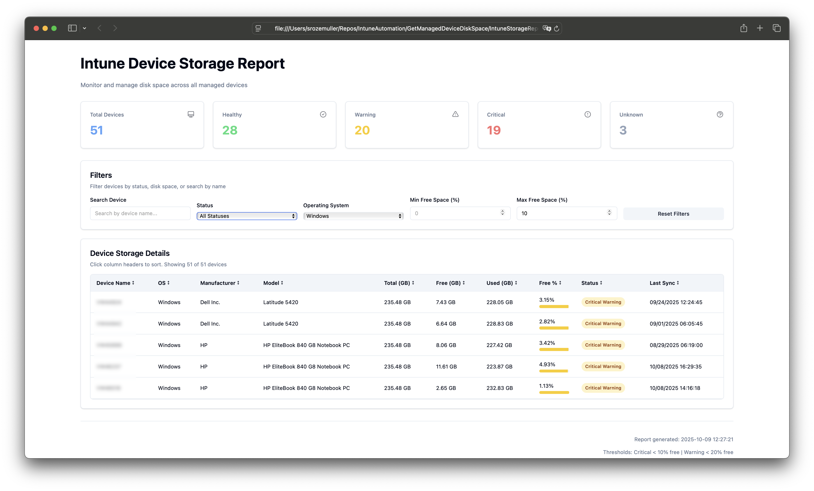

Storage management is a critical aspect of device administration that often gets overlooked until it's too late. Low disk space can cause application failures, prevent updates from installing, and impact user productivity. For IT administrators managing hundreds or thousands of devices through Microsoft Intune, manually checking disk space on each device is simply not feasible.

In this blog, I'll show you how to leverage the Microsoft Graph API and PowerShell to automatically retrieve disk space information from all your Intune-managed devices and generate a comprehensive HTML report. This solution gives you visibility into your entire device fleet's storage health at a glance.




## Why Monitor Disk Space?

Proactive disk space monitoring helps you:

- **Prevent Issues Before They Occur**: Identify devices running low on storage before users experience problems.
- **Plan Hardware Upgrades**: Make data-driven decisions about which devices need storage upgrades.
- **Optimize Software Deployment**: Ensure devices have sufficient space before pushing large updates or applications.
- **Improve User Experience**: Address storage issues before they impact productivity.

## The Problem

While Intune provides excellent device management capabilities, getting a consolidated view of disk space across all managed devices requires multiple steps. You need to navigate through device details individually or export data that may not include all the hardware information you need.

Additionally, calculating meaningful metrics like percentage of free space and presenting this data in an easily digestible format requires manual effort.

## The Solution: PowerShell and Graph API

To solve this challenge, I created a PowerShell script that:

- **Retrieves All Managed Devices**: Fetches the complete list of devices from Intune.
- **Gathers Detailed Hardware Information**: Collects storage metrics and other relevant device details.
- **Calculates Storage Metrics**: Determines used space, free space percentages, and storage health.
- **Generates an HTML Report**: Creates a visual, sortable report for easy analysis.

## How the Script Works

### Connecting to Microsoft Graph

First, ensure you're connected to Microsoft Graph with the appropriate permissions. The `DeviceManagementManagedDevices.Read.All` permission is required to read device information.

```powershell
# Connect to Microsoft Graph
Connect-MgGraph -Scopes "DeviceManagementManagedDevices.Read.All"
```

### Fetching Managed Devices

The script starts by retrieving all managed devices from Intune. We use the `beta` endpoint because it provides access to detailed hardware information not available in the v1.0 endpoint.

```powershell
function Get-ManagedDevices {
    $uri = "https://graph.microsoft.com/beta/deviceManagement/managedDevices"
    $devices = @()
    
    do {
        $response = Invoke-MgGraphRequest -Method GET -Uri $uri
        $devices += $response.value
        $uri = $response.'@odata.nextLink'
    } while ($uri)
    
    return $devices
}
```

This function handles pagination automatically by following the `@odata.nextLink` property, ensuring we retrieve all devices regardless of how many are in your tenant.

### Retrieving Detailed Hardware Information

Once we have the list of devices, we need to fetch detailed hardware information for each device. The key here is to use the `$select` parameter to retrieve only the properties we need, which improves performance and reduces response size.

```powershell
function Get-DeviceHardwareInfo {
    param (
        [Parameter(Mandatory)]
        [string]$DeviceId
    )
    
    $selectProperties = @(
        "id",
        "deviceName",
        "managedDeviceName",
        "operatingSystem",
        "osVersion",
        "lastSyncDateTime",
        "hardwareInformation",
        "ethernetMacAddress",
        "processorArchitecture",
        "physicalMemoryInBytes"
    ) -join ","
    
    $uri = "https://graph.microsoft.com/beta/deviceManagement/managedDevices('$DeviceId')?`$select=$selectProperties"
    
    try {
        $response = Invoke-MgGraphRequest -Method GET -Uri $uri
        return $response
    }
    catch {
        Write-Warning "Failed to retrieve hardware info for device $DeviceId : $_"
        return $null
    }
}
```

## Understanding the API Response

When you query a specific device with hardware information, the response includes a `hardwareInformation` object that contains valuable storage metrics. Here's what the relevant properties look like:

```json
{
    "hardwareInformation": {
        "totalStorageSpace": 510728863744,
        "freeStorageSpace": 435344293888,
        "serialNumber": "XX33TMT24143GT",
        "manufacturer": "Microsoft Corporation",
        "model": "Surface Laptop 6 for Business"
    }
}
```

The storage values are in bytes, so we'll need to convert them to more readable units (GB) and calculate percentages.

### Calculating Storage Metrics

Let's create a function that processes the device information and calculates useful storage metrics:

```powershell
function Get-StorageMetrics {
    param (
        [Parameter(Mandatory)]
        [object]$Device
    )
    
    $hardwareInfo = $Device.hardwareInformation
    
    # Check if storage information is available
    if ($null -eq $hardwareInfo.totalStorageSpace -or $hardwareInfo.totalStorageSpace -eq 0) {
        return [PSCustomObject]@{
            DeviceName = $Device.deviceName
            ManagedDeviceName = $Device.managedDeviceName
            OperatingSystem = $Device.operatingSystem
            Manufacturer = $hardwareInfo.manufacturer
            Model = $hardwareInfo.model
            SerialNumber = $hardwareInfo.serialNumber
            TotalStorageGB = "N/A"
            FreeStorageGB = "N/A"
            UsedStorageGB = "N/A"
            FreePercentage = "N/A"
            UsedPercentage = "N/A"
            StorageStatus = "Unknown"
            LastSync = $Device.lastSyncDateTime
        }
    }
    
    # Convert bytes to GB (divide by 1024^3)
    $totalGB = [math]::Round($hardwareInfo.totalStorageSpace / 1GB, 2)
    $freeGB = [math]::Round($hardwareInfo.freeStorageSpace / 1GB, 2)
    $usedGB = [math]::Round(($hardwareInfo.totalStorageSpace - $hardwareInfo.freeStorageSpace) / 1GB, 2)
    
    # Calculate percentages
    $freePercent = [math]::Round(($hardwareInfo.freeStorageSpace / $hardwareInfo.totalStorageSpace) * 100, 2)
    $usedPercent = [math]::Round(100 - $freePercent, 2)
    
    # Determine storage status
    $status = switch ($freePercent) {
        { $_ -lt 10 } { "Critical" }
        { $_ -lt 20 } { "Warning" }
        default { "Healthy" }
    }
    
    return [PSCustomObject]@{
        DeviceName = $Device.deviceName
        ManagedDeviceName = $Device.managedDeviceName
        OperatingSystem = $Device.operatingSystem
        Manufacturer = $hardwareInfo.manufacturer
        Model = $hardwareInfo.model
        SerialNumber = $hardwareInfo.serialNumber
        TotalStorageGB = $totalGB
        FreeStorageGB = $freeGB
        UsedStorageGB = $usedGB
        FreePercentage = $freePercent
        UsedPercentage = $usedPercent
        StorageStatus = $status
        LastSync = $Device.lastSyncDateTime
    }
}
```

This function converts storage values to gigabytes, calculates usage percentages, and assigns a status based on available free space. Devices with less than 10% free space are marked as "Critical", while those with less than 20% are marked as "Warning".

## Building the Report

Now let's create an HTML report that presents this data in a clear, visually appealing format:

```powershell
function Export-StorageReport {
    param (
        [Parameter(Mandatory)]
        [array]$DeviceData,
        [string]$OutputPath = "./IntuneStorageReport.html"
    )
    
    # Calculate summary statistics
    $criticalCount = ($DeviceData | Where-Object { $_.StorageStatus -eq "Critical" }).Count
    $warningCount = ($DeviceData | Where-Object { $_.StorageStatus -eq "Warning" }).Count
    $healthyCount = ($DeviceData | Where-Object { $_.StorageStatus -eq "Healthy" }).Count
    $totalDevices = $DeviceData.Count
    
    # Generate table rows
    $tableRows = foreach ($device in $DeviceData) {
        $statusColor = switch ($device.StorageStatus) {
            "Critical" { "#dc3545" }
            "Warning" { "#ffc107" }
            "Healthy" { "#28a745" }
            default { "#6c757d" }
        }
        
        @"
        <tr>
            <td>$($device.DeviceName)</td>
            <td>$($device.OperatingSystem)</td>
            <td>$($device.Manufacturer)</td>
            <td>$($device.Model)</td>
            <td>$($device.SerialNumber)</td>
            <td>$($device.TotalStorageGB) GB</td>
            <td>$($device.FreeStorageGB) GB</td>
            <td>$($device.UsedStorageGB) GB</td>
            <td>$($device.FreePercentage)%</td>
            <td>$($device.UsedPercentage)%</td>
            <td style="background-color: $statusColor; color: white; font-weight: bold;">$($device.StorageStatus)</td>
            <td>$($device.LastSync)</td>
        </tr>
"@
    }
    
    $html = @"
<!DOCTYPE html>
<html>
<head>
    <title>Intune Device Storage Report</title>
    <style>
        body {
            font-family: 'Segoe UI', Tahoma, Geneva, Verdana, sans-serif;
            margin: 20px;
            background-color: #f5f5f5;
        }
        h1 {
            color: #0078d4;
            border-bottom: 3px solid #0078d4;
            padding-bottom: 10px;
        }
        .summary {
            display: flex;
            gap: 20px;
            margin: 20px 0;
        }
        .summary-card {
            flex: 1;
            padding: 20px;
            border-radius: 8px;
            color: white;
            box-shadow: 0 2px 4px rgba(0,0,0,0.1);
        }
        .critical-card { background-color: #dc3545; }
        .warning-card { background-color: #ffc107; color: #333; }
        .healthy-card { background-color: #28a745; }
        .total-card { background-color: #0078d4; }
        .summary-card h3 { margin: 0; font-size: 2em; }
        .summary-card p { margin: 5px 0 0 0; }
        table {
            width: 100%;
            border-collapse: collapse;
            background-color: white;
            box-shadow: 0 2px 4px rgba(0,0,0,0.1);
            margin-top: 20px;
        }
        th {
            background-color: #0078d4;
            color: white;
            padding: 12px;
            text-align: left;
            font-weight: bold;
            position: sticky;
            top: 0;
        }
        td {
            padding: 10px;
            border-bottom: 1px solid #ddd;
        }
        tr:hover {
            background-color: #f0f0f0;
        }
        .timestamp {
            text-align: right;
            color: #666;
            margin-top: 20px;
            font-style: italic;
        }
    </style>
</head>
<body>
    <h1>Intune Managed Device Storage Report</h1>
    
    <div class="summary">
        <div class="summary-card total-card">
            <h3>$totalDevices</h3>
            <p>Total Devices</p>
        </div>
        <div class="summary-card healthy-card">
            <h3>$healthyCount</h3>
            <p>Healthy</p>
        </div>
        <div class="summary-card warning-card">
            <h3>$warningCount</h3>
            <p>Warning</p>
        </div>
        <div class="summary-card critical-card">
            <h3>$criticalCount</h3>
            <p>Critical</p>
        </div>
    </div>
    
    <table>
        <thead>
            <tr>
                <th>Device Name</th>
                <th>OS</th>
                <th>Manufacturer</th>
                <th>Model</th>
                <th>Serial Number</th>
                <th>Total Storage</th>
                <th>Free Storage</th>
                <th>Used Storage</th>
                <th>Free %</th>
                <th>Used %</th>
                <th>Status</th>
                <th>Last Sync</th>
            </tr>
        </thead>
        <tbody>
            $($tableRows -join "`n")
        </tbody>
    </table>
    
    <div class="timestamp">
        Report generated: $(Get-Date -Format "yyyy-MM-dd HH:mm:ss")
    </div>
</body>
</html>
"@
    
    Set-Content -Path $OutputPath -Value $html
    Write-Host "Report generated: $OutputPath" -ForegroundColor Green
}
```

This HTML report includes:

- **Summary Cards**: Quick overview showing total devices and counts by status.
- **Color-Coded Status**: Visual indicators for Critical (red), Warning (yellow), and Healthy (green) devices.
- **Detailed Table**: Complete device information including storage metrics.
- **Responsive Design**: Clean, modern styling that's easy to read.

## How to Use the Script

Putting it all together, here's the complete workflow:

```powershell
# Connect to Microsoft Graph
Connect-MgGraph -Scopes "DeviceManagementManagedDevices.Read.All"

# Get all managed devices
Write-Host "Retrieving managed devices..." -ForegroundColor Cyan
$devices = Get-ManagedDevices
Write-Host "Found $($devices.Count) devices" -ForegroundColor Green

# Collect storage information for each device
$storageData = @()
$counter = 0

foreach ($device in $devices) {
    $counter++
    Write-Progress -Activity "Gathering storage information" -Status "Processing device $counter of $($devices.Count)" -PercentComplete (($counter / $devices.Count) * 100)
    
    $deviceDetails = Get-DeviceHardwareInfo -DeviceId $device.id
    
    if ($deviceDetails) {
        $metrics = Get-StorageMetrics -Device $deviceDetails
        $storageData += $metrics
    }
}

Write-Progress -Activity "Gathering storage information" -Completed

# Generate the report
Export-StorageReport -DeviceData $storageData -OutputPath "./IntuneStorageReport.html"

# Open the report
Start-Process "./IntuneStorageReport.html"
```

### Running the Script

Save all the functions and the main script in a `.ps1` file and execute it. The script will:

1. Connect to Microsoft Graph (you'll be prompted to authenticate).
2. Retrieve all managed devices from Intune.
3. Gather detailed hardware and storage information for each device.
4. Calculate storage metrics and status.
5. Generate an HTML report and automatically open it in your default browser.



### Optimizing for Large Environments

If you manage thousands of devices, consider adding parallel processing to speed up data collection:

```powershell
$storageData = $devices | ForEach-Object -ThrottleLimit 10 -Parallel {
    $deviceDetails = Invoke-MgGraphRequest -Method GET -Uri "https://graph.microsoft.com/beta/deviceManagement/managedDevices('$($_.id)')?`$select=id,deviceName,managedDeviceName,operatingSystem,osVersion,lastSyncDateTime,hardwareInformation,ethernetMacAddress,processorArchitecture,physicalMemoryInBytes"
}
```

## Conclusion

This PowerShell solution provides a simple yet powerful way to monitor disk space across all your Intune-managed devices. By automating the data collection and presenting it in a visual HTML report, you can quickly identify devices that need attention and take proactive measures before storage issues impact your users.

The script is easily customizable - you can adjust the warning thresholds, add additional device properties, or modify the report styling to match your organization's standards.

You can find the complete script in my [GitHub repository](https://github.com/srozemuller/IntuneAutomation/tree/main/GetManagedDeviceDiskSpace).

Thank you for reading my blog on monitoring Intune managed device disk space with PowerShell.

