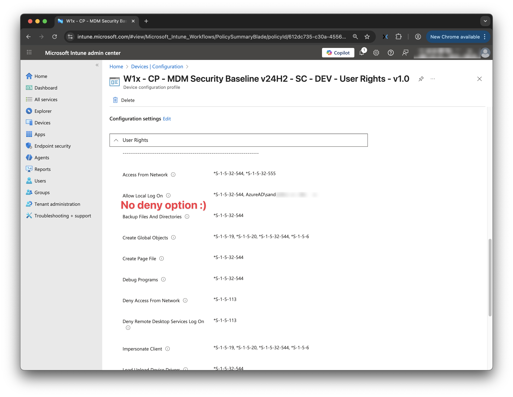
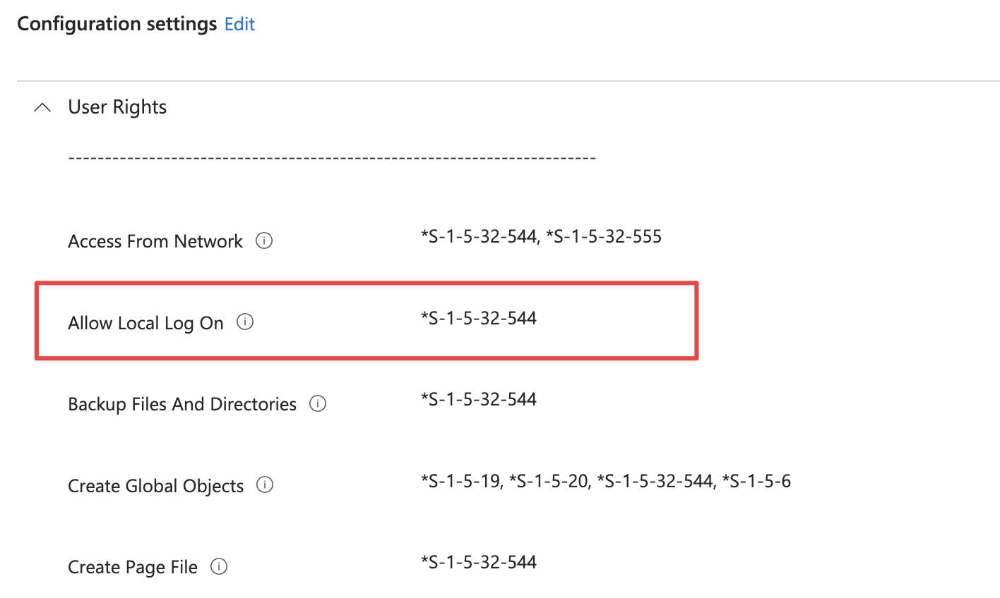

## Dynamically Restrict Local Logon to the Primary User on Intune-Managed Windows Devices

In many organisations, Windows devices move between users during onboarding and offboarding processes. Autopilot assigns a **Primary User**, but Windows itself does not prevent other Azure AD users from signing in to that same device. The result is a common and recurring problem:  
a device ends up being used by someone it was not intended for.

At first glance, Intune seems to offer a solution. The *Allow log on locally* user right can be configured through an Account Protection policy. However, this setting is static. It cannot adapt per device and does not understand the concept of “Primary User”. That means that you have to create a policy for every device and configure the primary user in that policy. 
Not that scalable :).

This led me into a deep dive into Windows logon rights, how Azure AD identities are represented on the device, and what actually happens during Autopilot and OOBE sign-ins. Eventually, this research resulted in a dynamic and safe solution: allow the Autopilot Primary User and administrators, and block everyone else.

Before getting there, we need to understand how Windows decides who can log in at all.



## In short
Intune provides a setting called Allow local log on, but it is static.
It cannot dynamically enforce that only the Autopilot Primary User (and administrators such as LAPS) may sign in.

Why not?

- Azure AD users do not have a SID on the device until after their first login.
- Logon rights in Windows require SIDs, not UPNs.
- The first Autopilot OOBE login bypasses logon rights entirely.
- Intune cannot insert the correct user SID per device dynamically.
- Deny policies are dangerous and can easily lock out all users.

This blog explains how Windows handles identity, SIDs, logon rights, and the Autopilot login sequence.
From there, we build a safe, dynamic solution:

- Intune deploys a baseline policy allowing only administrators to log in.
- After OOBE, the device learns who the Primary User is and generates their SID.
- A Proactive Remediation script detects the Primary User locally.
- The script uses secedit to update Allow log on locally with the Primary User SID.
- From the second login onward, Windows enforces that only the Primary User and administrators may sign in.

This approach prevents unwanted users from logging in to devices they should not use,
while keeping Autopilot, LAPS, and administrator access fully functional.

To understand why restricting local logon for Azure AD users is challenging, we must first look at how Windows internally handles identities and logon rights.

## Security Identifiers (SIDs)

Every identity in Windows—local users, groups, service accounts, domain users—has a **Security Identifier (SID)**. The SID is the actual identifier Windows uses everywhere: for ACLs, privileges, and logon rights.

Even if you configure a setting using a username, Windows always converts it to a SID before storing it internally.

Azure AD identities work differently:

- A local account has a SID immediately.
- A domain account has a SID retrieved from a domain controller.
- An Azure AD user has **no SID** on the device until after their first successful login.

This is because Azure AD is not a domain. The SID is not stored anywhere locally and cannot be retrieved without a login.

## How Windows stores logon rights

Logon rights such as:

- Allow log on locally  
- Deny log on locally  
- Allow log on through Remote Desktop Services  

are stored in the **Local Security Authority (LSA)** policy store, part of the SECURITY hive:

```
HKLM\SECURITY\Policy
```

Entries are stored as SIDs.  
Unknown identities (identities without a SID yet) cannot be evaluated.

## What happens during the first Azure AD login

When an Azure AD user signs in to a device for the first time:

1. The user authenticates via CloudAP.
2. Azure AD returns the user’s Object ID (GUID).
3. The device generates an Azure AD SID:  
   `S-1-12-1-<hashed-object-id>`
4. LSA stores the SID.
5. A local profile is created.

This means Windows only learns the SID of an Azure AD user **after** the first successful sign-in.
This point becomes crucial later when we talk about enforcement.

# Why This is a Problem for Restricting Logon

Given that Windows requires SIDs for evaluating logon rights, and Azure AD users have no SID until after logging in, several issues arise.

## Intune’s User Rights CSP expects SIDs

The Account Protection profile in Intune allows you to configure *Allow log on locally*.  
Intune writes these values into LGPO and the LSA policy store.

However:

- It cannot dynamically insert each device’s Primary User.
- It cannot convert a UPN to a SID on its own.
- It cannot adapt policies per device.

Intune’s system is **static**, while the requirement is **dynamic**.

## Deny rights are dangerous

Some administrators (like me) try to block unwanted users using Deny rights such as:

```
SeDenyInteractiveLogonRight
```

This backfires on Azure AD Joined devices because:

- Deny rights are evaluated first.
- Azure AD user SIDs often do not exist early in logon.
- Deny rules can accidentally match broad groups.
- This can lock out *all* Azure AD users, including the Primary User.

During testing, deny rules caused complete device lockouts multiple times.

That could be a very good reason why this is also not an option in the settings catalog.



## OOBE Login is special

Even if the device already has a restrictive policy applied, the first user login during OOBE **always bypasses local user rights**.

This is by design:

- The SID does not exist yet.
- The profile does not exist yet.
- CloudAP must create the identity.
- LSA cannot evaluate rights for unknown users.

If Windows enforced local logon rights during OOBE, Autopilot would be impossible.

So even with:

```
Allow log on locally = Administrators only
```

the OOBE login for the Primary User will still succeed.

This is expected and required behaviour.

---

# What Intune Does (and Does Not) Control

Intune participates in this process, but it does **not** control user sign-in during OOBE.

### During Device ESP  
Intune delivers device-targeted policies, including User Rights.

### During User OOBE  
Windows ignores User Rights Policies.

### After first login  
Windows enables LSA privilege checks, and Intune-configured logon rights become active.

Because Intune cannot dynamically insert the Primary User into the logon rights and because OOBE ignores the policy anyway, Intune alone cannot enforce “Primary User only”.

This is where automation comes in.

---

# The Desired Behaviour

With the fundamentals and constraints understood, the goal becomes clear:

- Allow the Autopilot Primary User to sign in.  
- Allow administrators, including the LAPS local admin.  
- Deny all other Azure AD users.  
- Avoid deny-right lockouts.  
- Apply the restriction dynamically after OOBE.  
- No per-device policies.

Now we can build a solution that respects Windows identity behaviour and Intune’s limitations.

---

# Solution Architecture

The final solution consists of three layers.

## 1. Intune Baseline Policy

Configure a device-targeted Account Protection policy:

```
SeInteractiveLogonRight = *S-1-5-32-544
```

This ensures:

- Local administrators can always sign in.
- LAPS can always sign in.
- The device will not lock itself out.

This policy arrives during Device ESP but is not enforced during OOBE.



## 2. Dynamic Local Enforcement with Proactive Remediation

After the Primary User completes OOBE and logs in for the first time:

- Their SID is generated.
- The device can evaluate user rights properly.
- Now we enforce the restriction dynamically.

The Proactive Remediation:

- Reads the Autopilot Primary User UPN.
- Resolves the SID if available.
- Falls back to the UPN if SID does not yet exist.
- Generates a minimal security template.
- Applies it using secedit.

This updates:

```
SeInteractiveLogonRight = <PrimaryUser SID or UPN>, *S-1-5-32-544
```

From this point onward, only the Primary User and administrators can sign in.

## 3. Enforcement begins after OOBE

On the second login:

- SID exists
- LSA evaluates rights
- Other users are denied
- Administrators and LAPS are still allowed

This creates the exact behaviour we want.

---

# Deep Dive: How Secedit Applies Local Security Policy

Secedit operates using three building blocks.

## Security Template (INF)

Defines the intended state:

```ini
[Privilege Rights]
SeInteractiveLogonRight = AzureAD\user@domain.com,*S-1-5-32-544
```

## Security Database (SDB)

Created using:

```
secedit /import /db rights.sdb /cfg rights.inf
```

This merges the template with existing policy and Windows defaults.

## LSA Policy Application

Applied using:

```
secedit /configure /db rights.sdb /areas USER_RIGHTS
```

Secedit will:

- Try to resolve UPN → SID  
- Write the resolved SID into LSA  
- If SID does not exist yet, store the UPN as a placeholder  
- Let CloudAP update the entry after first login

This behaviour is key to making the solution safe and predictable.

---

# Implementation
Now we know what must be done to make sure only the primary user can login, and administrators, it is time to do some PowerShell on the managed device.

## Step 1: Detect the Primary User

```powershell
$upn = (Get-ItemProperty 'HKLM:\SOFTWARE\Microsoft\Provisioning\Diagnostics\AutoPilot').CloudAssignedUserUpn
```

## Step 2: Resolve the SID if possible

```powershell
$nt = New-Object System.Security.Principal.NTAccount("AzureAD", $upn)

try {
    $sid = $nt.Translate([System.Security.Principal.SecurityIdentifier]).Value
} catch {
    $sid = $null
}
```

## Step 3: Build the INF

If `$sid` exists:

```
SeInteractiveLogonRight = *S-1-5-32-544,<sid>
```

Otherwise:

```
SeInteractiveLogonRight = *S-1-5-32-544,AzureAD\user@domain.com
```

## Step 4: Apply via Secedit

```powershell
secedit /import /db C:\Windows\Temp\rights.sdb /cfg C:\Windows\Temp\rights.inf
secedit /configure /db C:\Windows\Temp\rights.sdb /areas USER_RIGHTS /quiet
```

## Step 5: Verify

```powershell
secedit /export /cfg C:\Windows\Temp\rights_after.inf
```

# How to manage this using Intune
The key is detection and remediation. 

# Conclusion

What started as a simple goal—only allow the Primary User and administrators to sign in—turned into a deeper journey through Windows identity architecture, Azure AD SID generation, and how Intune interacts with LSA policy.

The key takeaways:

- Azure AD users do not have SIDs until after first login.
- OOBE sign-in bypasses local logon rights entirely.
- Intune cannot dynamically target device-specific Primary Users.
- Deny rights on Azure AD Joined devices are risky.
- Secedit supports UPN placeholders and safely updates them later.
- A dynamic remediation provides the missing link.

The result is a robust, scalable, and safe way to ensure that each device is only used by the person it is assigned to, without locking out administrators or breaking Autopilot.

If you want a ready-to-import Proactive Remediation package or downloadable scripts, feel free to ask.
