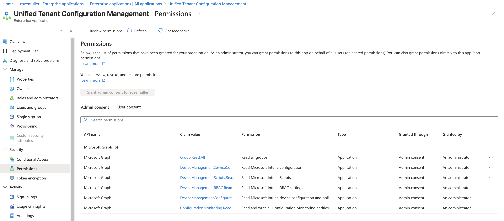
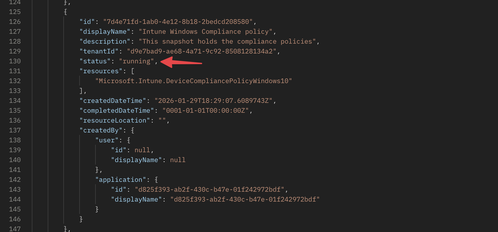
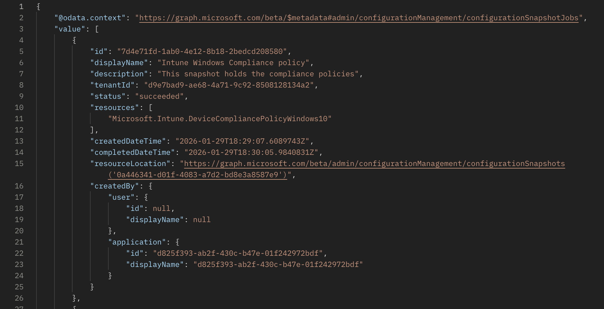
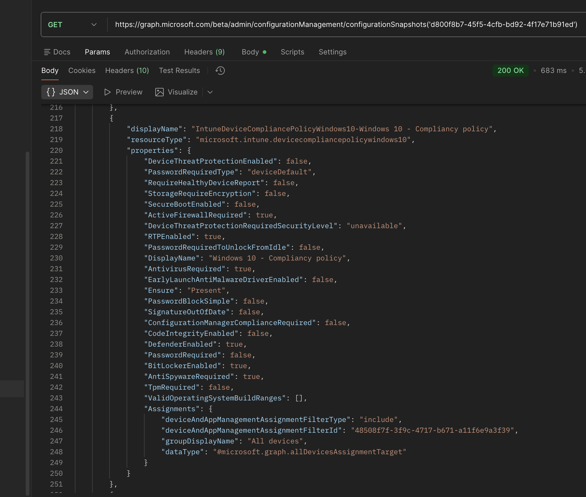
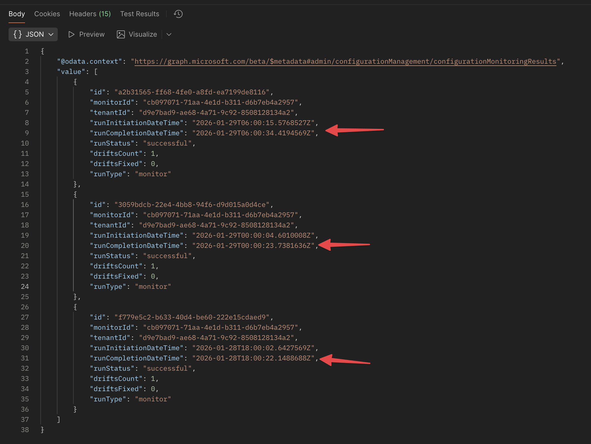
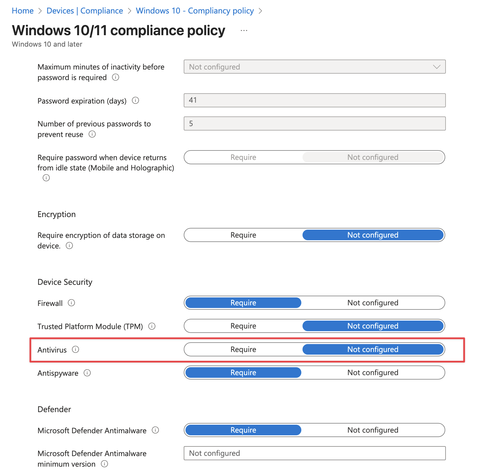
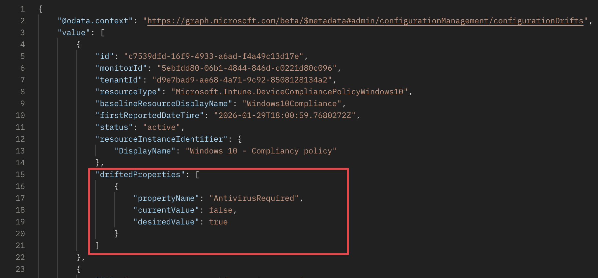

Microsoft pushed something live that many of us have been building ourselves for years. Unified Tenant Configuration Management entered public preview, and with it came something that has been missing from Microsoft 365 automation for a long time: `native Intune drift monitoring`.  

Up until now, keeping track of configuration drift has always been reactive. You queried current state, stored snapshots somewhere, compared JSON, parsed audit logs, and hoped you did not miss anything important in between. It worked, but it was fragile, noisy, and never really declarative.
Now, Microsoft Graph takes all the heavy lifting for you.



With Unified Tenant Configuration Management, that model changes. Instead of constantly asking what the current state is, you define what the state *should* be.  
From that moment on, keeps checking it for you. If reality no longer matches your intent, you get a drift. Nothing more. Nothing less.
That is the gateway to building real baselines at tenant level.
That pushed me to start playing around with it and here are my first impressions.


## Desired state instead of constant comparison
I started playing with in Intune compliance policy area which is a blind spot in many Intune environments. Configurations that rarely change but carry a lot of risk when they do. 
Someone adds an extra group. Someone removes the intended one or changes a setting. Everything still functions, but governance is suddenly off and often unnoticed. 

What I want in this case is very explicit. A specific setting (AntivirusRequired) in a Windows compliance policy is disabled that should be enabled. 
No more. No less.

With UTCM you could monitor the whole resource or just a few settings. You define which properties matter and treat those as authoritative. Graph will periodically evaluate the live configuration in your tenant against that definition and tell you when it no longer matches.

## Unified Tenant Configuration Management Components
While playing with it, I noticed that the documentation is still a bit thin, and it is quite complex. Especially when your not that familiar with Graph API and permissions. 
Without going into detail too much, let me explain the main components and how they fit together.

We have the following API building blocks:

- **Monitor with baselines**: A baseline is a declaration of how you want a specific configuration to look. It contains one or more resources with properties that are considered authoritative.
- **Drifts**: A drift is the outcome of a monitor evaluation when the current state no longer matches the baseline. It contains details about what changed.
- **Snapshots**: A snapshot is a read-only representation of the current state of a resource at a specific point in time. Snapshots are taken during evaluations and used for comparison against the baseline.

Besides these components, there are also a permissions aspect and authentication requirements. 
UTCM uses a service principal that Microsoft provisions in your tenant to run evaluations. 

You need to create (could be changed later after preview period) and grant that identity specific permissions to read configurations in your tenant.
Meaning, you have to create a service principal with this ID `03b07b79-c5bc-4b5e-9bfa-13acf4a99998`. A new principal is created with the name `Unified Tenant Configuration Management`.  

Check the Microsoft documentation for more information about [Creating the service principal and assigning permissions can be done through Azure AD portal or Graph API.](https://learn.microsoft.com/en-us/graph/utcm-authentication-setup#authentication)

You can also perform the setup directly in Microsoft Graph Explorer. Send the following request to create UTCM's managed service principal:

POST https://graph.microsoft.com/v1.0/servicePrincipals  
Content-Type: application/json  

{
  "appId": "03b07b79-c5bc-4b5e-9bfa-13acf4a99998"
}

The response contains the new object, so note the returned `id`—that value is the objectId of the UTCM principal and is what you will use when granting permissions.

Then retrieve the Microsoft Graph service principal itself by querying `/servicePrincipals?$filter=appId eq '00000003-0000-0000-c000-000000000000'`. Note the `id` from that result and call `/servicePrincipals/{graph-id}` (substituting the noted id) to inspect its `appRoles`. Look for entries such as `DeviceManagementConfiguration.Read.All` where `type` is `Admin` and jot down the corresponding `id` for each permission you need.

With those ids in hand, assign the permissions to UTCM by posting to `/servicePrincipals/{utcm-objectid}/appRoleAssignments`:

POST https://graph.microsoft.com/v1.0/servicePrincipals/{utcm-objectid}/appRoleAssignments  
Content-Type: application/json  

{
  "principalId": "<your-utcm-objectid>",
  "resourceId": "<graph-service-principal-id>",
  "appRoleId": "<app-role-id-for-the-permission>"
}

Repeat that appRole assignment for each permission the monitor requires (for example, `Group.Read.All`). Once the requests succeed, UTCM can read the resources that fuel your baselines.

After creation, add the needed API permissions to that principal. For Intune policies, you need at least `DeviceManagementConfiguration.Read.All` and `Group.Read.All` permission.


**Why both permissions?**

Because you need to check resource itself that is linked to the `DeviceManagement` scope permissions. The underlying group information for assignments is linked to the `Group` scope. To evaluate the membership of those groups, UTCM needs to read them as well.



## How it works in practice
In basic, you create a monitor with an embedded baseline that describes the desired state. From that moment on, UTCM takes care of evaluating that intent every `six` hours.  
If something changes, a drift object appears that you can query and act upon. Then you can build logging, alerting, or even remediation workflows on top of that signal. You have to creat a process that fetches those drifts and acts upon them.

### My way of working
With that in mind, I started experimenting with building a monitor that keeps track of a specific Intune compliance policy. 
So, what I did was:
- Creating a snapshot first with the current state of the compliance I want to monitor; 
- Then I picked the properties of that snapshot to only include the properties I cared about;
- Finally, I wrapped that baseline inside a monitor definition and created it through Graph API.


## Building a snapshot for an Intune compliance policy
To create a baseline, you first need to understand the resource structure of an Intune compliance policy. You can fetch that information through Graph API by creating a snapshot. 
I've sent a `POST` request to the following endpoint to create a snapshot of the Intune compliance policy resource:

```text
https://graph.microsoft.com/beta/admin/configurationManagement/configurationSnapshots/createSnapshot 
```

```json
{
  "displayName": "Intune Compliance policy",
  "description": "This snapshot holds the compliance policies",
  "resources": [
    "Microsoft.Intune.DeviceCompliancePolicyWindows10"
  ]
}
```

After sending that request, a backend job is created that takes a snapshot of all Intune compliance policy resources in the tenant. You can check the status of that job by querying the snapshot creation status endpoint. Once the job is completed, you can fetch the snapshot details.



After a few moments, the snapshot is ready. You can now query the snapshot details to see the status. Also, it provides the location where you can find the resource information.

```text
https://graph.microsoft.com/beta/admin/configurationManagement/configurationSnapshots/{snapshot-id}
```

By sending a `GET` request the `ResourceLocation` URL, you get the actual snapshot details.




## Creating a monitor with a baseline for the compliance policy
When you fetch the snapshot details, you can see the resources that were captured. In this case, it includes all Intune compliance policies in the tenant. You can then extract the specific policy you want to monitor.

Let us make this concrete.

The goal is to monitor a single compliance policy and ensure that the `AntivirusRequired` is set to `true`. That intent is captured in the baseline definition and wrapped inside a monitor.

### Monitor schema
The monitor schema looks like below. It contains a `display name` (for monitor), `description`, and a `baseline` object. The baseline includes the resource definition for the compliance policy you want to monitor.
As you can see, the resources property in the baseline is an array that could hold one or more resource definitions. Each resource definition includes the display name, resource type, and properties that define the desired state. 

The properties section is where you specify the authoritative properties for the policy and can be mapped to the snapshot data you fetched earlier.

In the example below, I am monitoring the `Windows 10 - Compliancy policy` and ensure that the `AntivirusRequired` is set to `true`, and it exists in any way (Ensure: Present).

```json
{
  "displayName": "Windows Compliance Assignments",
  "description": "This monitor checks for Intune Windows 10 Compliance assignment",
  "baseline": {
    "displayName": "Win10comp to all devices",
    "description": "This is a baseline with the compliance policy assigned to all devices",
    "resources": [
      {
        "displayName": "Windows10Compliance",
        "resourceType": "Microsoft.Intune.DeviceCompliancePolicyWindows10",
        "properties": {
          "DisplayName": "Windows 10 - Compliancy policy",
          "Ensure": "Present",
          "AntivirusRequired": true,
          "Assignments": [
            {
              "deviceAndAppManagementAssignmentFilterType": "include",
              "deviceAndAppManagementAssignmentFilterId": "48508f7f-3f9c-4717-b671-a11f6e9a3f39",
              "groupDisplayName": "All devices",
              "dataType": "#microsoft.graph.allDevicesAssignmentTarget"
            }
          ]
        }
      }
    ]
  }
}
```

This body is sent as a `POST` request to the monitor creation endpoint:

```text
https://graph.microsoft.com/beta/admin/configurationManagement/configurationMonitors
```

From that point, it's up to UTCM to take care of the rest. As mentioned before, every six hours the created service principal evaluates the current state of that policy against the baseline you defined. 

### Monitor the monitor
I did a small check on the monitor results, and noticed that it's running at also a fixed set of times (00:00, 06:00, 12:00, 18:00 UTC). 
Based on that information, I did a little assumption that the evaluation runs at those times, and it doesn't matter when you create the monitor. Good to know for planning purposes.



In the results, you see the run status, the start and end time, and the number of drifts detected (should be zero at this point). 
Based on that, you could set up some alerting or logging to keep track of the monitor status.


## Detecting drift
Now we have created a snapshot (to understand the resource structure) and created a monitor with a baseline (to define the desired state), we can check the results.
If everything is still in line with the baseline, the monitor will show no drifts. But as soon as something changes, a drift object will be created. As said, UTCM checks every six hours, so you have to wait for that moment. That also means, that when something changes and reverts back within that same six-hour window, nothing will be detected. Just something to keep in mind.

To check for drifts, you can query the monitor drifts endpoint:

```text
https://graph.microsoft.com/beta/admin/configurationManagement/configurationDrifts
```

This will return a list of all detected drifts in the tenant. You can filter the results based on the monitor ID to see drifts specific to your monitor.

## Test example
To test the drift detection, I modified the policy by adding changing the `AntivirusRequired` to `false`. After waiting for the next evaluation cycle, I queried the drifts endpoint and saw that a drift was detected.
So, the baseline in the monitor checks for the `AntivirusRequired` property in the `Windows 10 - Compliancy policy`. When I change that value, the current state no longer matched the baseline, resulting in a drift.



As you can see in the screenshot above, the antivirus is set to not configured. After the next evaluation cycle, I queried the drifts endpoint again.
When I queried the drifts endpoint, I saw the drift details, including what changed.



## Considerations
While playing with UTCM, to keep these in mind:

- **Evaluation Frequency**: UTCM evaluates every six hours. Plan accordingly for your monitoring and alerting needs. Its not possible to change that frequency (at least not in public preview);
- **Service Principal**: Ensure the service principal is created under this id `03b07b79-c5bc-4b5e-9bfa-13acf4a99998`;
- **Permissions**: Make sure the service principal has the necessary permissions to read the resources you want to monitor.

### Tenant monitoring

The following API limits apply to the configurationMonitor API:
- You can create up to 30 configurationMonitor objects per tenant.
- Each configurationMonitor runs at a fixed interval of six hours. A monitor cannot be configured to run at any other frequency.
- An administrator can monitor up to 800 configuration resources per day per tenant, across all monitors. Administrators decide how to use this quota—through a single monitor or multiple monitors. Example: If an admin includes 20 transport rules and 30 conditional access policies in a monitor's baseline, that monitor tracks 50 resources per cycle. Since the monitor runs every six hours (4 cycles/day), this results in 200 monitored resources per day. Additional monitors can be created until the daily 800‑resource limit is reached.
- When an administrator updates the baseline of an existing monitor, all previously generated monitoring results and detected drifts for that monitor are automatically deleted.

### Drifts

The following API limits apply to the configurationDrift API:
- All active drifts are retained and available for administrators to review at any time.
- Each fixed drift is deleted 30 days after it is resolved.

### Snapshot

The following API limits apply to the configurationSnapshotJob API:
- You can extract a maximum of 20000 resources per tenant per month. This is a cumulative limit across all snapshots.
- There is no maximum number of snapshots you can create per day or per month. You may generate as many snapshots as needed, as long as the total number of resources extracted stays within the 20,000-resource monthly quota for the tenant.
- A maximum of 12 snapshot jobs are visible to the administrator. If the administrator wants to create more snapshot jobs, they have to delete one or more of the existing jobs.
- A snapshot is retained for a maximum of seven days, after which it is automatically deleted.

More information about this new world:
[Unified Tenant Configuration Management API reference](https://learn.microsoft.com/en-us/graph/api/resources/unified-tenant-configuration-management-api-overview?view=graph-rest-beta)
[Get started with Unified Tenant Configuration Management](https://learn.microsoft.com/en-us/graph/unified-tenant-configuration-management-concept-overview)

## Conclusion
Unified Tenant Configuration Management is a game-changer for monitoring and managing configurations in Microsoft 365. By allowing administrators to define desired states and automatically detect drifts, it simplifies the process of maintaining compliance
But it is very complex and requires a good understanding of Graph API and permissions. As it is still in public preview, I expect more features and improvements to come.

