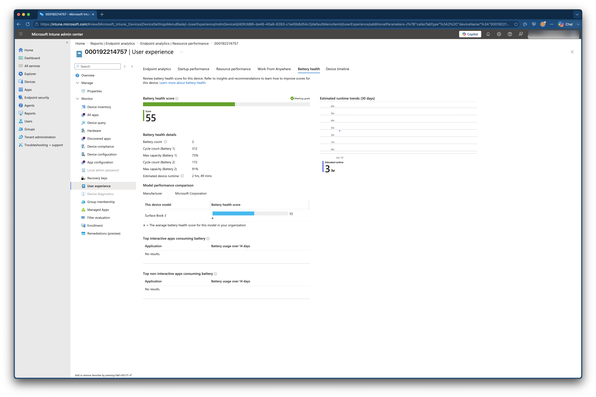
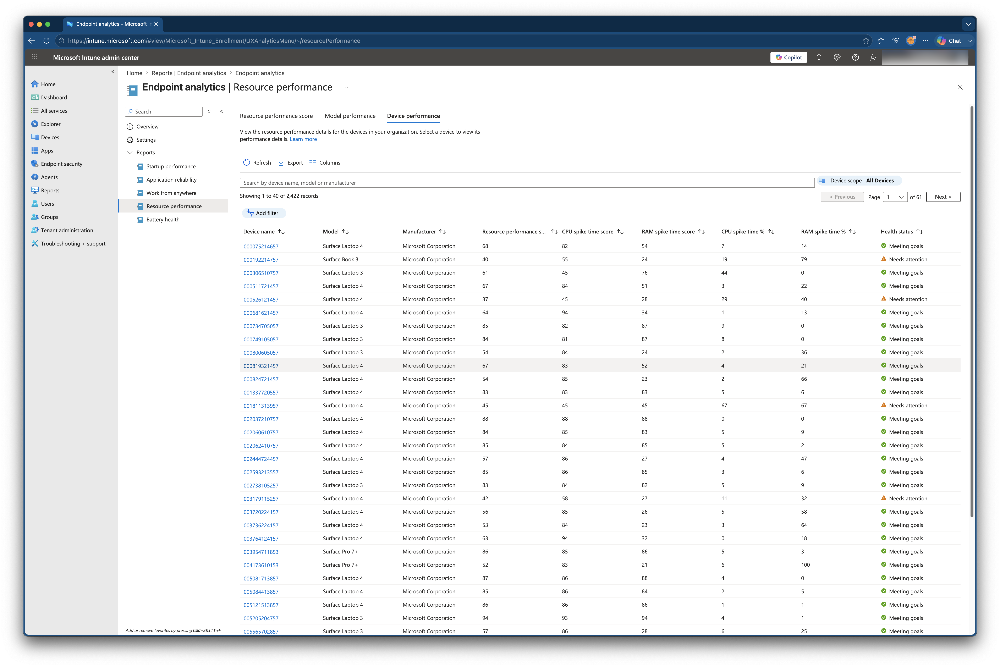
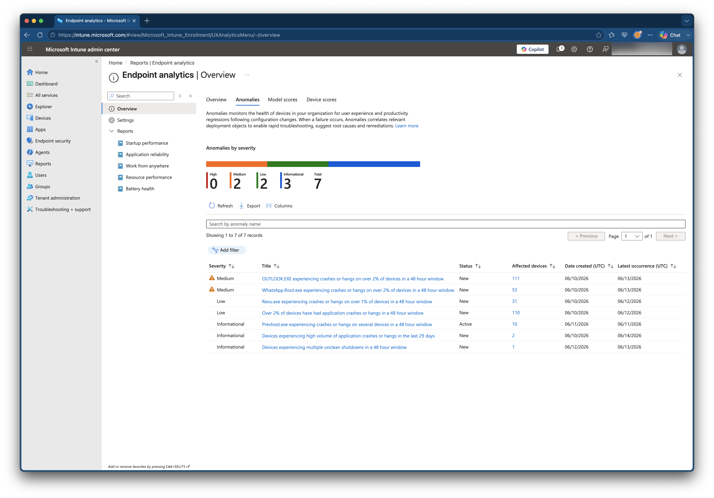
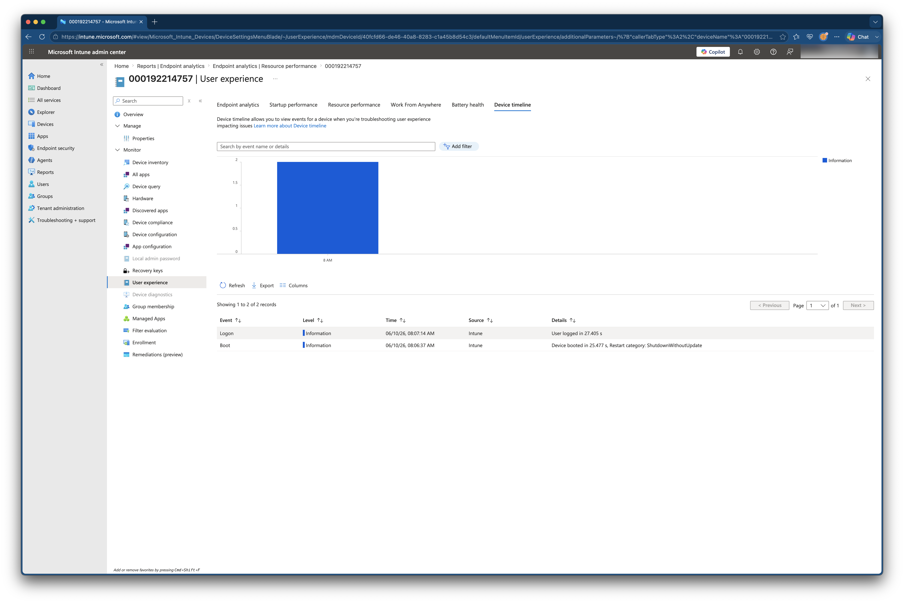
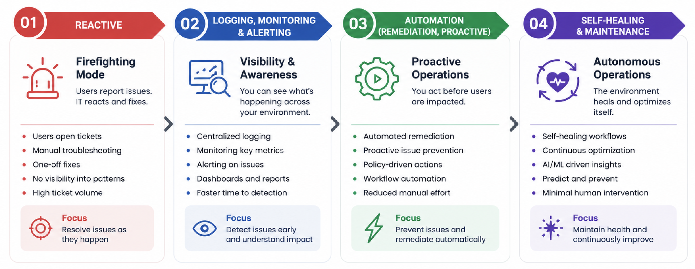
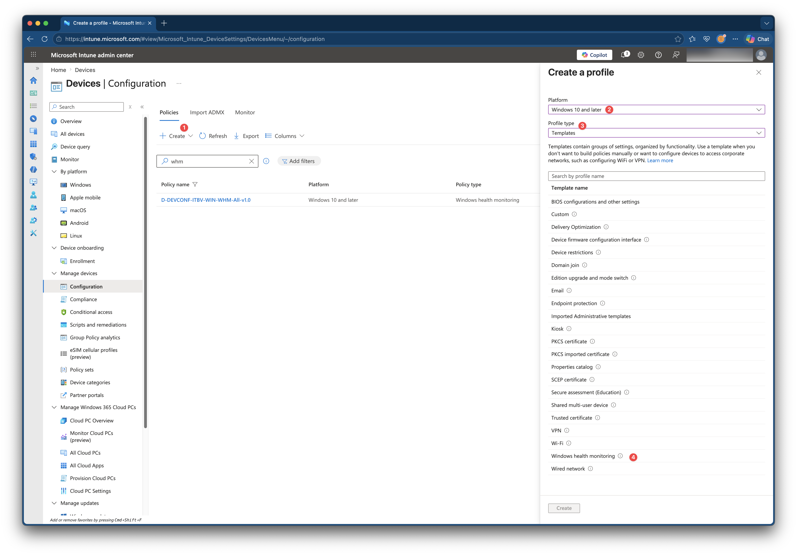

Microsoft Intune has been focused on managing devices.
We deploy applications, publish configuration settings, enforce compliance, and secure endpoints. When everything works, users can do their jobs and IT is just a service that comes out of the wall.

But the moment devices become slow, batteries start degrading, applications crash unexpectedly, or users experience performance issues, administrators often find themselves switching between multiple tools trying to answer a simple question:
- What is actually happening on this device?

I most of the cases finding that answer is hard. However users almost call immediately, you didn't have the time to dive into it thereafter, and when you have the time, the issue is gone.
In this blog, we will dive into Endpoint Analytics and Advanced Analytics and see where Advanced Analytics can help you. 



Microsoft introduced Endpoint Analytics to help organizations better understand the experience users have on their devices. Startup performance, application reliability, and device responsiveness suddenly became measurable.
That was a step forward.

But Endpoint Analytics primarily answers one question: Is there a problem?

Microsoft Intune Advanced Analytics takes the next step.
- It helps answer: Why and where is there a problem?
- Which devices are likely to become a problem before users notice?

Microsoft recently announced that Advanced Analytics will be added to the Microsoft 365 E3 license and above. That means that this feature becomes available without a specific Intune Suite License. That means, this is the time to take the next step in managing your device fleet. And, to be honest Im very happy with that. Personally Im a guy that lives monitoring, logging, automation and remediation. I played with Advanced Analytics already and now will take a closer look at what it brings to the table and why it might fundamentally change how you manage your device fleet.
Endpoint Analytics versus Advanced Analytics.

You can read Microsoft's announcement here: https://techcommunity.microsoft.com/blog/microsoftintuneblog/microsoft-365-adds-advanced-microsoft-intune-solutions-at-scale/4474272

## Advance Analytics Overview
To start with a clear mind, Advanced Analytics is not replacing Endpoint Analytics, in fact, its build on top of that. Better said, you must configure Endpoint Analytics first before you can use Advanced Analytics.

### Where is the difference then? 
The difference is at the context part and what you can do with the data. Where Endpoint Analytics give you ‘static' basic information, Advanced Analytics provides the ability to work with that data that is near real-time.
Endpoint Analytics focuses on measuring user experience through metrics such as startup performance, application reliability, and device responsiveness. It helps identify devices that are performing below expectations.

Advanced Analytics adds an additional layer of operational intelligence.
Instead of simply highlighting that a device is experiencing problems, it provides additional context that helps explain why those problems are occurring and whether similar patterns exist across the wider environment.

### Where Advanced Analytics can help you?

Most organizations already have monitoring. They use dashboards and have reporting.
But many organizations still operate reactively.
A user reports an issue, support investigates, a root cause is found, although you hope. In real-life you often see hope that it will never come back instead of an eureka moment.
Advanced Analytics is designed to close that gap.

Instead of focusing on individual devices, it enables administrators to identify patterns across the entire fleet using Multi Device Query (MDQ). More information about this feature is well written by my buddy Joost Gelijsteen (https://joostgelijsteen.com/device-query-for-multiple-devices)

With MDQ is you get the ability to search at your entire fleet for specific scenarios.

### Scenario's
Let’s clarify this with a few scenario’s

#### Scenario 1: The Battery Problem Nobody Sees
Battery degradation is one of those issues that often remains invisible until users start complaining.
By the time a support ticket is raised, productivity has already been impacted.
Imagine managing thousands of devices.
Every month a handful of users report that their battery suddenly lasts only an hour.
The traditional approach is straightforward.
A ticket is raised -> Support investigates -> The battery is replaced -> Case closed.

Advanced Analytics introduces `Battery Health`, providing visibility into battery capacity and degradation trends over time.
Instead of waiting for failures, administrators can identify devices approaching replacement thresholds months in advance.

This creates opportunities for proactive lifecycle management.
Replacement devices can be ordered before failures occur.
Procurement teams can forecast hardware requirements more accurately.
Support teams can schedule replacements during planned maintenance windows.
The feature itself is useful.
The operational impact is where the real value lives.

#### Scenario 2: A Slow Device
Every administrator has to deal with:
My laptop is slow.

The challenge is that "slow" means something different to every user.
One user may be experiencing memory pressure.
Another may have storage bottlenecks.
A third might be affected by a recently deployed application or Windows Updates.
Without proper telemetry, troubleshooting becomes guesswork.

`Resource Performance` provides visibility into CPU, memory, and storage related performance issues across the environment.
Instead of relying on user perception, administrators gain measurable insights into device behavior.
Patterns start to emerge.
Specific hardware models may consistently underperform.
Certain applications may introduce resource bottlenecks.
Particular user groups may experience degraded performance after software deployments.
These are the kinds of insights that are difficult to discover through traditional support processes.

#### Scenario 3: The Update That Breaks Everything
Software deployments are usually measured by success rates.
- Did the update install?
- Did the policy apply?
- Did the deployment complete?
Those metrics are important.

Unfortunately, they don't always tell the whole story.
Imagine deploying a Windows update to 10,000 devices.
Installation success looks perfect, Compliance looks healthy and everything appears normal.

Three days later support tickets begin arriving.
Boot times have increased, applications start crashing and devices feel sluggish.

`Anomaly Detection` helps identify unusual patterns that emerge after changes occur.
Instead of waiting for support volumes to increase, administrators can identify abnormal behavior much earlier and investigate before issues spread further throughout the environment.
This is where analytics starts becoming operationally valuable rather than simply informational.

#### Scenario 4: What Changed?
One of the most frustrating questions during troubleshooting is:
What changed? Where the answer is usually, nothing.
Yet something almost always changed.

- A Windows update.
- A driver.
- An application.
- A policy assignment.
- A configuration change.

`Device Timeline` helps reconstruct the sequence of events occurring on a device.
Instead of manually correlating information from multiple locations, administrators gain a chronological view of significant events.
When troubleshooting complex issues, having a timeline often reduces investigation time dramatically.
Rather than searching for clues, you can follow the story of the device.

## The Real Value Is Not the Dashboard, it is the data behind it
As said, Advanced Analytics give you insights using additional reports and gives you the ability to search for related properties in your whole device fleet using MDQ. 
Organizations don't become more mature because they have more graphs.
They become more mature because they use information to drive operational decisions. The maturity levels I often use are

Stage 1: Reactive
Users report problems.
IT responds.

Stage 2: Monitoring, Logging and Alerting
IT can see problems.

Stage 3: Analytics
IT understands why problems occur.

Stage 4: Automation
IT automatically responds to problems.

Advanced Analytics helps organizations move from monitoring to understanding and give you the tool to really analyse starting at the top.
Once you have visibility into:
Battery degradation, device performance, anomalous behavior, historical trends, device state, you can begin building operational workflows around that information.

Imagine receiving alerts when battery health drops below a defined threshold.
Imagine identifying devices whose performance suddenly deteriorates after a deployment.
Imagine detecting unusual behavior patterns before users create support tickets.
Instead of waiting for problems to surface, the platform begins highlighting areas that require attention.
That shift from reactive support to proactive operations is where Advanced Analytics becomes truly valuable.

## Getting Started with Advanced Analytics 
To start with Advanced Analytics, Endpoint Analytics is your starting point.
You should verify:

Endpoint Analytics prerequisites are met, if you are total new with this feature, start enabling Endpoint Analytics (https://learn.microsoft.com/en-us/intune/endpoint-analytics/configure?pivots=intune#enable-endpoint-analytics)
Then create a Windows Health Monitor policy and assign it to all devices to enable health monitoring on the Windows Endpoints

## Where I Whould Start?
Start with a single operational challenge.

If I were enabling Advanced Analytics today, I would focus on two capabilities first.
First checking my own incident/tickets system and find the top 5 incidents, based on category. Example incident category: performance issues at John Doe, application Notepad++ is slow at Johnny Bravo, laptop takes a long time to boot at Candy Lover. Then use the `device performance` and `anomaly detection` reports. Look if those devices comes by in the report. Then start further investigatoin using Device Query and Multi Device Query to find if there are relational properties at those devices.

Device Query opens the door to something much larger than troubleshooting. It provides direct visibility into endpoint state and creates opportunities for automation and proactive management.
The second area to look at is the anomaly page.  This page shows where things differ regarding the big picture. 

## Looking Ahead
In this article I've focused on the basics. Understanding what is happening inside your endpoint environment and why problems occur.
Identifying trends before users notice them.
But visibility is only the first step.

The moment you can identify battery degradation, performance issues, anomalies, and device state, you can start creating alerting and automating responses.

I will work out a next blog where I will explain how to get data and send alerts using automation workloads. 
How Advanced Analytics data can be combined with Microsoft Graph, and automation platforms as Logic Apps, Azure Functions and Intune remediation workflows to move from visibility to action and ultimately towards proactive endpoint management.

