Microsoft announced that Multi Admin Approval (MAA) now also applies to Graph API calls made by apps and service principals. Until now MAA only applied when an admin made changes in the Intune portal. But that changed. From now on, automated scripts and tools that use app-only tokens are intercepted too.

If you have automation in place that writes to Intune — deploying apps, pushing scripts, updating configurations — that automation will start failing with a `4xx` errors. Not because of missing permissions, but because MAA is now in the way.

In this blog I will explain what happens, how to find out if you are affected, and what to do before enabling MAA — or before it hits you by surprise.



## What is Multi Admin Approval?

Multi Admin Approval is an Intune feature that enforces a "four-eyes" principle on changes. When MAA is enabled for a workload like Apps or Configuration Policies, every change needs a second admin to approve it before it takes effect.

That makes sense for human admins working in the portal. But automation doesn't wait for approval. It fires a Graph API call and expects a `200 OK` back. That is the problem.

Microsoft has now extended MAA enforcement to app-authenticated Graph API calls. That means any service principal, app registration, or automation tool that writes to a MAA-protected resource will get blocked.

The affected write operations are `POST`, `PATCH`, `PUT`, and `DELETE`. Read operations (`GET`) are not affected.

### What resources can be protected?

MAA can be enabled per workload. The current list of protected resource types is:

- Apps
- Compliance policies
- Configuration policies
- Device actions
- Role-based access control
- Scripts
- Tenant configuration

So if your automation touches any of these and MAA is enabled for that workload, you will see failures.

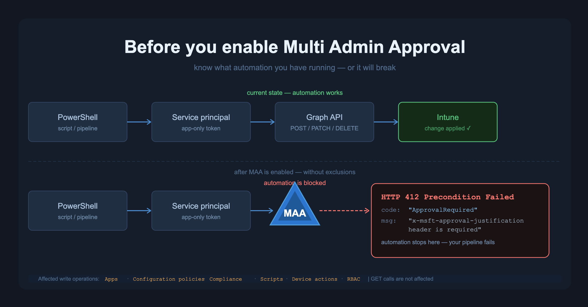

## What does the error look like?

For the test I used Postman against a tenant where MAA is enabled. Postman itself showed up in my report — more on that later. Here is what you actually see depending on what you send.

**Stage 1 — no justification header at all**

Your automation sends a normal POST or PATCH request. Nothing special. MAA intercepts it and returns a `400 Bad Request`:

```
Header 'x-msft-approval-justification' is required to request approval.
```

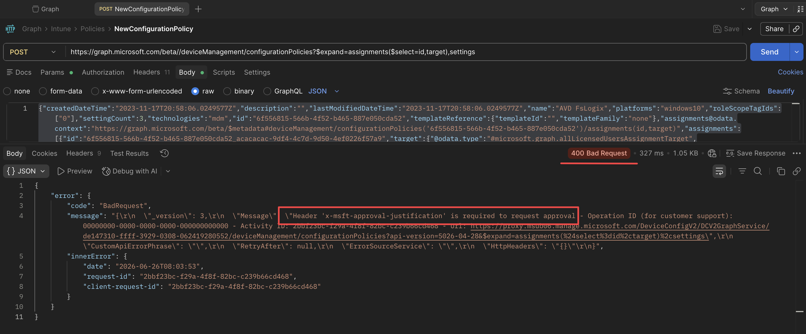

This is the first thing most people see when MAA is enabled and their automation breaks. It looks like a bug in the request, but it is MAA.

**Stage 2 — justification header present but not Base64 encoded**

You add the header but send it as plain text, like `I must create a policy`. Still a `400`:

```
'x-msft-approval-justification' must be a valid base64 encoded string.
```

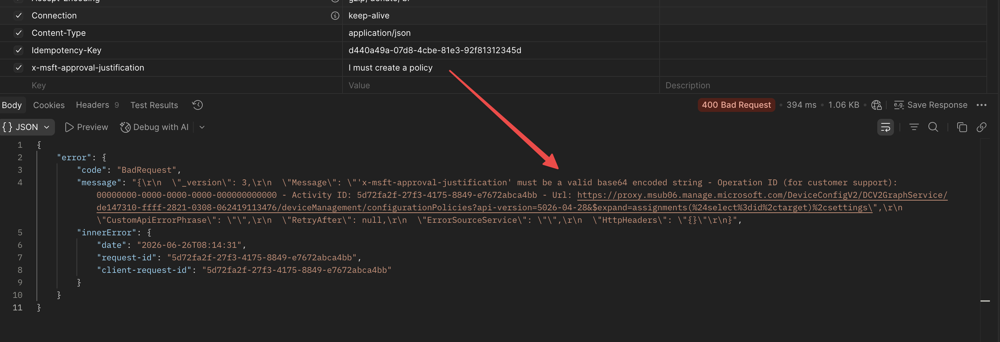

The value must be Base64 encoded. In PowerShell: `[Convert]::ToBase64String([Text.Encoding]::UTF8.GetBytes("your justification here"))`.

**Stage 3 — correct Base64 encoded header**

Now the request gets through MAA and returns a `412 Precondition Failed`. This is expected — it means MAA accepted the request and queued it for approval:

```json
{
  "error": {
    "code": "BadRequest",
    "message": "Approval Required. Request Approval using the request ID returned as part of the x-msft-approval-code response header. x-msft-approval-code: 9e0e406b-6822-45bb-b015-bfc1bfa5dd58"
  }
}
```

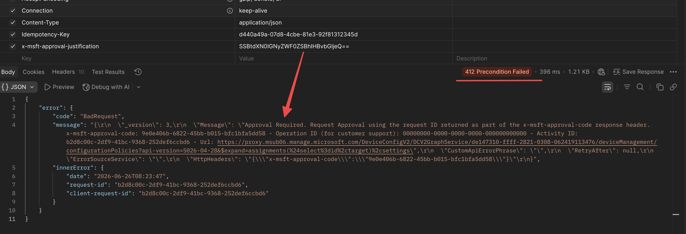

The `x-msft-approval-code` value in the message is what you need to resubmit the request after a human approves it. Your automation has to store that code, wait for approval, then fire the request again — which is why most automation just cannot work this way.

This is not a permissions problem at any of these stages. The app has the right permissions. MAA is intercepting the call.

At portal level, the approval flow looks like this:

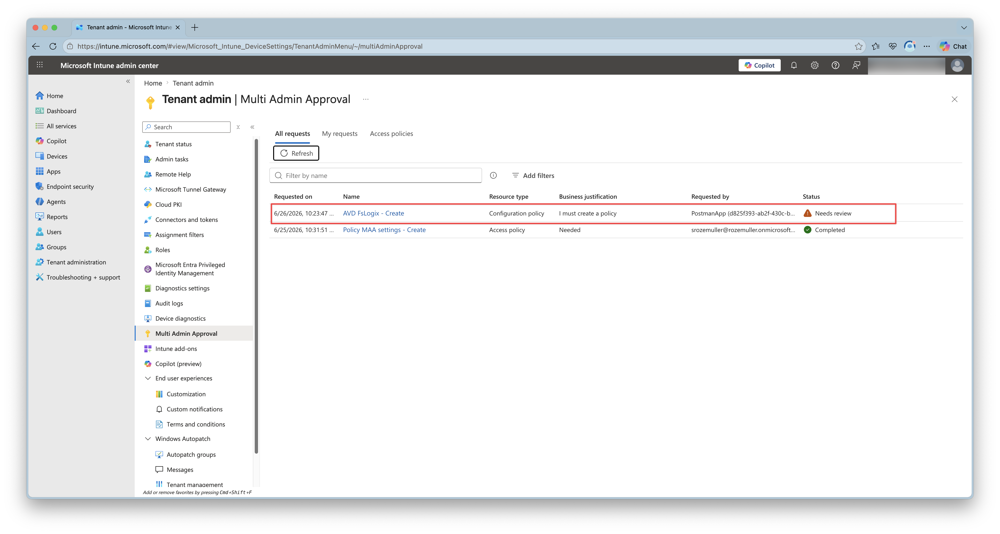

For the details you must click on the approval request. The approval request shows the justification, the resource, and the user who made the request (PostMan app). The second admin can approve or reject it.

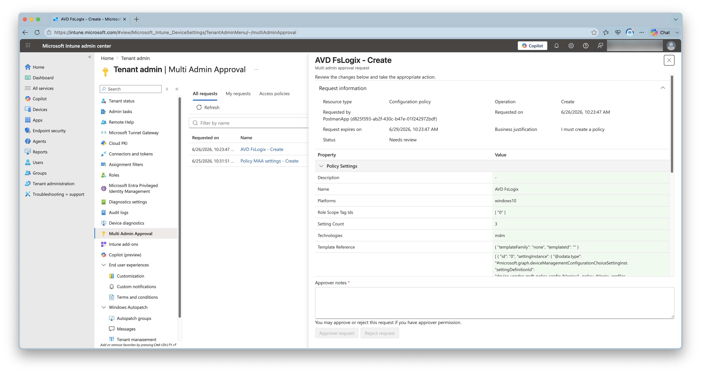

## How does the new flow work?

Microsoft designed a multi-step flow for automation that wants to work with MAA. In short:

1. Send your request with an `x-msft-approval-justification` header (Base64 encoded string)
2. Get back a `412` with an `x-msft-approval-code` in the response headers (See screenshot below)
3. Wait for a human admin to approve the request in the Intune admin center
4. Resubmit your request with the `x-msft-approval-code` header instead

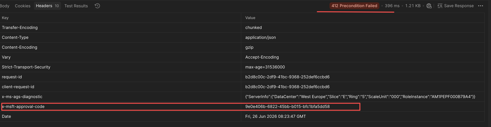

This is fine for some use cases, but for most automation this completely breaks the flow. Sometimes you cannot pause a pipeline to wait for a human to click approve.

The practical fix for trusted automation is to **exclude the app registration from the MAA policy**. That way MAA still applies to human admins in the portal, but your automation runs without interruption.


## Check your environment before enabling MAA

Before you enable MAA — or if you want to know if you are already affected — you need to answer one question: which service principals are actually making changes to Intune?

Two data sources give you that answer, and together they tell the full story.

### Intune Audit Logs — what is actually happening

The Intune audit log records every write action against Intune resources, whether it came from the portal or the API. Crucially, it also records who or what triggered the action. When a service principal makes the change — not a user — you can see that in the actor field. The user principal name is empty, and the application ID and display name are filled in instead.

This is your ground truth. If a service principal shows up here, it is actively writing to Intune right now. Those are exactly the identities that MAA will block once you enable it.

### Entra Sign-In Logs — what could potentially break

The sign-in logs tell a different story. They record every token request, including app-only sign-ins where a service principal authenticates to Microsoft Graph using client credentials — no user involved. Not every app that signs in to Graph is writing to Intune, but any app that has done so in the past 30 days is a candidate.

The combination is the philosophy: the **audit log shows you what is already breaking things**, the **sign-in log shows you what could break**. Cross-reference the two and you have a clear list of apps to either exclude from MAA or update before you flip the switch.

## The PowerShell script

The script below reads the Intune audit logs and the Entra sign-in logs and gives you an HTML report. Run it before you enable MAA to get a clear picture of which automation is active in your tenant.

You need the `Microsoft.Graph` PowerShell module and permissions to read audit logs and sign-in logs.

```powershell
#Requires -Modules Microsoft.Graph.Authentication

<#
.SYNOPSIS
    Checks your Intune environment for automation that will break when Multi Admin Approval is enforced.

.DESCRIPTION
    This script:
    - Reads Intune Audit Logs for changes made by non-user actors (service principals)
    - Reads Entra Sign-In Logs for app-only sign-ins to Microsoft Graph
    - Outputs an HTML report so you know what to review and what to exclude from MAA

.NOTES
    Required permissions (delegated or application):
    - AuditLog.Read.All

    The script uses read-only Graph calls. It does not make any changes.
#>

[CmdletBinding()]
param(
    [Parameter()]
    [int]$AuditLogDays = 30,

    [Parameter()]
    [string]$OutputPath = ".\MAA-Check-Report.html"
)

Write-Host "Connecting to Microsoft Graph..." -ForegroundColor Cyan
Connect-MgGraph -Scopes "AuditLog.Read.All" -NoWelcome

$graphVersion = 'beta'
$auditResults = [System.Collections.Generic.List[PSCustomObject]]::new()
$signInResults = [System.Collections.Generic.List[PSCustomObject]]::new()

$since = (Get-Date).AddDays(-$AuditLogDays).ToUniversalTime().ToString("yyyy-MM-ddTHH:mm:ssZ")

# ---------------------------------------------------------
# Step 1: Check Intune Audit Logs for non-user changes
# ---------------------------------------------------------
Write-Host "Reading Intune Audit Logs for the last $AuditLogDays days..." -ForegroundColor Cyan

$auditUri = "https://graph.microsoft.com/$graphVersion/deviceManagement/auditEvents?`$filter=activityDateTime ge $since&`$orderby=activityDateTime desc"

$allAuditEvents = @()
do {
    $response = Invoke-MgGraphRequest -Method GET -Uri $auditUri
    $allAuditEvents += $response.value
    $auditUri = $response.'@odata.nextLink'
} while ($auditUri)

Write-Host "Retrieved $($allAuditEvents.Count) audit events. Filtering for non-user actors..." -ForegroundColor Gray

foreach ($event in $allAuditEvents) {
    $actor = $event.actor
    # When a service principal makes the call, userPrincipalName is empty and applicationId is set
    if ($actor.applicationId -and (-not $actor.userPrincipalName -or $actor.userPrincipalName -eq "")) {
        $auditResults.Add([PSCustomObject]@{
            Date     = $event.activityDateTime
            Activity = $event.activityDisplayName
            Resource = $event.resources | Select-Object -First 1 -ExpandProperty displayName
            AppName  = $actor.applicationDisplayName
            AppId    = $actor.applicationId
            Result   = $event.activityResult
        })
    }
}

Write-Host "Found $($auditResults.Count) audit event(s) made by service principals." -ForegroundColor Yellow

# ---------------------------------------------------------
# Step 2: Check Entra Sign-In Logs for app-only sign-ins
# ---------------------------------------------------------
Write-Host "Reading Entra Sign-In Logs for app-only sign-ins (last $AuditLogDays days)..." -ForegroundColor Cyan

$signInUri = "https://graph.microsoft.com/$graphVersion/auditLogs/signIns?`$filter=(signInEventTypes/any(t: t eq 'servicePrincipal' OR t eq 'managedIdentity') and (createdDateTime ge $since))&`$select=id,createdDateTime,appDisplayName,appId,resourceDisplayName,status,signInEventTypes"
$allSignIns = @()
do {
    $response = Invoke-MgGraphRequest -Method GET -Uri $signInUri
    $allSignIns += $response.value
    $signInUri = $response.'@odata.nextLink'
} while ($signInUri)

# Filter on Intune or Graph resource access
$intuneSignIns = $allSignIns | Where-Object {
    $_.resourceDisplayName -like "*Intune*" -or
    $_.resourceDisplayName -like "*Microsoft Graph*"
}

# Group by app to avoid noise — one row per app, showing last sign-in
$grouped = $intuneSignIns | Group-Object -Property appId

foreach ($group in $grouped) {
    $latest = $group.Group | Sort-Object createdDateTime -Descending | Select-Object -First 1
    $signInResults.Add([PSCustomObject]@{
        AppName    = $latest.appDisplayName
        AppId      = $latest.appId
        Resource   = $latest.resourceDisplayName
        LastSignIn = $latest.createdDateTime
        SignIns    = $group.Count
    })
}

Write-Host "Found $($signInResults.Count) distinct app(s) with service principal sign-ins to Graph/Intune." -ForegroundColor Yellow

# ---------------------------------------------------------
# Step 3: Build HTML report
# ---------------------------------------------------------
Write-Host "Building HTML report..." -ForegroundColor Cyan

function ConvertTo-HtmlTable {
    param([object[]]$Data, [string]$Title, [string]$Description)

    if (-not $Data -or $Data.Count -eq 0) {
        return "<h2>$Title</h2><p class='empty'>$Description<br><em>Nothing found.</em></p>"
    }

    $headers = ($Data[0].PSObject.Properties.Name | ForEach-Object { "<th>$_</th>" }) -join ""
    $rows = $Data | ForEach-Object {
        $cells = ($_.PSObject.Properties.Value | ForEach-Object { "<td>$_</td>" }) -join ""
        "<tr>$cells</tr>"
    }

    return @"
<h2>$Title</h2>
<p>$Description</p>
<table>
  <thead><tr>$headers</tr></thead>
  <tbody>$($rows -join "`n")</tbody>
</table>
"@
}

$html = @"
<!DOCTYPE html>
<html lang="en">
<head>
<meta charset="UTF-8">
<title>Intune MAA Impact Check</title>
<style>
  body { font-family: Segoe UI, Arial, sans-serif; margin: 40px; background: #f4f6f9; color: #1a1a2e; }
  h1 { color: #0078d4; }
  h2 { color: #005a9e; border-bottom: 2px solid #0078d4; padding-bottom: 4px; margin-top: 40px; }
  p { max-width: 900px; }
  table { border-collapse: collapse; width: 100%; margin-top: 12px; background: #fff; border-radius: 6px; overflow: hidden; box-shadow: 0 1px 4px rgba(0,0,0,0.1); }
  th { background: #0078d4; color: white; padding: 10px 14px; text-align: left; font-size: 13px; }
  td { padding: 9px 14px; font-size: 13px; border-bottom: 1px solid #e8eaf0; }
  tr:last-child td { border-bottom: none; }
  tr:nth-child(even) td { background: #f8f9ff; }
  .empty { color: #666; font-style: italic; }
  .summary { background: #fff3cd; border: 1px solid #ffc107; border-radius: 6px; padding: 16px 20px; margin: 20px 0; max-width: 900px; }
  .footer { margin-top: 60px; font-size: 12px; color: #888; }
</style>
</head>
<body>
<h1>Intune Multi Admin Approval — Impact Check Report</h1>
<p>Generated: $(Get-Date -Format "yyyy-MM-dd HH:mm") | Audit period: last $AuditLogDays days</p>

<div class="summary">
  <strong>What to do with this report:</strong><br>
  Any app that shows up in <em>both</em> tables is actively authenticating to Graph and making changes to Intune through automation.
  Before enabling MAA for a workload, add those apps to the <strong>Exclusions</strong> tab of the relevant MAA access policy — or update the automation to handle the approval header flow.
</div>

$(ConvertTo-HtmlTable -Data $auditResults.ToArray() -Title "Intune Audit Log — Changes by service principals (last $AuditLogDays days)" -Description "These audit events were made by a service principal, not by a user. This is your clearest signal that automation is actively changing Intune resources.")

$(ConvertTo-HtmlTable -Data $signInResults.ToArray() -Title "Entra Sign-In Logs — App-only sign-ins to Graph/Intune (last $AuditLogDays days)" -Description "These apps authenticated to Microsoft Graph using an app-only token (no user). Cross-reference with the audit log above to confirm which ones are writing to Intune.")

<div class="footer">
  Script: rozemuller.com | Intune MAA documentation: https://learn.microsoft.com/en-us/intune/fundamentals/role-based-access-control/multi-admin-approval-graph-api
</div>
</body>
</html>
"@

$html | Out-File -FilePath $OutputPath -Encoding UTF8
Write-Host "Report saved to $OutputPath" -ForegroundColor Green
Write-Host ""
Write-Host "Summary:" -ForegroundColor Cyan
Write-Host "  Audit events by service principals         : $($auditResults.Count)" -ForegroundColor White
Write-Host "  App-only sign-ins to Graph/Intune          : $($signInResults.Count)" -ForegroundColor White
Write-Host ""
Write-Host "Open $OutputPath to review the report." -ForegroundColor Green
```

### How to run it

The simplest way:

```powershell
.\Invoke-MAACheck.ps1
```

Or with a longer look-back window and a custom output path:

```powershell
.\Invoke-MAACheck.ps1 -AuditLogDays 60 -OutputPath "C:\Reports\MAA-Check.html"
```

You only need one permission:

| Permission | Why |
|---|---|
| `AuditLog.Read.All` | Read Intune audit logs and Entra sign-in logs |

The script makes no changes. It is safe to run as a first step or on a regular schedule for monitoring.

## What to do with the output

The report has two tables.

**Table 1 — Intune Audit Log changes by service principals**
This is the most important one. If an app shows up here, it is actively making changes to Intune through automation. The `Result` column tells you if the calls succeeded. After MAA is enabled without exclusions, those same calls would fail.

**Table 2 — Entra app-only sign-ins**
This shows which apps are authenticating to Graph using client credentials — no user in the flow. Cross-reference with the audit log to confirm which ones are actually writing to Intune versus just reading.

If an app appears in both tables, it is your automation. Before enabling MAA, decide:

- **Exclude it from the MAA policy** — the easiest fix for trusted automation
- **Update the automation** to use the approval header flow — good if you need full MAA compliance


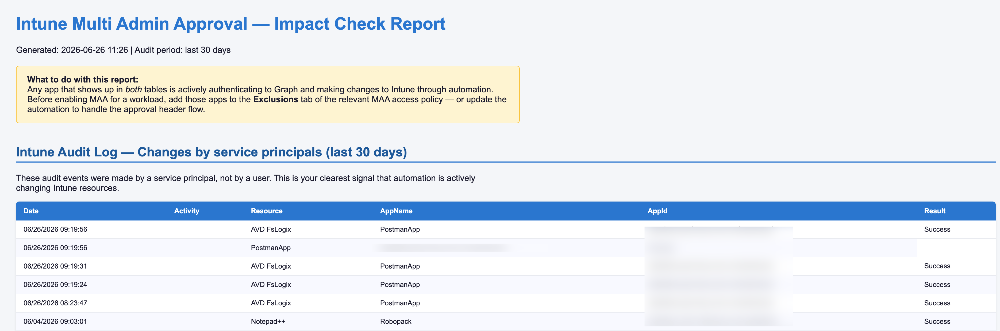

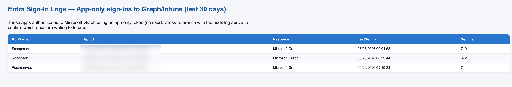

## How to exclude an app from MAA

In the [Intune admin center](https://intune.microsoft.com):

1. Go to **Tenant administration** → **Multi Admin Approval** → **Access policies**
2. Open the policy for the workload you want to protect
3. Go to the **Exclusions** tab
4. Add the service principal (by app ID or display name)
5. Save — note that this change itself requires a second admin to approve

The exclusion only applies to app-authenticated calls from that specific service principal. Human admins working in the portal still go through the MAA flow. Best of both worlds.

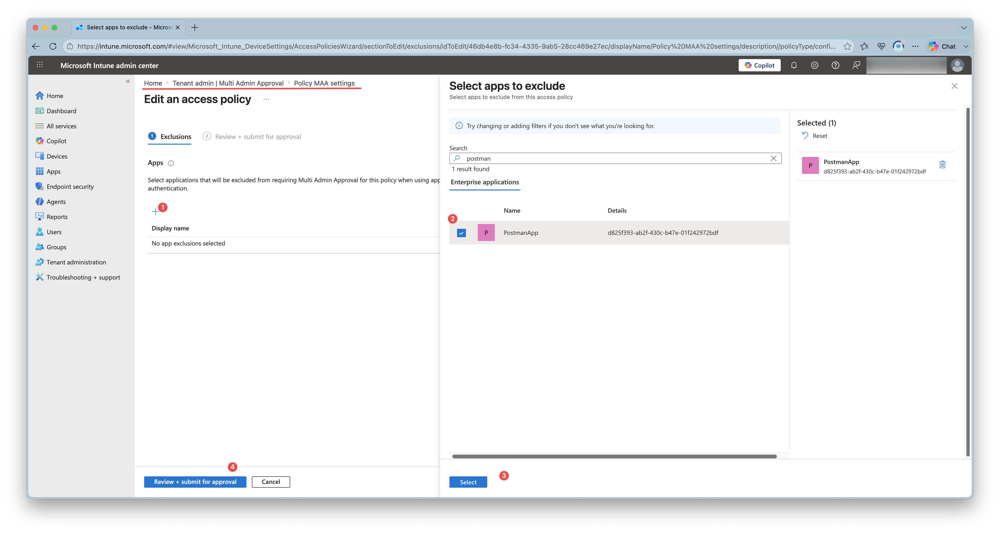

### After excluding an app
After following the Multi Admin Approval process and excluding the application, the workflow should work again.
In this screenshot below, I ran exact the same process as before, but this time I excluded the Postman app from MAA. The audit log shows that the same call now succeeds.

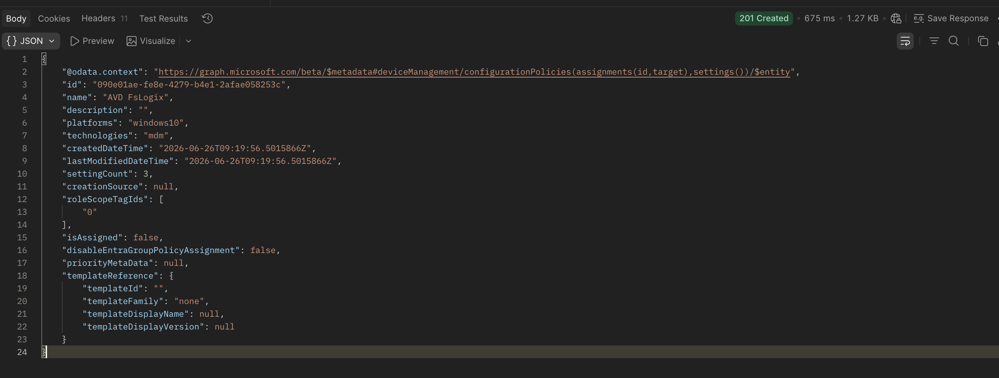


## Wrapping up

MAA is a good security feature. Requiring a second pair of eyes on Intune changes makes sense, especially for sensitive workloads like scripts and RBAC. But without preparation it will silently break your automation.

The key steps:

1. Run the script and look at what is writing to Intune through automation
2. Decide which apps to exclude from MAA before enabling it
3. For automation that should go through MAA, update it to handle the approval header flow
4. Enable MAA per workload, starting with the least critical ones

Don't find out the hard way when a deployment pipeline fails at 2AM. Check first.

## Intune Assistant
If you are using Intune Assistant, you can also check the Intune audit logs page to see which service principals are making changes. The audit log shows the actor for every change, and you can filter on "Application" to see only service principals. This is a quick way to spot automation that will be affected by MAA.

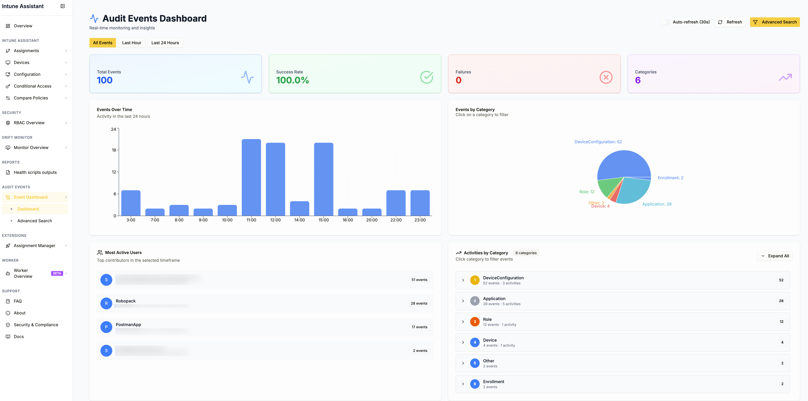

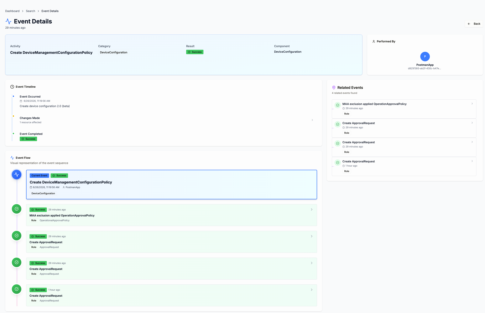


You can download the script from my GitHub repository: [Check-AppsForMAA.ps1](https://github.com/srozemuller/IntuneAutomation/tree/main/Check-AppsForMAA)
Go to Intune Assistant [https://community.intuneassistant.cloud](https://community.intuneassistant.cloud) 

For more information about Multi Admin Approval, see the Microsoft documentation: [Multi Admin Approval for Graph API](https://learn.microsoft.com/en-us/intune/fundamentals/role-based-access-control/multi-admin-approval-graph-api)


