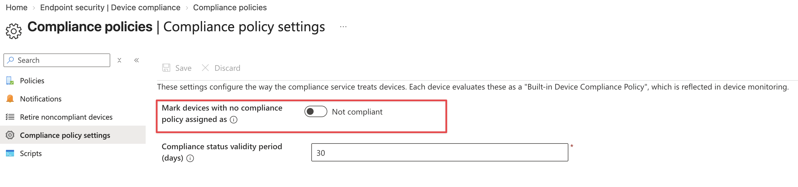
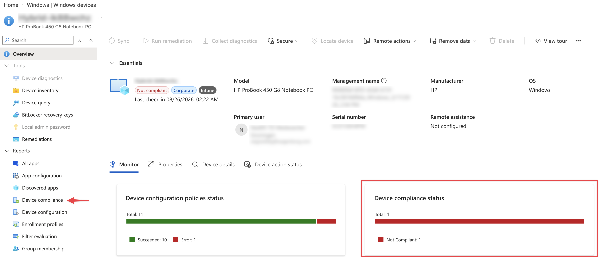
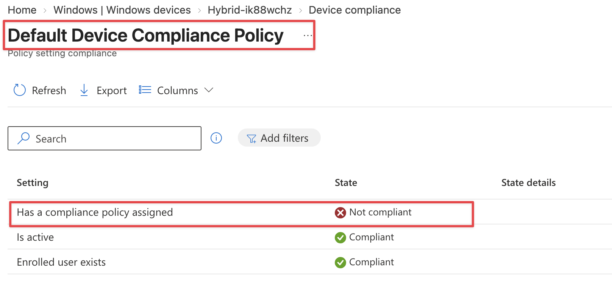
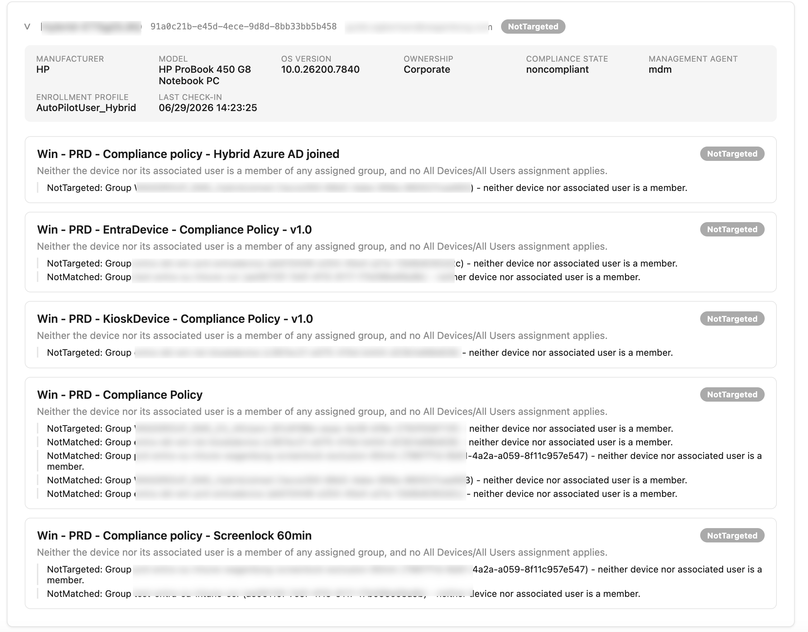
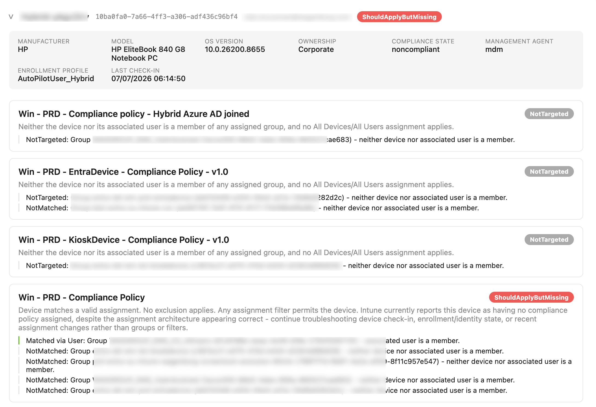
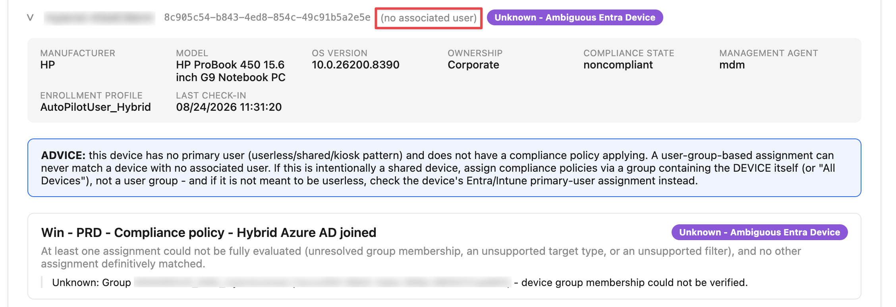

A while ago I was checking an Intune environment when I noticed a Windows device marked as `Not compliant`.
Nothing special so far. A device can become noncompliant for many reasons.

Maybe BitLocker is disabled. Maybe Microsoft Defender isn't healthy. Maybe the Windows version doesn't meet the requirements.

But this device was different.

When I opened the compliance details, none of the configured Windows compliance settings were causing the problem. Instead, the device failed the **Default Device Compliance Policy**.
Because of that policy the device was telling me, I don't have a compliance policy at all. 

In this blog, I tell more about how to troubleshoot and analyze in an automated way why a device felt of the radar and why the Default Device Compliance kicked in.



# Why Does This Intune Device Have No Compliance Policy Assigned?
As mentioned, I had devices that where not compliant because of not having a compliance policy. And that immediately changed the question.
The device wasn't failing a compliance setting. The device wasn't receiving a compliance policy at all.

The tenant was configured with a default compliance policy with the setting:

**Mark devices with no compliance policy assigned as = Not compliant**

This is exactly how I want it configured. If Intune has never evaluated a device against one of the compliance policies, I don't want that device to become compliant by default. 

But the setting and its effect, only tells me that there is a problem.

It doesn't tell me **why this particular device has no compliance policy assigned**.

And that scenario turned out to be a surprisingly difficult question to answer from the Intune portal.

The first reason for that was because this tenant was quite new for me, so I to needed dig. 
The second reason, the portal doesn't give me a clear answer. It only tells me that the device is not compliant because it has no compliance policy assigned. But it doesn't tell me why.


## What does the tenant compliance setting actually do?
Before troubleshooting the device, it helps to understand what this tenant wide setting does.

You can find it in the Intune admin center under:

**Endpoint security > Device compliance > Compliance policy settings**

There you will find:
**Mark devices with no compliance policy assigned as**

The default value is `Compliant`.

With that configuration, a device that isn't reached by any compliance policy can still be considered compliant.
That behavior has always felt a little strange to me.

If a device hasn't received one of the compliance policies, Intune hasn't evaluated the device against the security requirements I configured in those policies.

Changing the setting to `Not compliant` changes that behavior.

A device without an assigned compliance policy is now considered noncompliant.



You can find more information about this setting in the Microsoft documentation: [Configure default device compliance policy settings](https://learn.microsoft.com/en-us/intune/device-security/compliance/overview#compliance-policy-settings).
Microsoft also recommends this configuration when compliance is used with Conditional Access, because it prevents a device without an assigned compliance policy from simply being treated as compliant.

And that is exactly what happened in my case. The device didn't fail BitLocker. It didn't fail Defender.  It didn't fail because of its Windows version.

It failed before any of those settings even became relevant.

**No compliance policy reached the device.**

That is an important difference.

## The Default Device Compliance Policy gives us the first clue

When I looked at the device compliance status, Intune showed:





Intune is actually giving us a useful clue here.

The problem is not inside one of the configured compliance policies. The problem is coverage.
But this is also where the information stops.

Intune tells me that the device doesn't have a compliance policy. It doesn't tell me why.
I know there are Windows compliance policies in the tenant. So the next question becomes:

**Why doesn't one of those policies reach this device?**

That is where the troubleshooting starts.

## Finding the reason manually
For one device, you can investigate this from the portal.
The first step is checking the Windows compliance policies in the environment and looking at their assignments.

A policy could be assigned to `All Users`, `All Devices`, an Entra ID user group or an Entra ID device group.

From there, you need to work out whether the assignment should include the affected device.

If the policy is assigned to a user group, you need to know which user is associated with the device. You then need to check whether that user is actually a member of the assigned group.
If the policy is assigned to a device group, you need to find the Entra device object and check its group membership.

With `All Users` or `All Devices`, the assignment looks much easier.

But even then, you are not done.

## Assignment filters can completely change the result

Imagine a compliance policy with this assignment:

`Windows Corporate Compliance - Assignment: All Devices - Filter: Corporate Windows Devices`

At first sight, I would expect that policy to reach every device. But `All Devices` is only part of the assignment.
The filter also needs to match. 

Imagine the filter contains a rule that only includes corporate devices:

`device.deviceOwnership = Corporate`

If the affected device is registered as `Personal`, the result changes completely.

The policy targets `All Devices`, but the assignment filter removes this particular device from the effective assignment.

The policy exists. The assignment exists. The device is still not covered.

Without checking the complete assignment, that can be easy to miss.

## Group assignments add another layer

Now imagine the compliance policy is assigned to:
`Intune Windows Users Group`

To determine whether that policy should apply, I first need to know which user is associated with the device.
Then I need to check whether that user is a member of the group.

Maybe the user was never added. Maybe a dynamic group rule changed. Maybe the user was removed.
Or maybe this is a shared device without a primary user.

In that situation, a user based assignment might not provide the coverage you expected.

The same applies to device groups.

I need to find the correct Entra device object, check the group membership and determine whether the device is actually included in the group used by the compliance policy.
None of those checks are particularly difficult.

The problem is that I need to collect the information from several places and connect it myself. Imagine you have a lots of compliance policies and a large number of devices. The process becomes time consuming and error prone.

## Exclusions make the assignment even more interesting
Then there are exclusions.

Imagine this assignment:
`Included: All Devices - Excluded: Intune Compliance Exceptions Group`

At first sight, the device should be covered because the policy targets `All Devices`.
But if the device is also a member of the exclusion group, the policy doesn't apply.

Maybe that is intentional. Maybe the device was temporarily added to an exception group during troubleshooting and nobody removed it afterwards.

For the result it doesn't matter.
The device is outside the compliance policy.

So when investigating one device manually, I need to check the policy assignment, group membership, exclusions and assignment filters before I can explain why the policy doesn't apply.

And then I need to repeat that process for every Windows compliance policy, for every device. 

## The problem isn't finding the data
At this point the actual problem became clear.

The information is there. Intune knows the device. Intune knows the compliance policies. Entra knows the users, devices and groups. The assignments are known. The exclusions are known. The filters are known.

What is missing is the connection between all those pieces of information.
What I really want is Intune to tell me:

> This policy doesn't apply to this device because of this reason.

That is exactly the kind of problem where automation becomes useful.

## Automating the investigation
So I created a PowerShell based analyzer.

The goal isn't to replace Intune compliance and it isn't another compliance scanner.
I am not trying to determine whether BitLocker is enabled or whether Defender is healthy.

The analyzer starts with one very specific question:

> Why doesn't this device have a compliance policy?

This is where the Microsoft Graph API backend comes in. Graph is used to collect the information needed to answer that question.

At a high level, the process looks like this:
`Device without compliance policy -> Determine platform -> Get compliance policies -> Evaluate assignments -> Check exclusions -> Evaluate assignment filter -> Explain result`

The current version focuses on Windows devices.
For each Windows compliance policy, the analyzer determines whether the assignment targets the device or its associated user. It then checks whether an exclusion applies and whether an assignment filter changes the effective targeting.

The important part is what happens after those checks.

The analyzer doesn't just return `True` or `False`.
It explains **why** a policy does or doesn't apply.

## Turning assignments into something useful
Imagine the device isn't included by any assignment. Instead of only telling me that the policy doesn't apply, the analyzer can return something like:
`Policy: Windows User Compliance - Result: NotTargeted - Reason: Neither the device nor the associated user is a member of the assigned group`



That immediately tells me where to look.
Now I don't need to open every policy, inspect every assignment and manually check all the related Entra groups.

The analyzer has already followed that chain for me.

## ShouldApplyButMissing changes the investigation completely

There is another result that I find even more interesting.
Imagine the analyzer evaluates a device and sees this:

`Assignment: MATCH - Exclusion: NO MATCH - Assignment filter: MATCH`


Based on the configuration, the compliance policy should reach the device.

But remember why the analyzer is checking this device in the first place.

Intune reported the device as having **no compliance policy assigned**.
That creates a special analyzer result:
`ShouldApplyButMissing`

This isn't an Intune compliance state. It is a conclusion from the analyzer.

And it changes the troubleshooting direction completely. The assignment architecture appears to be correct. Changing group membership or rewriting assignment filters probably isn't where I should start.
Instead, I can start looking at things such as device check in, enrollment state, device identity, stale objects, recent assignment changes or the Intune policy evaluation process itself.

That saves time because it tells me which part of the problem I can stop investigating.

## Don't guess when the information isn't reliable

There is also an `Unknown` result.


I think that one is important.

Automation becomes dangerous when a script gives a confident answer while the underlying information isn't conclusive.

For example, the analyzer might not be able to uniquely resolve the correct Entra device object. There could be multiple objects related to the same device identity, or part of the assignment might not be evaluated reliably.
In that situation I don't want the analyzer to return: `NotTargeted` because that would suggest we know something we don't actually know.

Instead it returns: `Unknown` together with the reason.
The goal is to automate the investigation.

Not the guessing.

## Troubleshooting a single device

When I am investigating one device, I can run the analyzer directly against that managed device.

For example:

```powershell
.\Test-IntuneCompliancePolicyCoverage.ps1 -DeviceName "WIN11-001"
```

The script retrieves the device, determines the platform and evaluates the Windows compliance policies against that device.
For every policy, I get the result together with the explanation. That already removes a lot of portal clicking.
But while building the analyzer, I realized something else. Troubleshooting one device is only half of the story.

Intune already knows which devices have this problem.

## Intune already has the population we need
There is an organizational report called **Devices without compliance policy**.

You can find it under:
**Reports > Device compliance > Reports > Devices without compliance policy**

This report gives exactly the population I am interested in. Instead of giving the analyzer one device, I can therefore also let it retrieve all devices from that report.
The command below schedules the report, waits till it is ready, downloads the result and evaluates every Windows device in that report.
```powershell
.\Test-IntuneCompliancePolicyCoverage.ps1 -AllDevicesWithoutCompliancePolicy
```

Now the use case changes. I am no longer troubleshooting one incident. I am analyzing compliance policy coverage across the environment.

For every Windows device returned by the Intune report, the same assignment analysis is performed.
That means I can move from a result like: `73 devices don't have a compliance policy` to something much more useful:

```basic
17 devices are not targeted
3 devices should receive a compliance policy but don't
Several devices require further investigation
```

The Intune report tells me **which devices have no compliance policy**.
The analyzer adds the missing part:

**Why?**

## Creating a report I can actually work with
Console output is fine when I am checking one or two devices. It becomes less useful when I want to review an entire environment.
That is why the analyzer can also generate an HTML report.

```powershell
.\Test-IntuneCompliancePolicyCoverage.ps1 -AllDevicesWithoutCompliancePolicy -ExportHtml
```

The HTML report gives an overview of the affected devices and lets me drill into the policy evaluation for each device.
I can see the device name, associated user, manufacturer, model, operating system version, ownership, enrollment information and last check in.

More importantly, I can see the result for every evaluated Windows compliance policy and the reason behind that result.
If a policy returns `NotTargeted`, I can see why.
If it returns `Excluded`, I can see which part of the assignment caused it.
If an assignment filter removes the device, that becomes visible.
And if the configuration says the policy should apply but Intune still reports no compliance policy, `ShouldApplyButMissing` immediately stands out.

That is the information I want when troubleshooting. Not another page with a red status.

I want to know why it is red.

## From troubleshooting to monitoring
This is also where the tenant wide setting becomes much more interesting.

I originally configured:
**Mark devices with no compliance policy assigned as = Not compliant**
because I don't want a device with an unknown compliance state to become compliant by default.

But that setting also creates a useful monitoring signal.
If something breaks in the compliance targeting architecture, the device becomes visible.

Maybe a user falls out of a group. Maybe a device group changes. Maybe somebody adds an exclusion. Maybe an assignment filter stops matching. Maybe a shared device depends entirely on user based targeting.
Or maybe the assignment looks completely correct but Intune still isn't applying the compliance policy.

All of those situations can eventually result in a device appearing in the **Devices without compliance policy** report.
That means I don't have to wait until somebody happens to notice a noncompliant device in the portal.
I can actively watch for changes in compliance coverage.

## Monitoring compliance coverage automatically
The analyzer supports running with an access token instead of requiring an interactive sign in.
That makes it possible to run the same analysis from an automation platform.
For example, the script could run daily from Azure Automation, an Azure Function, a scheduled PowerShell job or another automation platform.

The process is straightforward.
- Retrieve the **Devices without compliance policy** report.
- Analyze the devices.
- Store the result.
- Then compare it with the previous run.

Imagine yesterday's result looked like this: `Devices without compliance policy: 0`

And today's result suddenly looks like this: `Devices without compliance policy: 4 - 3 NotTargeted - 1 ShouldApplyButMissing`
Now I have something actionable.

I know the compliance coverage changed.
I know which devices are affected.
And I already have an indication of where the problem is.

Because the output can also be exported as HTML, JSON or CSV, the result can be stored, compared or processed by another system.
At that point, compliance coverage is no longer something I occasionally inspect in the portal.

It becomes something I can monitor.

## Compliance starts before the settings are evaluated
Most conversations about device compliance focus on the settings inside the compliance policy.

Is BitLocker enabled?
Is Microsoft Defender active?
Does the device meet the minimum Windows version?

Those settings are important.
But none of them matter if the device never receives the compliance policy.
You can build the best compliance policy in the world, but it doesn't protect anything that falls outside its assignment.

That is why I see:

**Mark devices with no compliance policy assigned as = Not compliant** as more than just another tenant setting. It is a compliance coverage guardrail.
If something in your targeting architecture breaks, the device doesn't silently disappear from compliance evaluation while still being considered compliant.

It becomes visible.

Intune already tells me **which** devices have no compliance policy.
With PowerShell and Microsoft Graph, I can also find out **why**.

And once that answer can be automated, moving from troubleshooting to continuous monitoring is only a small step.

You can find the analyzer script on GitHub: [Intune Compliance Policy Coverage Analyzer](https://github.com/srozemuller/IntuneAutomation/tree/main/IntuneCompliancePolicyCoverageAnalyzer)

