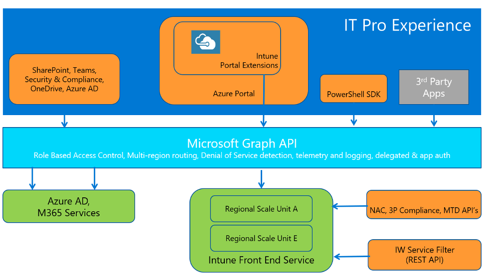
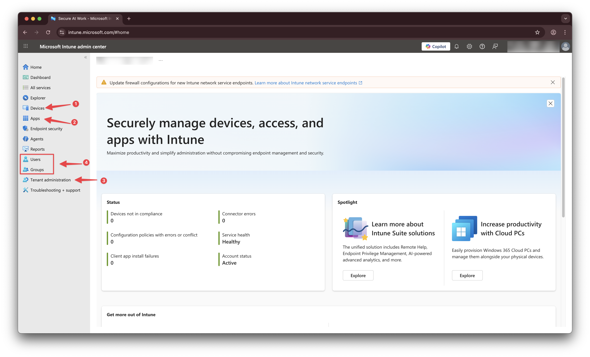
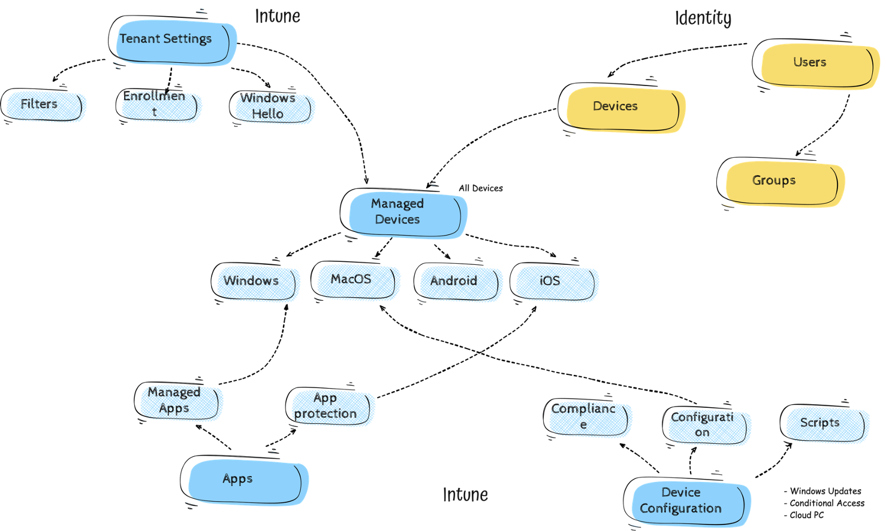
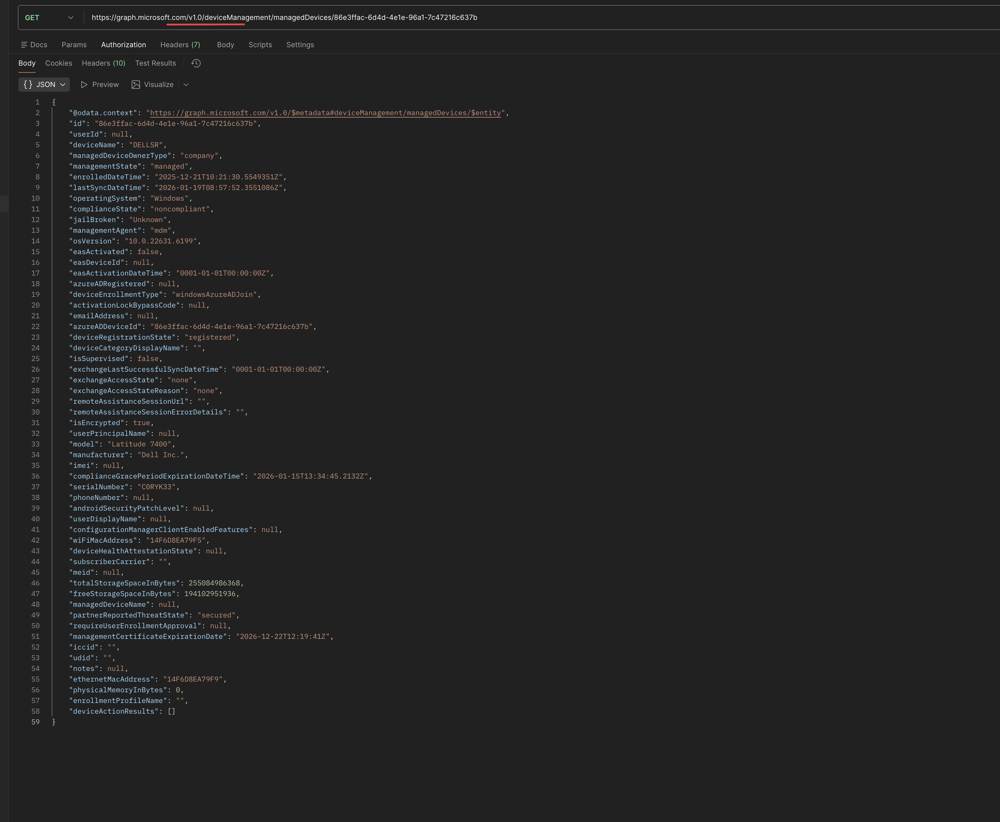
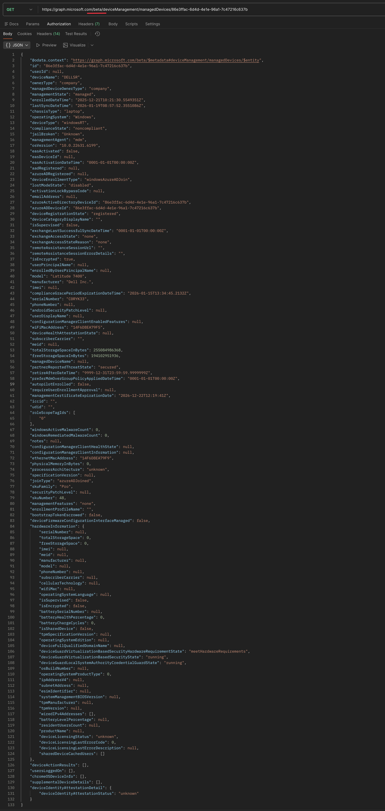

When I started working more seriously with Intune, one thing became clear fairly quickly.

Intune is a solid product. It’s powerful, flexible, and allows you to manage a wide range of settings from a single place.

At the same time, Intune is made up of a lot of moving parts.

Applications, policies, assignments, devices, identities — all with their own configuration options and dependencies. And once your environment grows, it becomes increasingly difficult to keep a complete overview of how everything fits together.

What’s configured today might not be what’s configured tomorrow.  
Settings evolve, new features are added, old options change or disappear. Endpoints move forward continuously, and your Intune environment moves with them — whether you actively manage that change or not.

That’s where blind spots start to appear.

Not because something is broken, but because it’s hard to see everything at once, and even harder to notice when things slowly drift away from what you intended.

To really stay in control of an Intune environment, you need to look at it from different angles:
- how things are configured
- how they are assigned
- how they change over time

And that’s where automation comes in.

Not as a replacement for the portal, but as a way to observe, verify, and control an environment that is constantly moving.

This post, part of a big Intune automation series, starts from the beginning on how to start that automation journey.

Think of this as the **first sip** in an Intune automation tasting.  
No rush. Just getting familiar with the landscape before we start shaping it.





## Goal

Before going any further, it helps to be clear about what this post is — and what it is not.

By the end of this first part, I don’t expect you to write automation or remember Graph endpoints.  
The goal is much simpler.

I want you to have a clear mental picture of how the Intune portal works behind the scenes, and how Microsoft Graph fits into that picture.

Once that clicks, everything else in this series becomes much easier to place.

## Why this series starts here

Many automation guides jump straight into scripts, permissions, and authentication.

This series deliberately starts earlier, with one simple question:

**What is Microsoft Graph, and how does it relate to Intune?**

Once that clicks:
- permissions start to make sense
- authentication becomes logical
- automation stops feeling intimidating

## Starting from what you already know: the Intune portal

If you work with Intune today, the portal is your starting point.

You create applications, configure policies, assign them to users or devices, and click **Save**. From an admin perspective, that *is* Intune.

What’s easy to forget is that the portal itself doesn’t actually do any of that work.

Every action you take in the portal results in data being sent somewhere, stored somewhere, and processed somewhere else. The portal only triggers that process.

So the interesting question becomes: *where does that work actually happen?*

## The portal is not the engine

Although it often feels like the portal is “doing the work”, it really isn’t.

The Intune portal:
- doesn’t store your configuration
- doesn’t enforce settings on devices
- doesn’t decide who is allowed to do what

It’s the interface.  
A dashboard that translates clicks into actions.

The real work happens behind it.

## Microsoft Graph: where Intune actually lives

Behind the Intune portal sits **Microsoft Graph**.

Microsoft Graph is Microsoft’s unified API platform. It’s where data lives and where actions are executed for many Microsoft services — users, groups, devices, security, and also Intune.

When you create a configuration policy in the portal, the portal sends a request to Microsoft Graph.  
When you assign an application, another request is sent.  
When you open a device, yet another request goes out.

The portal doesn’t make decisions on its own.  
It simply translates what you do into **Graph API calls**.

Automation works exactly the same way — just without the portal in between.

In the image below, you see the Intune portal on the top dark blue block, Microsoft Graph in the middle light blue block, and all services are below in the green blocks.

Source: Microsoft

## Breaking Intune down into its core parts

To make this easier to reason about, it helps to simplify Intune a bit.

At a high level, almost everything (from my opinion) in Intune revolves around the following core building blocks that all routes to the same destination, `managed devices`.

### Why this matters for automation

When people first hear “automate Intune with Microsoft Graph”, it’s easy to think in very broad terms: *“Just call Graph.”*

In practice, automation is much more deliberate than that.

Every automation task starts with a simple question:
*Which part of Intune am I working with?*

From there, you determine:
- which resource type you need
- which Graph path exposes that resource
- which operations are supported

Automation isn’t about knowing every endpoint by heart.  
It’s about understanding **how Intune is structured inside Microsoft Graph**, so you can find the right place to look.

That mental model is what allows automation to stay predictable and maintainable — and it’s something we’ll keep building on throughout this series.

### Devices (Intune, 1)
Devices are the targets. Managed devices, compliance state, configuration state, inventory — these are all represented as device objects in Graph.
When you check device status or troubleshoot a device in the portal, you’re viewing data that comes straight from Microsoft Graph.

### Applications (Intune, 2)
Applications are what you deploy and manage. Installation, configuration, updates, and assignments all live in Graph endpoints related to applications.
Whenever you work with apps in the portal, you’re interacting with application-related objects in Microsoft Graph.

### Tenant wide settings (Intune, 3)
These are the global settings that affect how Intune behaves across the entire tenant. They include configurations like enrollment restrictions, enrollment profiles and assignment filters for example.

### Identity (Entra ID, 4)
For completion, I also added Identity, that ties everything together (from Intune (managed device) to a device and the user that logs in on that device).
Users, groups, assignments, and permissions determine who receives what, and who is allowed to manage what. Identity is also what determines whether an action is allowed in the first place.
Without identity, nothing in Intune can be assigned or controlled.

Almost everything you do in the Intune portal touches one or more of these areas.  
Seeing Intune through this lens makes automation far less abstract.

In the schematic overview below, you can see how these core parts relate to each other within Intune. All core components route to the `managed devices`. It doesnt matter what you do, in the end, you assign it to `All Users`, `All Devices,` or `Entra ID Group`. Configuration always ends on a device.   

I know it’s a simplification an not every single component is in the schema. But it helps to see the big picture first.

## Microsoft Graph is not one API, or better, its not just one environment
As we splitted the Intune portal into core parts, it helps to do the same for Microsoft Graph.
Despite the name, Microsoft Graph is not a single, monolithic API.
Microsoft Graph is best thought of as a **gateway** with the main entrypoint `https://graph.microsoft.com`.   
A single main entry point that gives access to many different Microsoft services, each with their own data and behavior.

Intune is one of those services.

When you send a request to Microsoft Graph, you are not “talking to Graph” in a generic sense. You are asking Graph to route your request to the correct service and resource behind it.
That’s an important distinction, especially when you’re new to automation.

### To Beta or not to Beta
As mentioned above, Graph is a gateway to many services. But there is more to it. Microsoft Graph has two main API versions:
- `v1.0` (Generally Available)
- `beta` (Preview)

The `v1.0` version is the stable, production-ready version of Microsoft Graph. It contains features and endpoints that are fully supported for use in production environments.
The `beta` version, on the other hand, is where new features and endpoints are introduced for testing and evaluation. These features are not yet fully supported and may change or be removed in future releases.

However you would expect v1.0 to be the default version to use, but for Intune, many features and endpoints are only available in the `beta` version of Microsoft Graph. 
For example, just some managed device information. Since the `beta` is used by the portal, I used for this example `Postman` to show the difference between `v1.0` and `beta` for managed devices. (Getting data from Graph will be discussed in the next parts of this series).

`v1.0` request:

`beta` request

As you can see, the `v1.0` request has way less information than the `beta` request.

### One platform, many resource types

Within Microsoft Graph, everything is exposed as a **resource**.  
Users are resources. Devices are resources. Applications are resources. Intune policies are resources, even the assignments you create are resources at itself that are connected to a policy.

Each type of resource has:
- its own structure
- its own rules
- its own set of operations

This is why Graph consists of many endpoints rather than one.

From an Intune perspective, those resources map closely to the core building blocks we discussed earlier: **Applications, Devices, and Identity**.

Each of those building blocks has its own area within Microsoft Graph.

### How Intune is organized in Microsoft Graph

To keep things manageable, Microsoft Graph groups related Intune resources under specific paths.

For Intune-specific configuration and device management, most endpoints live under:

- `/deviceManagement/`  
  This includes configuration policies, compliance policies, managed devices, scripts, remediation, enrollment restrictions, assignment filters, and other tenant-wide Intune settings.

Application-related resources are grouped separately under:

- `/deviceAppManagement/`  
  This is where you’ll find endpoints for applications, app assignments, and app configuration.

So when you click around in the Intune portal, most of what you do maps to one of these two paths in Microsoft Graph.  
Example, when you want to show the devices in the portal, that action corresponds to a request sent to the `https://graph.microsoft.com/beta/deviceManagement/managedDevices` endpoint in Graph.
These two paths cover the area's of “Intune configuration”.

### Where identity fits in

Identity is the third core building block, and it’s slightly different.  
Users and groups are not Intune-specific resources. They belong to `Entra ID` (other Microsoft service) and are therefore exposed through the main Microsoft Graph paths, such as:

- `/users/`
- `/groups/`
- `/devices/`

Intune relies heavily on these identity resources for assignments, targeting, and access control, but it doesn’t own them.

That’s why automation often involves **multiple areas of Graph at the same time**:
- Intune endpoints for configuration
- Identity endpoints for correct identity information to target and scope correctly

## How the portal and Graph API are tied together
The Intune portal and Graph API are two separate worlds. The portal is the user interface (UI), while Graph is the backend engine.

What the portal does is actually very straightforward.  
Every action you perform in the UI results in an HTTP request being sent to Microsoft Graph. Depending on the action, that request uses a `GET`, `POST`, `PATCH`, or `DELETE` operation against a specific Graph endpoint.

Creating a policy, updating a setting, assigning an application — they all follow that same pattern.

Automation works in exactly the same way.
The only difference is that instead of the portal sending those HTTP requests for you, your script or application does it directly. There are no hidden features or special automation endpoints involved. It’s the same backend, the same APIs, and the same rules.

That also means that anything capable of sending authenticated HTTP requests can interact with Intune in the same way the portal does. Think about PowerShell, Graph Explorer, Postman, or any programming language with HTTP capabilities.

In fact, you’re not learning a new system. You’re learning how to interact with the one you already use — just without clicking through the UI.

## What to take away from this first sip

You don’t need to remember endpoints or API versions yet.

Just remember this:

- Intune runs on Microsoft Graph.  
- The portal is one way to interact with it. Automation is another.

That’s enough for now.

## What’s next

In the next post, we’ll take the next small step. Mapping the Intune portal to Graph endpoints in more detail, and exploring how to read data from Intune using automation.

For now, enjoy the first sip. Every good automation journey starts slow 🍺  
The rest of the series can be found here:





