In the first sip we landed on the most important mental model for Intune automation: the portal is a UI, Graph is the engine. Every click you make in Intune ends up as an HTTP request to Microsoft Graph. If you can read those requests, you can reproduce them, although the most of them. If you can reproduce them, you can automate them.

This part is about how the communication. How the portal interacts with the API backend. In good communication you have a sender and a reponder. Someome sends, reciever answers. The interaction between the Intune portal and the Graph API backend isn't different in these. 
Someone clicks in the portal and sends a request, API answers. 

In this part we zoom in into that process, no PowerShell yet. Not SDKs yet. Just the protocol you are always using, even when you are “just clicking”.
Maybe it sounds a bit boring, but understanding this process is super important for creating automation in later steps. For me, it is also the first step towards automation. Understanding the process and know every single detail around it. 

## REST Methods (Sender)
Microsoft Graph is a REST API. That mostly means you interact with resources, using standard HTTP methods, by sending and receiving JSON.

From an Intune perspective, a resource is usually one of these things:

- A device compliance policy
- A configuration profile
- A managed device
- An application
- An assignment to one main resource
- A role assignment
- A template, a setting catalog instance, an endpoint security policy, and so on

The method you choose tells Graph what you want to do with the resource.

`GET` means read, the by far the most used request method;
`POST` means create, every time you create something in Intune this method is used;
`PATCH` means update part of an existing object, example changing a name, or add a setting to a policy;
`PUT` means replace, not used very often in Intune;
`DELETE` means delete, doesn't need more explanation I guess.

Except the `GET` request all other requests are resource specific. That means that you have to provide the full location in the API request. Examples will follow. 
A `GET` request can do both, requesting a single resource as aslo requesting at a higher level. Think about going to the configuration policy page in Intune and see all the policies.

A request is always the same set of building blocks

No matter if you use Graph Explorer, Postman, curl, PowerShell, or the Graph SDK, every request has the same ingredients.
A URL, An HTTP method, Headers, and optional a body (for POST, PATCH, sometimes PUT)

For Intune, the URL almost always starts in one of these two places:

https://graph.microsoft.com/beta/deviceManagement/...
https://graph.microsoft.com/beta/deviceAppManagement/...

That split matters. Microsoft Graph API is not one API, its a huge web with lots of lines and endpoints.

### HTTP GET requests
As mentioned, every click is a HTTP request to the Graph API backend. The most used action is `GET`.
Lets start exploring yourself, start with something safe: read compliance policies.
To follow the process, open your favourite browser and then open DEV tools. 

In my example, I use Microsoft Edge and then use the F12 button. 
You should see something similar like the sceenshot below:

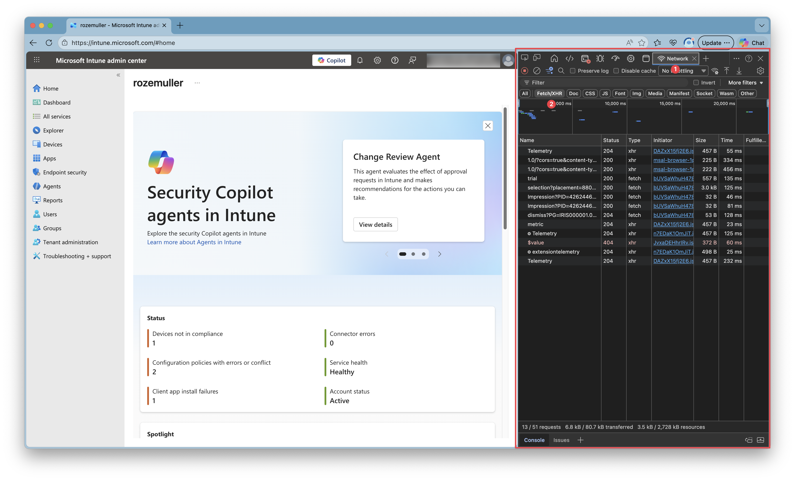

The normal page on the left, and the dev tools on the right. Then go to the network tab (1). To keep a clear view as possible set the filter to show only `fetch` requests (2).

Then go to the compliance policies and see what happens. A long list with requests shows up. Yes you need a bit experience to filter our the correct requests, but you will learn fast. 

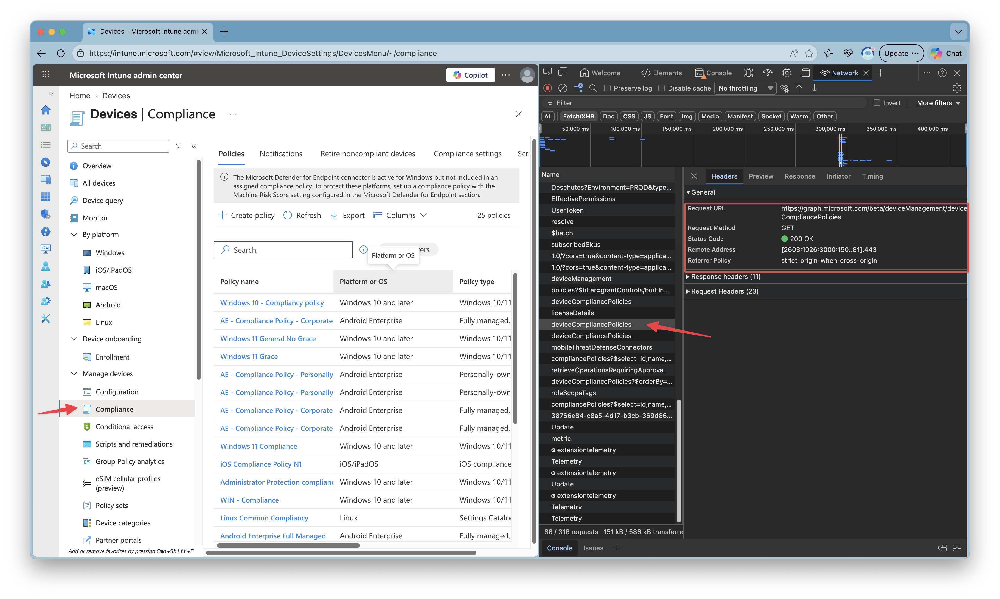

You see the raw HTTP request, what looks like this:

```http
GET https://graph.microsoft.com/v1.0/deviceManagement/deviceCompliancePolicies
```
And the response is JSON, typically with a value array. See the screenshot below. I picked the request, and opened the response tab. There you see an array with the policies where I opened one of them. 

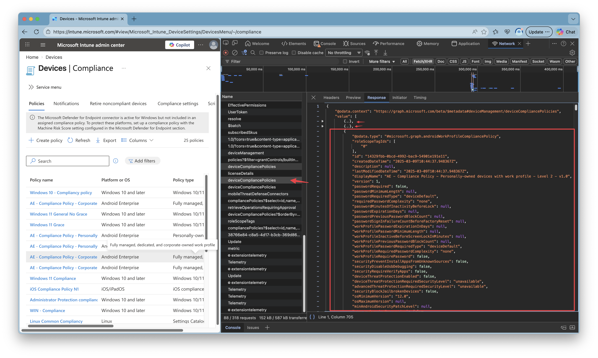

### HTTP POST requests
Now lets step furhter to `POST` request. This is the moment you are going to do things where POST is the type where you create new resources.
A POST request sends most of the time the root endpoint like `https://graph.microsoft.com/v1.0/deviceManagement/deviceCompliancePolicies` and always needs a body, aka the payload. So what you actually say is create a resource with the parameters provided in the body. 
A body often contains, a displayname and settings. 

The POST request basicly looks like below.
```http
POST https://graph.microsoft.com/v1.0/deviceManagement/deviceCompliancePolicies

Authorization: Bearer <access_token>
Content-Type: application/json

{ ... JSON payload... }
```

The payload is the part you normally build through the portal UI.
In the portal, you fill out fields. Under the hood, you are just constructing JSON.

Let me make it clear using the screenshots belo. I create a simple Intune compliance policy with a displayname and just some random settings (so dont blame me for the configuration). 

After providing a display name first, the wizard goes to the settings. 
I numbered the settings, keep them in mind, so we can map them to the JSON body later. 

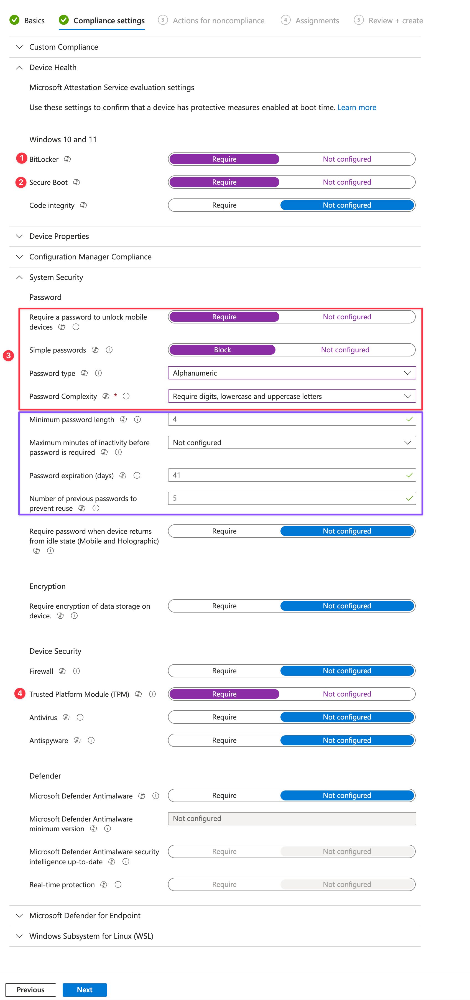

After walking through the wizard and reviewing the policy you click on `create`. By clicking on create, a `POST` request is send to the Graph API. 
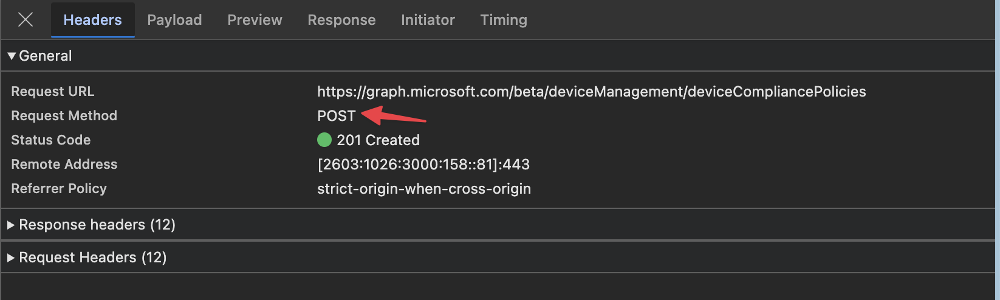. 

This is also the point where `portal-magic` happens. 
Lets take a look at the body that is send. To see that body, go to the `payload` tab.

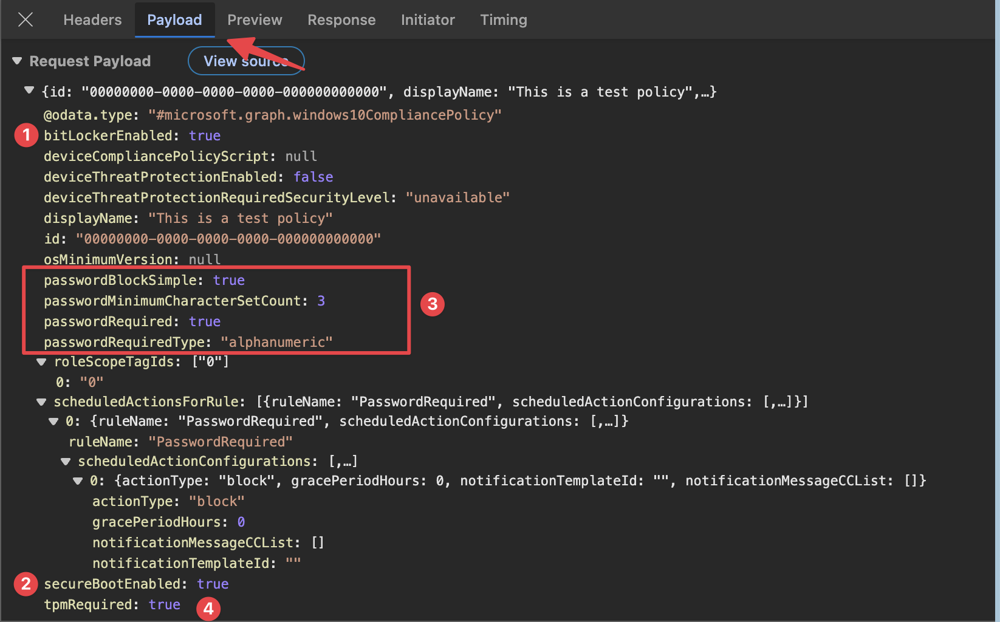

1) Bitlocker: the portal shows `Bitlocker Require`, where the API body uses `BitlockerEnabled`
2) SecureBootEnabled: almost the same at the Bitlocker part, its saying `SecureBoot Require` where the API uses the name `SecureBootEnabled`
3) Password part: this one has more objects as you can see in the red box. The first thing is `Require a password to unlock mobile devices` with `Rquired`, where the API body say `PasswordRequired`. 
The next thing is the `Password type` where I say `Alphanumeric`, where the API body uses `PasswordRequiredType` with the same value.

The we go to `Password complexity`. I say `Require digits, lowercase and uppercase letters`. The API body uses a number now under the property `passwordMinimumCharacterSetCount`.

This is where the portal comes in, it translates the values you see into values the API needs. Sometimes `Require` changes to a boolean `true` or `false` but also values can be a number. 

But there is more. In the case of password settings a lot more settings become available. I didn't touch them where the portal keeps the default settings. Thats the purple box. 
As you can see in the body, those default values are not sent. 

4) At last we have `TPM Require` that is a boolean again. 

As you can see, what you see is not always what you get. 

For now I kept it basic with a next-next-finish deployment. 
In basic these Intune resources are simple objects. Others are typed objects with nested setting instances, or template references.

When you also want to add assignments, you have to create the policy first and then the assignments must be created separately afterwards.

Graph does not hide that complexity for you. The portal does.

### HTTP PATCH requests
PATCH requests is what “edit and save” turns into.
You do not resend the entire policy. You send only what you want to change.

In difference with `GET` or `POST`, the `PATCH` request type needs always a specific endpoint. Meaning, you have to send an ID as well. 

In the example below, a compliance policy display name is changed. 
```http
PATCH https://graph.microsoft.com/v1.0/deviceManagement/deviceCompliancePolicies/<policyId>
Authorization: Bearer <access_token>
Content-Type: application/json

{
"displayName": "Not so test policy anymore"
}
```

Let's take a look on how this looks like in the portal.
I've opened the above created policy and changed the displayname. 

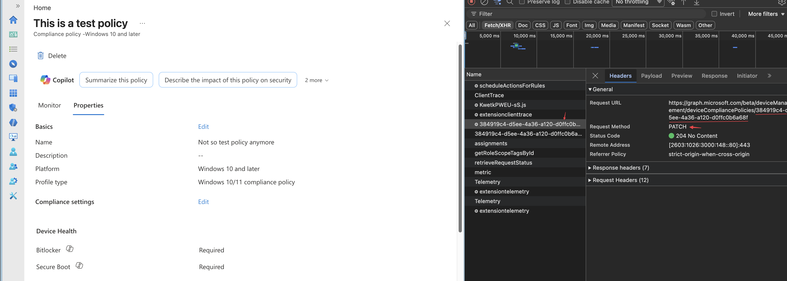

As you can see, a `PATCH` request is send using the main api endpoint and the policy ID. 
When looking into the payload, you will see the portal send the whole policy again with the correct settings. 

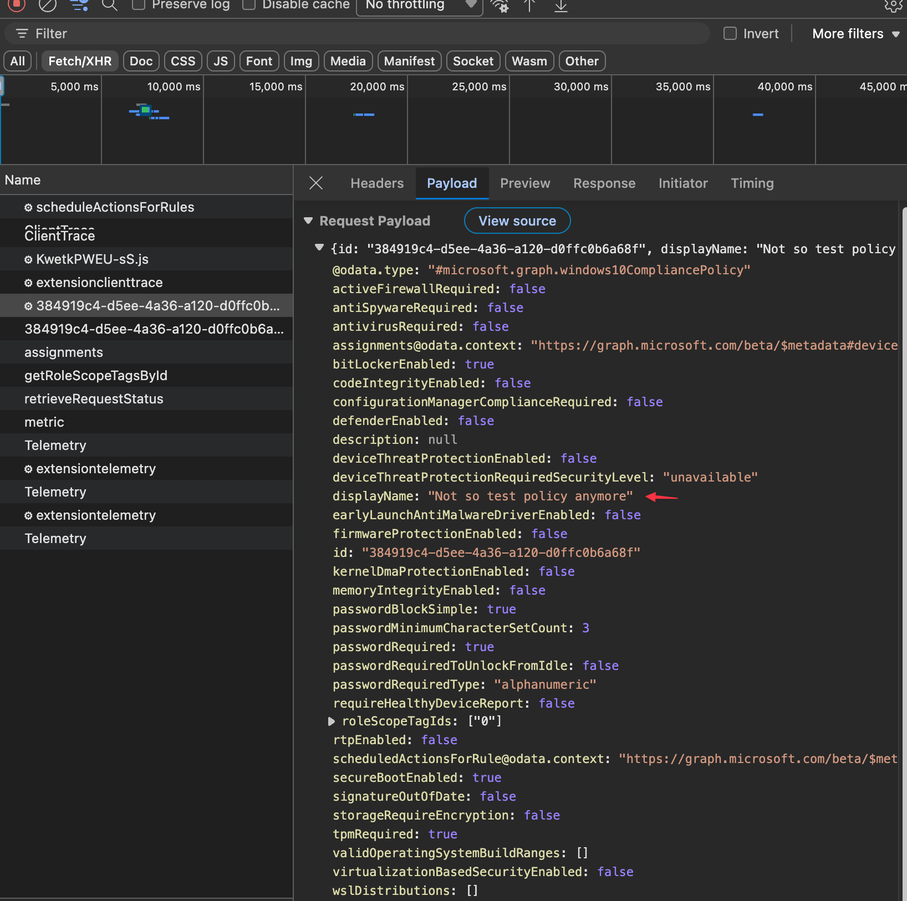

### HTTP DELETE requests
The last request type is `DELETE`. As the title say, you delete resources with this. It is a quite simple method. Just send a delete request to the correct endpoint and thats it. No body to send or response to look at. 

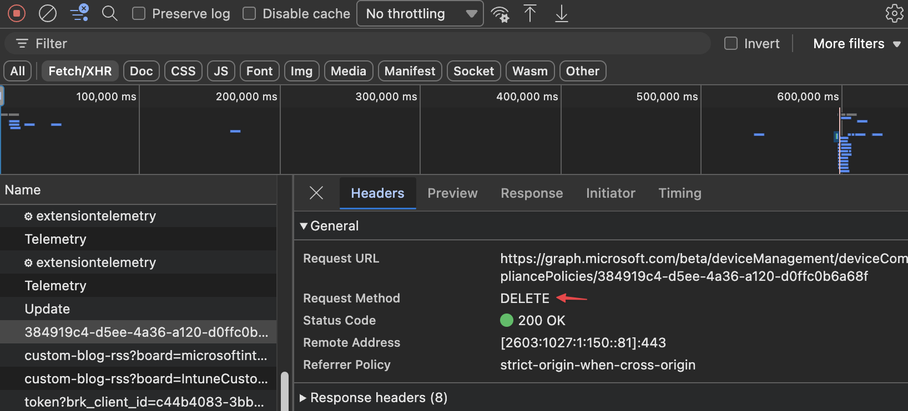

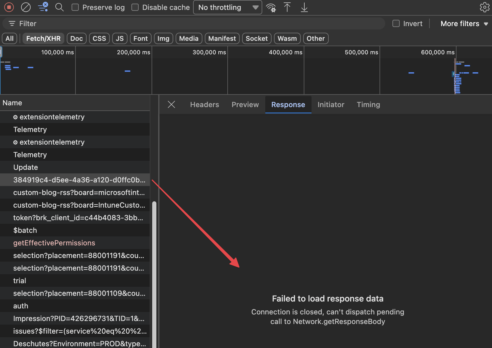

## API Responses
As mentioned, communication is all about sending and receiving. In the previous part we looked at how the portal sends information to the backend. Now we take a look at what comes back.
In the previous part I already hinted that the API responds with a JSON formatted body.

Every request you send to Microsoft Graph gets a response back. That response is more than only data. It is a combination of:

- A status code
- Response headers
- Sometimes a JSON body

The status code is the first thing to understand. That code tells you if the action succeeded, failed, or needs extra attention.

The response body often contains the returned object, a list of objects, or an error message with extra details. In the portal you usually do not see all of that directly, because the portal translates it into buttons, messages, tables, and wizards. But under the hood it still starts with a normal HTTP response.

For example, when you do a `GET` request for compliance policies, the API often responds with a `200 OK` and a JSON body that contains the result.

```http
HTTP/1.1 200 OK
Content-Type: application/json

{
  "value": [
    {
      "id": "12345",
      "displayName": "Windows Compliance Policy"
    }
  ]
}
```

That means two things:

1. The request itself was handled correctly
2. The body contains the data you asked for

When you create a new resource using `POST`, the response often looks different. In that case Graph may return the created object, or sometimes no visible body at all depending on the endpoint and action.

## Basic HTTP response codes
You do not need to memorize the full list. For Intune and Graph automation, these are the basic ones you will see most often.

### 200 OK
This means the request was successful.
You will mostly see this on `GET` requests, but also on successful updates or other actions.

Think: the API understood the request, processed it, and returned a valid response.


### 201 Created
This means a new resource was created successfully.
You often see this after a `POST` request.


Think: the API accepted the payload and created the object.

### 204 No Content
This means the action succeeded, but there is no response body.
You often see this with `DELETE` requests, and sometimes with update actions.

Think: the API did the work, there is just nothing extra to return.

### 400 Bad Request
This means the request was invalid.
Most of the time the URL was correct, but the body was wrong, a required property is missing, or a value does not match what the API expects.

Think: your request reached the API, but the API rejected it.

### 401 Unauthorized
This means you are not properly authenticated.
Usually the access token is missing, expired, or not valid for the API you are calling.

Think: you are not signed in correctly for this request.

### 403 Forbidden
This means you are authenticated, but you do not have enough permissions.
This is very common when working with Microsoft Graph.

Think: the API knows who you are, but you are not allowed to do this action.

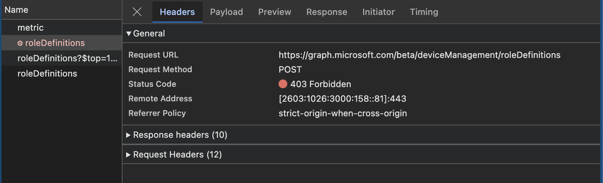
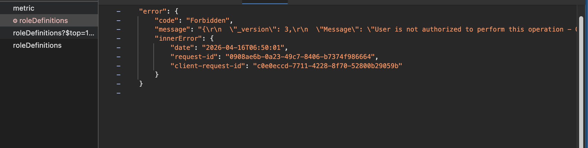

### 404 Not Found
This means the endpoint or the specific resource was not found.
For example, the URL may be wrong, or the object ID does not exist anymore.

Think: you asked for something that the API cannot find.

### 429 Too Many Requests
This means you sent too many requests in a short period of time.
Microsoft Graph protects itself with throttling.

Think: slow down, wait, and try again later.

### 500 Internal Server Error
This means something failed on the API side.
Your request may be fine, but the backend hit a problem while processing it.

Think: something broke in the service, not necessarily in your request.

## The real logic lives in the API
This is an important mental model.

The response code is not random and it is not decided by the portal. The real logic lives in the API backend.

That backend receives your request and then checks things like:

- Is the token valid?
- Does the caller have enough permissions?
- Does the resource exist?
- Is the JSON body valid?
- Are all required properties present?
- Can the requested action actually be completed?

Based on those checks, the API decides what happened and builds the response.

If everything is correct, it returns a success code like `200`, `201`, or `204`.
If something is wrong, it returns a failure code like `400`, `401`, `403`, `404`, or `500`.

So the response code is basically the API summarizing the outcome of its own internal logic.

The portal only reacts to that result. If the API says success, the portal shows the object or closes the wizard. If the API says failure, the portal shows an error message. The portal is not the source of truth here. The API is.

That also explains why automation becomes easier once you understand responses.
If you know how to read the status code and the response body, you can often troubleshoot problems much faster than by only looking at the portal.

## Reading errors in practice
When a request fails, do not only look at the red error in the portal. Open the network trace and inspect the response.

Look at:

- The status code
- The error message in the JSON body
- The endpoint you called
- The payload you sent

Very often the answer is already there.

A `400` usually means something in your request body is wrong.
A `401` or `403` usually points to authentication or permissions.
A `404` usually means the URL or object ID is wrong.
A `429` means you need retry logic.

That is why reading responses is just as important as reading requests.

## What’s next
We now know what the Graph API and how the Intune portal interacts with it. 
In the next post, we’ll take the next small step. Zooming in into Graph endpoints in more detail, learn how to find the correct endpoints and exploring how to read data using tools like Graph Explorer.

For now, enjoy this sip. Every good automation journey starts slow 🍺  
The rest of the series can be found here:





