Earlier I explained how to use the REST API to get more information about Azure file shares. This is because we like to monitor file share usage based on absolute values. In this blog post, I explain the follow-up for Azure file share usage monitoring with Logic Apps. First I explain how the Logic App works and how I did the maths. Second I explain how to deploy this Logic App automated. In the end, we have a deployment of Azure file share usage monitoring in an automated way.

Inspired by Peter Klapwijk his post about [Get notified on expiring Azure App Registration client secrets](https://www.inthecloud247.com/get-notified-on-expiring-azure-app-registration-client-secrets/), I decided to write also a Logic App. This Logic App is monitoring file shares usage based on absolute values.



## Working flow

To understand the Logic App, I like to explain the working flow and the goal I want to achieve. The main goal is to check every storage account on files shares and do a check on use per file share. The usage is calculated in percentage based on the file share size. In the end, if the usage percentage is higher than 90% I want a message in Microsoft Teams. The authentication credentials are stored in an Azure key vault.

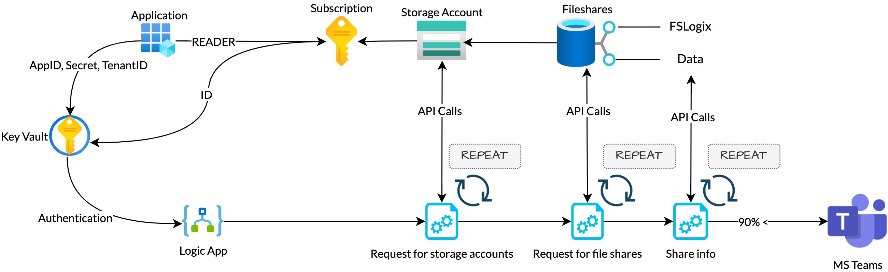
## Logic App components

In the previous post, I showed how to crawl for storage accounts, search the files shares, how to fetch the file share expanded information. If you look at the code you notice there are a few loops with HTTP GET requests to the Azure management REST API. After the information is there, I do some maths to calculate the usage in percentage. In the Logic App, I’m doing the same. To clarify, I split the Logic App into main components.

### Authentication

Before we are able to request the REST API for the first time, we need to set variables. Variables for authentication and a later also a kind of ‘working’ variable. To request an API, you need to authenticate first. In this Logic App, I use a service principal with a Reader role on the subscription. (If you have more subscriptions, make sure the service principal has permissions to all needed subscriptions.)  
About the authentication variables, I created an Azure key vault first. In the key vault I stored the application details (appId and appSecret). Also, I stored the subscriptionId and tenantId.   
To set these four Key Vault values into the Logic App, create a new step and search for **Azure Key Vault**. Under actions, click on **Get Secret** and select the correct secret.

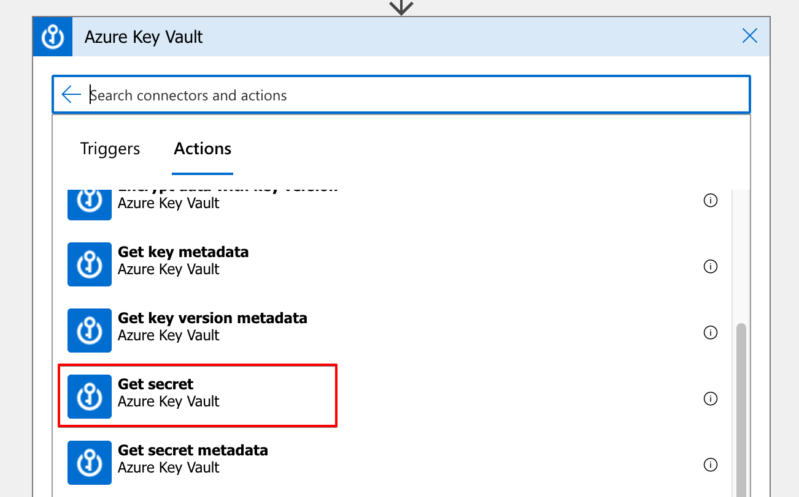
To keep the overview clear, I would suggest to rename the steps into a fitting name.

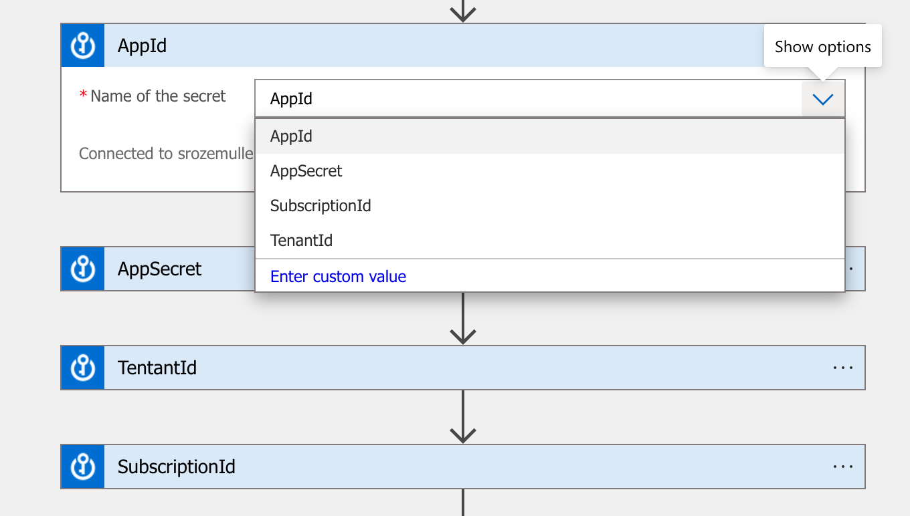
These variables are now recognized and selectable in the upcoming tasks.

### Other variables

If a storage account has a file share it returns the file share usage. During the flow, I store the file share usage into a variable with the Set variable action. The fact is, before we can set, we have to initialize the variable first. Initializing variables must be done at the top level.


To initialize variables, add a new task, search for **variables** and click **Initialize variable**. Because I want to calculate with decimals I use the float type.


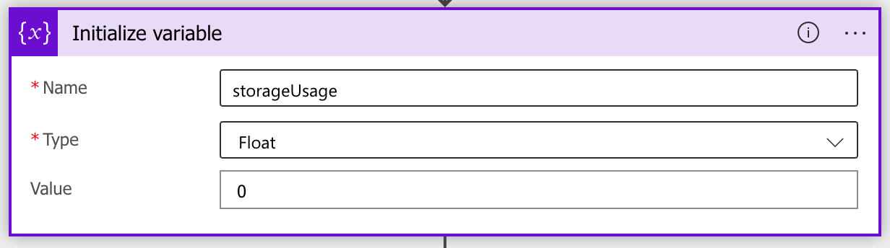

## Get storage account information

The first stop in Azure file share usage monitoring with Logic Apps is get all storage accounts. As mentioned, make sure the application has at least a **Reader** role assigned to the subscription. To send requests to an API, we need the **HTTP** task. In actions, use the HTTP task. In the HTTP task use the **GET** method. As URI I used the **[storage account LIST](https://docs.microsoft.com/en-us/rest/api/storagerp/storage-accounts/list)** URL. The subscriptionId in the URL is a variable from the Azure Key Vault initiated in the previous steps.   
  
The next part is to set authentication. To add the authentication parameters, click on the **Add new parameter** box and select **Authentication.**

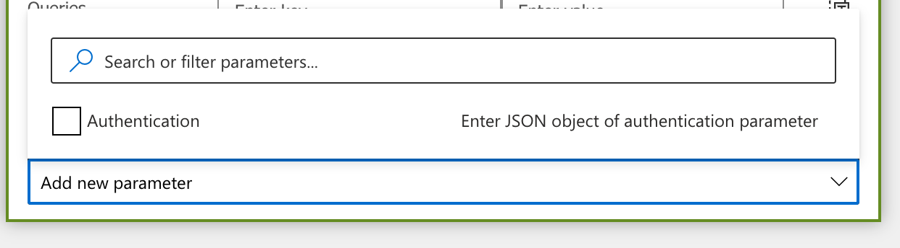I’ve configured the authentication part the following way.

- **Authentication type**: Active Directory OAuth
- **Tenant**: the tenantId value from the Key Vault
- **Audience**: this is the resource where to authenticate to which is in the case ***https://management.azure.com***
- **Client** **ID**: the AppId value from the Key Vault
- **Credential** **type**: Secret
- **Secret**: AppSecret value from the Key Vault

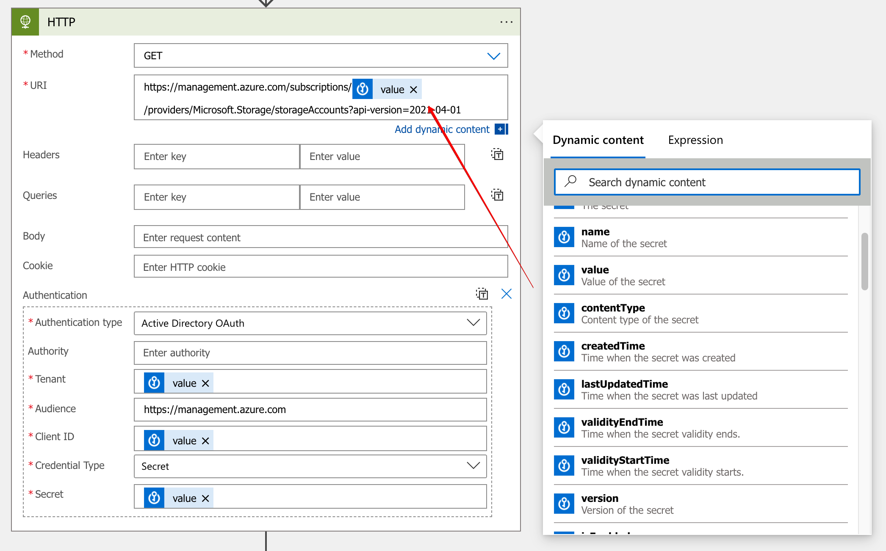

Now we are able to run the Logic App for the first time. After running go to the **Run History** to see the output. As you can see the output is in JSON format.

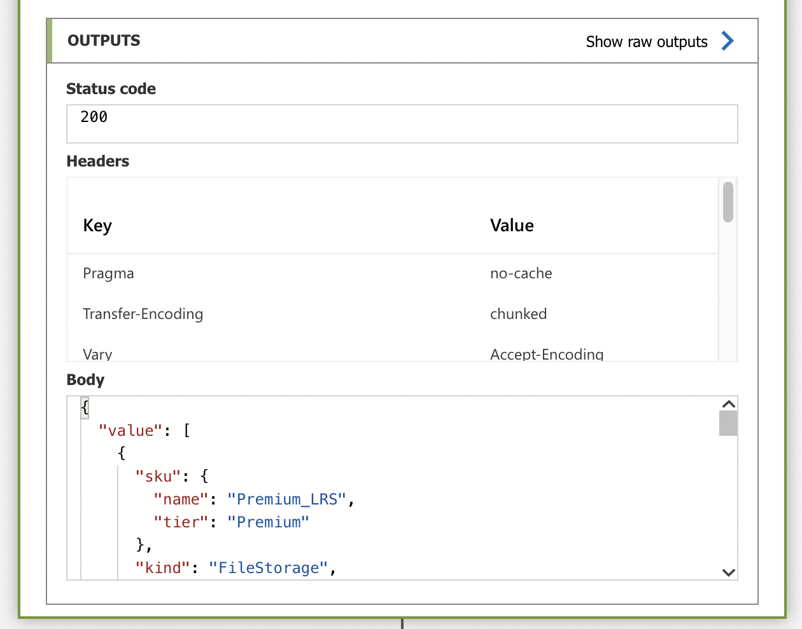
To work with this data, we need to parse the JSON output into new variables. Luckily, in Logic Apps, there is a task called Parse JSON. In the task, you have two fields. the content input and the part of how the schema looks like. The schema is to tell how the task must parse the JSON content.   
Where the content is the body output of the HTTP task you need to fill in the schema yourself. But, take a look at the **Use sample payload to generate schema** option. Click on the link, and put the JSON HTTP body output content in it.

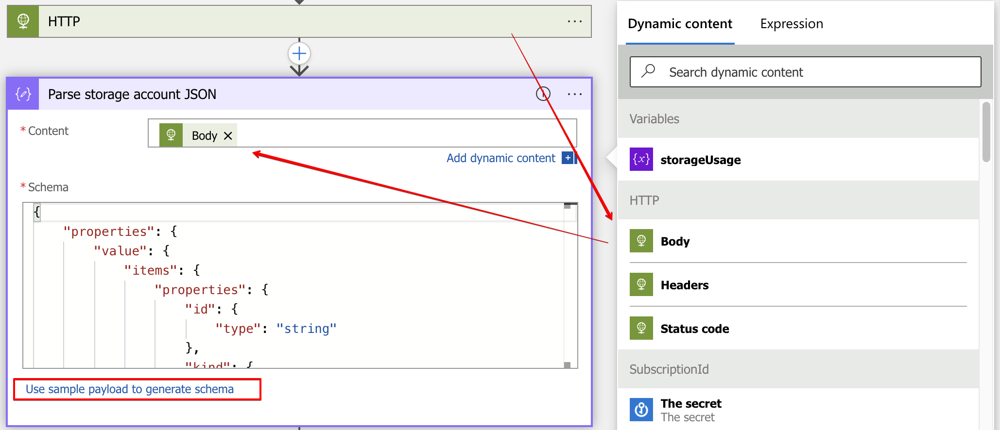

### Get the storage account shares

Now we have storage accounts insights, let’s search for file shares for every storage account. This is the first for each loop in the Logic App. First, I create a task called ForEach. Search for the Control task. I use the JSON output value as input in the next HTTP request. The ID represents the storage account resource ID. In the for each loops through the JSON content.

To clarify, the file share REST API URI looks like this:  
**https://management.azure.com/subscriptions/{subscriptionId}/resourceGroups/{resourceGroupName}/providers/Microsoft.Storage/storageAccounts/{accountName}/fileServices/default/shares?api-version=2021-04-01**

The storage account ID output look like this:  
“id”: “/subscriptions/&lt;subscriptionId&gt;/resourceGroups/&lt;resourceGroup&gt;/providers/Microsoft.Storage/storageAccounts/&lt;account&gt;”,

So, the HTTP request URI is filled dynamically based on the storage account ID. As in the first HTTP request, we also need to authenticate. Use the same values as above.

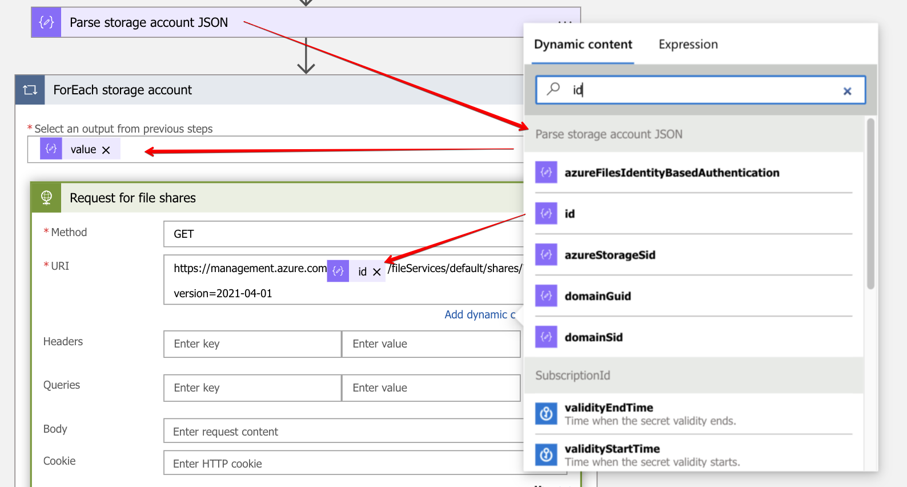

Once we have results, it is time to parse JSON again. Repeat the steps as described above. This time use the sample data from the file share output. Store the value output into the next foreach loop. This is the file share information loop. Actually in this loop the calculation happens.

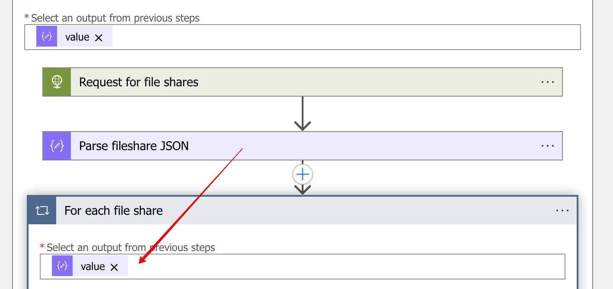

### Processing file share information

As said, this is the part where it all goes about. Finally, in this loop we got the file shares to work with. For now I skip the HTTP request and JSON parse part. The only thing I like to mention is the URL. Make a note about the $expand=stats at the end. Without this extra option, you will not get the usage statistics. This time, I use the file share ID as dynamic input.

URI: https://management.azure.com/subscriptions/&lt;subscriptionId&gt;/resourceGroups/&lt;resourceGroupName&gt;/providers/Microsoft.Storage/storageAccounts/&lt;accountName&gt;/fileServices/default/shares/&lt;shareName&gt;?api-version=2021-04-01

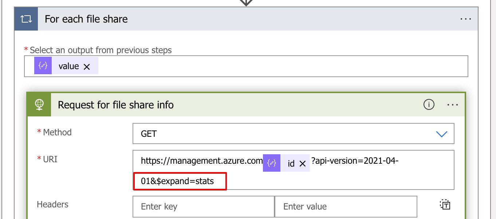

For more information about the file share, REST API check [the overview](https://docs.microsoft.com/en-us/rest/api/storagerp/file-shares/get).

After the JSON parse task, the **shareUsageBytes** become available. This is the value we are chasing after.

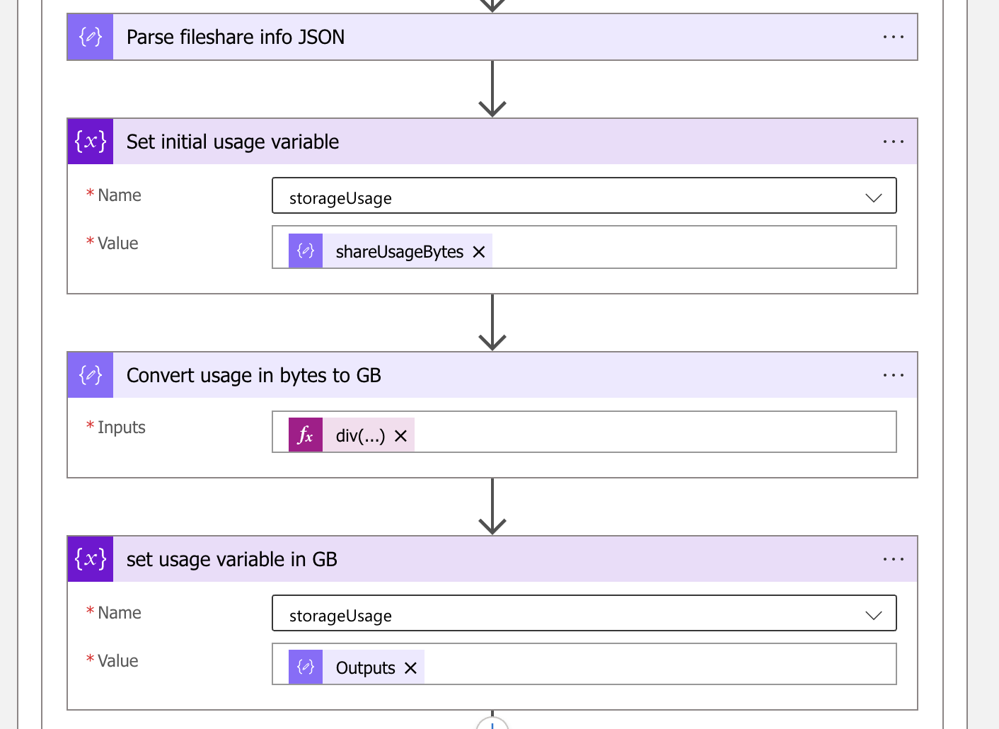

As the name says, it is in bytes. So, we need some maths to bring it back to GigaBytes. This is the time when the initial variable is used. First, we set the correct value into the variable.

### Logic App mathematics

To calculate file share usage we need some mathematics in the Logic App. To bring bytes back to GigaBytes, we need to divide the usage by 1024 three times. In Logic Apps, some math expressions are available to help. The divide expression in the task looks like below. Besides the div, we need the main value and the value to divide with.

***div(div(div(variables(‘storageUsage’),1024),1024),1024)***

Let me show an example to clarify. Suggesting we have usage of 100000000 bytes. In the first step, we set the value as a variable. Then we have the first divide,***div(variables(‘storageUsage’),1024)***. This is the first storageUsage value divided by 1024. For the second we use the first outcome, and so further.

<meta charset="utf-8"></meta>(294178816 ÷ 1024) = 287284  
(<meta charset="utf-8"></meta>287284 ÷ 1024) = 280  
(<meta charset="utf-8"></meta>280 ÷ 1024) = 0,27

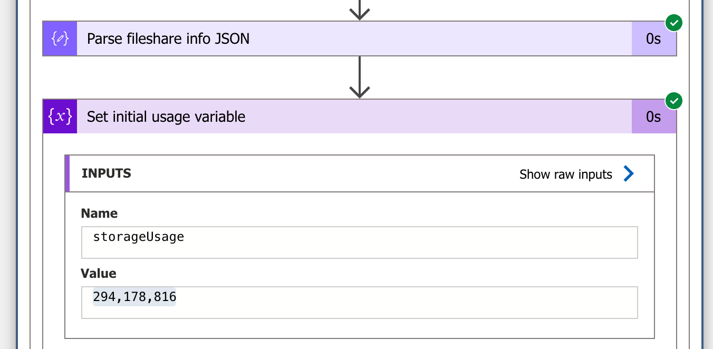

In the end, we have divided the storage usage 3 times by 1024. The new value is set into the storageUsage variable.

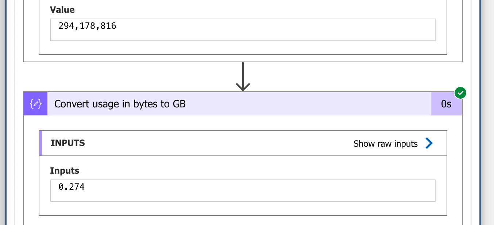
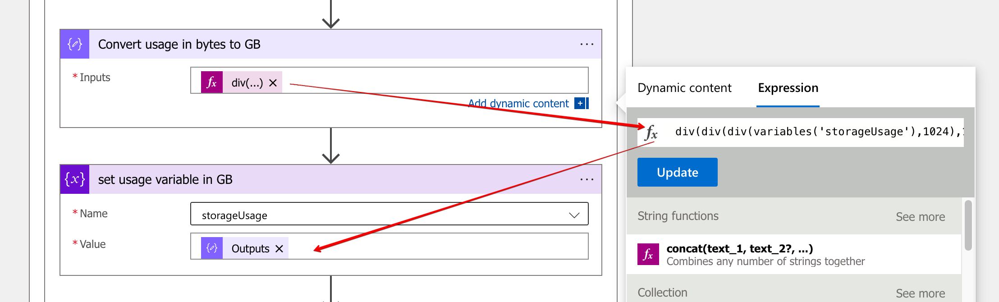

In the last step, I pick up the new value and do some maths again. This time to calculate the percentage in relation to the storage quota.

**mul(div(variables(‘storageUsage’),body(‘Parse\_fileshare\_info\_JSON’)?\[‘properties’\]?\[‘shareQuota’\]),100)**

Again, we divided the storageUsage variable. This time by the shareQuota (1024) from the file share info JSON output. At last, the final result is multiplied by 100.

<meta charset="utf-8"></meta>(0,27 ÷ 1024) \* 100 = 0,274 %

## Send alert from Logic App to MS Teams

The last step in Azure file share usage monitoring with Logic Apps is sending an alert. Finally, we have a percentage to play with. The idea is to send an alert message if the percentage is higher than 90 percent. I use Microsoft Teams to receive alerts by sending an adaptive card. To create adaptive cards go to <https://adaptivecards.io/designer/>.

In the Logic App, I created a **Condition** task (search for **Control**). If the output from the previous task is greater or equal to 90 then post an adaptive card in MS Teams.   
To add the adaptive card task, search for **Microsoft Teams** and select **Post adaptive card in a chat or channel.** Fill in the fields. In the adaptive card field, fill in the JSON generated from [the adaptive card designer page](https://adaptivecards.io/designer/).

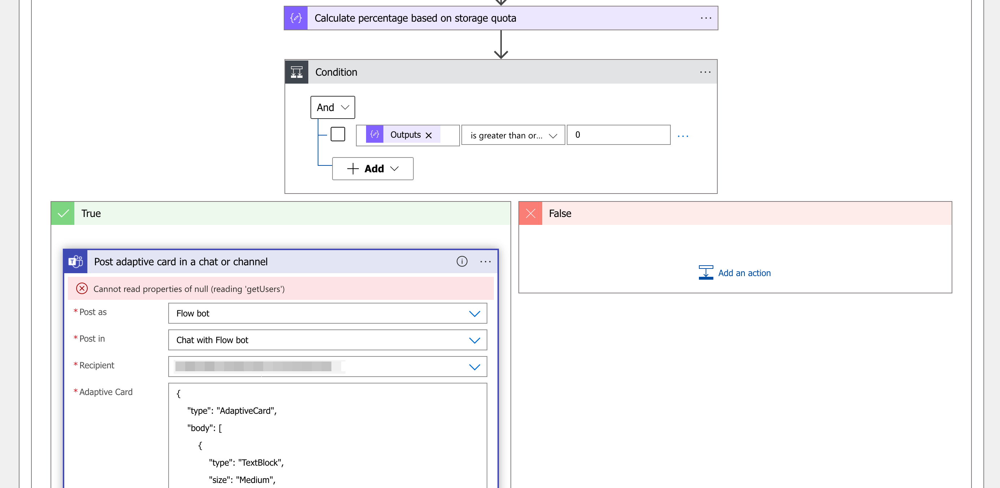

It is possible to use Logic App variables in the JSON content.

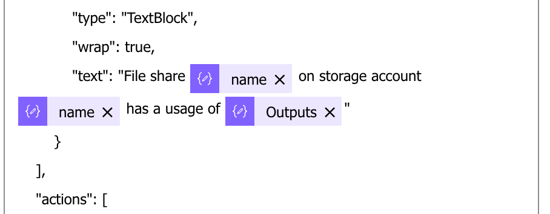

At last, we have a message in Microsoft Teams.

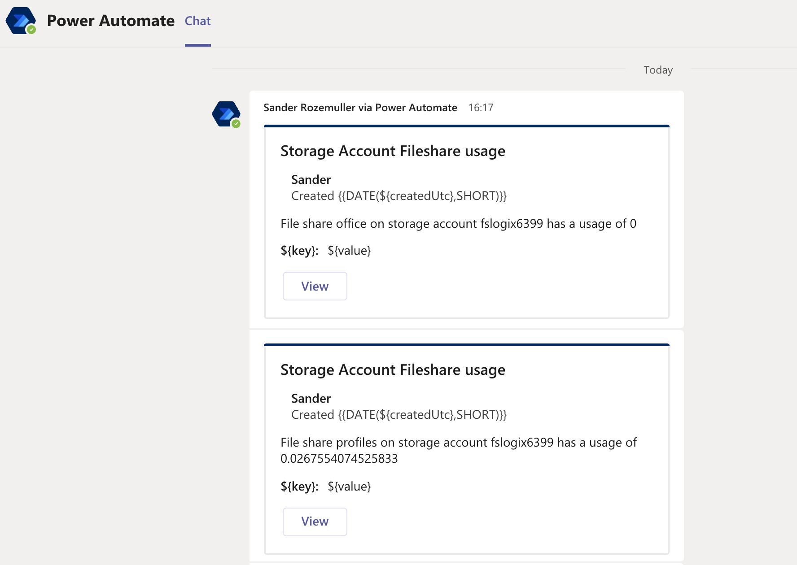
## Create a Logic App automated

The last and final point is creating a Logic App automated. To create a Logic App automated, I use the REST API.

As every API request, we need authentication headers, a request method, URL and a body. The most simple part in these is the URL and the request.

To deploy the Logic App, I used the settings below.  
  
**URL:**  https://management.azure.com/subscriptions/&lt;subscriptionID&gt;/resourceGroups/&lt;resourceGroup&gt;/providers/Microsoft.Logic/workflows/&lt;new-app-name&gt;?api-version=2016-06-01  
**Method:** PUT  
**Body:** [JSON file](https://github.com/srozemuller/Monitoring/blob/main/LogicApps/fileshare-monitoring.json) content

For the body we need a JSON formatted body. To simplify, I created a JSON body already from my Logic App. Before creating the Logic App, make sure you changed the value below.

- &lt;subscriptionId&gt;
- &lt;resourceGroup&gt;
- &lt;receipient&gt;

The code I used to deploy a Logic App automated

```powershell
Connect-AzAccount

$azureUrl = "https://management.azure.com"
$script:token = GetAuthToken -resource $azureUrl
$logicAppName = "NewLogicApp"
$context = [Microsoft.Azure.Commands.Common.Authentication.Abstractions.AzureRmProfileProvider]::Instance.Profile.DefaultContext
$Token = [Microsoft.Azure.Commands.Common.Authentication.AzureSession]::Instance.AuthenticationFactory.Authenticate($context.Account, $context.Environment, $context.Tenant.Id.ToString(), $null, [Microsoft.Azure.Commands.Common.Authentication.ShowDialog]::Never, $null, $resource).AccessToken
$authHeader = @{
    'Content-Type' = 'application/json'
    Authorization  = 'Bearer ' + $Token
}

$uri = "{0}/subscriptions/6d3c408e-b617-44ed-bc24-280249636525/resourceGroups/rg-roz-avd-01/providers/Microsoft.Logic/workflows/{1}?api-version=2016-06-01" -f $AzureUrl, $logicAppName
Invoke-RestMethod -Uri $uri -Headers $authHeader -Method PUT -Body (Get-Content ./fileshare-monitoring.json)
```

### Configuring the Logic App

After creating the Logic App based on the JSON input there are some settings you need to (re)configure.

You need the authenticate to MS Teams in the MS Teams step.   
Make sure you’ve setup an Azure Key Vault as well. In the Azure Key Vault you need the secrets as configured in the initial steps.

The JSON file is stored at my [GitHub](https://github.com/srozemuller/Monitoring/blob/main/LogicApps/fileshare-monitoring.json).

For more information about creating Logic Apps with REST API, check: <https://docs.microsoft.com/en-us/rest/api/logic/workflows/create-or-update>

Thank you for reading this blog about how to do Azure file share usage monitoring with Logic Apps. 

