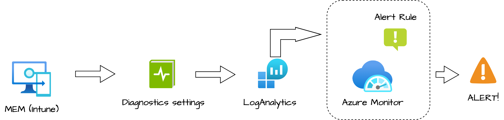
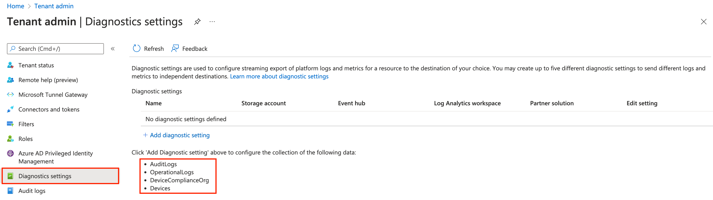
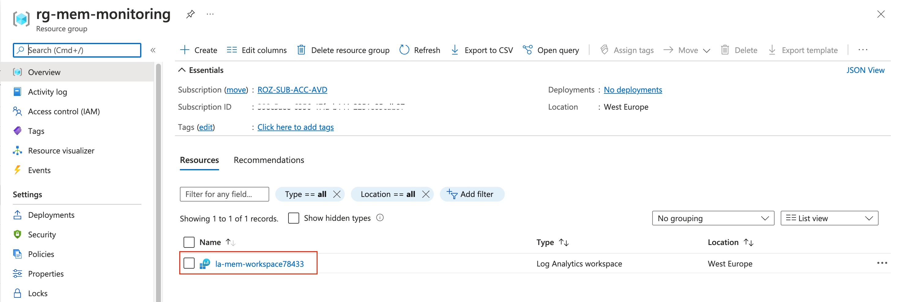
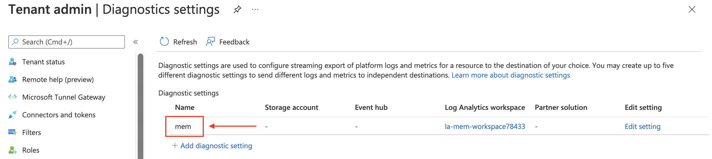
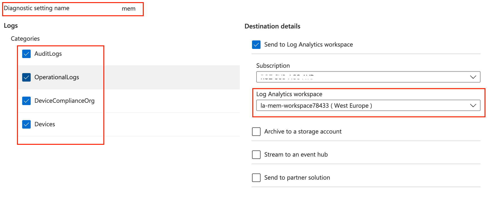
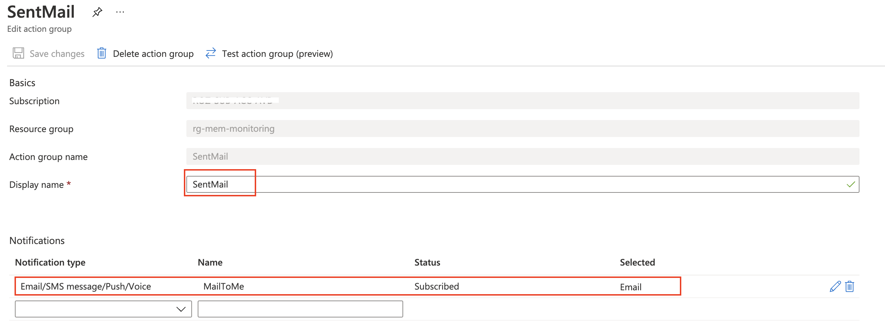
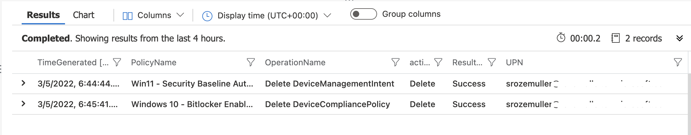
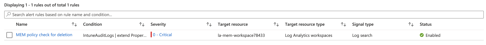
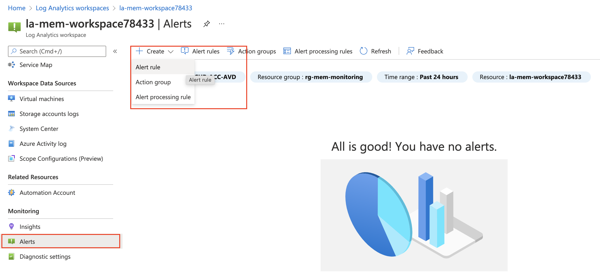

Out of the box, Microsoft Endpoint Manager has a reporting platform where lots of information is stored. Think about device management or endpoint analytics. For troubleshooting, reports can help. However, if you need to troubleshoot you are too late in the first place. It would be nice to get alerts out of Microsoft Endpoint Manager. Luckily, there are options to achieve that goal. In this post, I show a way to monitor and get alerts from Microsoft Endpoint Manager.

To get alerts we have several methods. Microsoft Endpoint Manager has the ability to connect with an Azure Log Analytics workspace (LAWS). Based on LAWS I use the Azure Monitor. To monitor and get alerting from Microsoft Endpoint Manager I used the strategy below.





## Authentication

I created an application registration with a **Contributor** role at the subscription level. This is because I want to create Azure resources. A resource group, a Log Analytics workspace, alert rules, and an action group If you have a resource group already, a contributor role at the resource group level is also fine.

It is also possible to log in with an account with contributor permissions. The reason why I use an application registration is because of the following:

*One of my automation ‘rules’ is trying to authenticate as little as possible. In this case, we are dealing with two environments. Microsoft 365 (Graph API) and Azure I’m able to use one login for both worlds. That is the point where I’m using application registrations a lot. Application registrations can have an Azure role as API permissions.*

## Microsoft Endpoint Manager diagnostics settings

In the basics, Microsoft Endpoint Manager has the ability to send diagnostic information to an Azure log analytics workspace (LAWS). You can find the **Diagnostics settings** under **Tenant admin**.   
The information contains data about the following subjects:

- Audit Logs
- Operational Logs
- Device Compliance Org
- Devices

  

In this chapter, I’m going to find out what information is exactly sent and how we can use the data for alerting. First, let’s create a log analytics workspace automated.

### Create a Log Analytics Workspace automated

Before creating a workspace, we need a resource group first. Creating a resource group is quite simple. Providing a location and a name is enough.

```powershell
$subscriptionId = [Microsoft.Azure.Commands.Common.Authentication.Abstractions.AzureRmProfileProvider]::Instance.Profile.DefaultContext.Subscription.id
$resourceGroupName = 'rg-mem-monitoring'
$location = "West Europe"
$url = "https://management.azure.com/subscriptions/{0}/resourcegroups/{1}?api-version=2021-04-01" -f $subscriptionId, $resourceGroupName
$body = @{
        location = $location
}
$parameters = @{
    uri = $url
    method = 'PUT'
    header = $authHeader
    body = $body | ConvertTo-Json
}
$resourceGroup = Invoke-RestMethod @Parameters
```

After the resource group is created use the code below to create a log analytics workspace. A workspace must have a unique name in a resource group. By using the Get-Random PowerShell command the workspace name will be completed with a random number.

```powershell
$workspace = "la-mem-workspace" + (Get-Random -Maximum 99999)
$LawsBody = @{
    location   = $location
    properties = @{
        retentionInDays = "30"
        sku             = @{
            name = "PerGB2018"
        }
    }
}
$lawsUrl = "https://management.azure.com/{0}/providers/Microsoft.OperationalInsights/workspaces/{1}?api-version=2020-08-01" -f $resourceGroup.id, $workspace
$loganalyticsParameters = @{
    URI     = $lawsUrl 
    Method  = "PUT"
    Body    = $LawsBody | ConvertTo-Json
    Headers = $authHeader
}
$laws = Invoke-RestMethod @loganalyticsParameters
$laws
```



### Configure diagnostics settings for Microsoft Endpoint Manager automated

Next is configuring diagnostics settings Microsoft Endpoint Manager automated. In this step, I also use the Azure management API. Yes, it is a setting on the Microsoft 365 side but this is the place where M365 and Azure come together. But there are some settings that need attention.

First, let’s take a look at the diagnostics REST API with a main focus on the create URL.

*https://management.azure.com/{resourceUri}/providers/Microsoft.Insights/diagnosticSetting*

In this URL two environmental values are needed. A resource URI (ResourceID) and a name. The name is the diagnostics name (red box).

  

Secondly, is the resource URI. This is the Azure resource ID. This is the point where we need to look closer. Because Microsoft Endpoint Manager (Intune) is not an Azure resource. After some digging, I noticed there is a way to configure diagnostic settings for Intune. This is by calling the microsoft.intune resource provide directly. It looks like the whole Intune site is a complete resource in the Azure cloud.   
  
What happens is that we are configuring diagnostic settings over a whole resource provider. In contrast to the mentioned URL above with a resource ID, the diagnostics settings REST API URL for Intune looks like the URL below.

*https://management.azure.com/providers/microsoft.intune/diagnosticSettings/{name}*

With that in mind, I configured a body with logs and added the workspace ID to connect with.

```powershell
$diagnosticsName = "mem"
$url = "https://management.azure.com/providers/microsoft.intune/diagnosticSettings/{0}?api-version=2017-04-01-preview" -f $diagnosticsName
$body = @{
    properties = @{
        workspaceid = $laws.id
        logs        = @(
            @{ 
                category = "AuditLogs"
                enabled  = $true
            },
            @{ 
                category = "OperationalLogs"
                enabled  = $true
            },
            @{ 
                category = "DeviceComplianceOrg"
                enabled  = $true
            },
            @{ 
                category = "Devices"
                enabled  = $true
            }
        )
    }
}
$diagParam = @{
    URI     = $url 
    Method  = "PUT"
    Headers = $authHeader
    Body    = $($body | ConvertTo-Json -Depth 5)
}
$diagnostics = Invoke-RestMethod @diagParam
$diagnostics
```

In the end, the diagnostics settings are configured.



For more information about the diagnostics settings, check the Microsoft documentation: <https://docs.microsoft.com/en-us/rest/api/monitor/diagnostic-settings>

## Using Azure Monitor for monitoring Microsoft Endpoint Manager

To monitor and get alerts from Microsoft Endpoint Manager we configure Azure Monitor. In the chapters above we configured a Log Analytics workspace and diagnostics settings in MEM. In this chapter, I give monitor some examples and send an alert with Azure Monitor. Before we are able to send alerts we need two things. An alert rule and an action group. The last one is the first thing we create. I create an action group that sent an e-mail to me, the most basic action group.

As a result of configuring diagnostics settings in MEM, we see new tables in the workspace.


To get data out of a workspace, we need to write a query in the Kusto language (KQL). In the examples below I have some basic queries to clarify the idea.

### Create a monitor action group automated

If we have an alert we need to send it somewhere. That somewhere is an action group. An action group can send an e-mail or an SMS. Also, an action group can send a voice message of an Azure app alert. Besides device notifications, an action group also can trigger Azure resources. Resources like a function app or logic app.   
For now, I have chosen to send an e-mail. The code below creates a SendMail action group that sends an e-mail. The $actionGroup variable is used in the next step.

```powershell
$actionName = "SentMail"
$actionUrl = "https://management.azure.com/{0}/providers/Microsoft.Insights/actionGroups/{1}?api-version=2021-09-01" -f $resourceGroup.id, $actionName
$actionBody = @{
    location   = "Global"
    properties = @{
        enabled        = $true
        groupShortName = "SentMail"
        emailReceivers = @(
            @{
                name                 = "MailToMe"
                emailAddress         = "sander@email.com"
                status               = "Enabled"
                useCommonAlertSchema = $true
            }
        )
    }
}
$actionGroupParams = @{
    URI     = $actionUrl 
    Method  = "PUT"
    Headers = $authHeader
    Body    = $actionBody | ConvertTo-Json -Depth 4
}
$actionGroup = Invoke-RestMethod @actionGroupParams
$actionGroup
```



### Monitor MEM policy deletion with Log Analytics

First I wrote an audit query to determine when a policy was deleted and by who. Idea is to get notified about the fact someone has deleted a policy. This can be a security baseline profile, a configuration policy or a compliance policy.


```sql
IntuneAuditLogs
| extend PropertiesObject = parse_json(Properties)
| extend actorObject = parse_json(PropertiesObject.Actor)
| extend targetsObject = parse_json(PropertiesObject.TargetDisplayNames)
| extend activityString = case(
            PropertiesObject.ActivityType == 0, "Create", 
            PropertiesObject.ActivityType == 1, "Delete",
            PropertiesObject.ActivityType == 2, "Patch",
            PropertiesObject.ActivityType == 3, "Action",
            PropertiesObject.ActivityType == 4, "SetReference", 
            PropertiesObject.ActivityType == 5, "RemoveReference", 
            PropertiesObject.ActivityType == 6, "Get", 
            PropertiesObject.ActivityType == 7, "Search",
            "Other"
        )
| project PolicyName=targetsObject[0],TimeGenerated, TenantId, SourceSystem, OperationName, activityString, ResultType, Properties, UPN=actorObject.UPN
| where activityString == "Delete"
```



The results show there are two policies deleted. A compliance policy and a management intent (which is a security baseline profile). At the moment this happens an alert must be sent.

The query works and the results are correct. Now it is time to create an Azure Monitor rule automated. Also in this situation, I use the REST API.

To keep my code clean, I firstly store the query into a variable.

```powershell
$query = @"
IntuneAuditLogs
| extend PropertiesObject = parse_json(Properties)
| extend actorObject = parse_json(PropertiesObject.Actor)
| extend targetsObject = parse_json(PropertiesObject.TargetDisplayNames)
| extend activityString = case(
            PropertiesObject.ActivityType == 0, "Create", 
            PropertiesObject.ActivityType == 1, "Delete",
            PropertiesObject.ActivityType == 2, "Patch",
            PropertiesObject.ActivityType == 3, "Action",
            PropertiesObject.ActivityType == 4, "SetReference", 
            PropertiesObject.ActivityType == 5, "RemoveReference", 
            PropertiesObject.ActivityType == 6, "Get", 
            PropertiesObject.ActivityType == 7, "Search",
            "Other"
        )
| project PolicyName=targetsObject[0],TimeGenerated, TenantId, SourceSystem, OperationName, activityString, ResultType, Properties, UPN=actorObject.UPN
| where activityString == "Delete"
"@
```

Secondly, I create a body to send in the request. In the body, I use two variables. The $query variable (from above) and the $laws.Id variable from the workspace creation part.

```powershell
$ruleBody = @{
    location   = "westeurope"
    properties = @{
        displayName         = "MEM policy check for deletion"
        description         = "Query which checks policy deletion every 5 minutes"
        severity            = 0
        enabled             = $true
        evaluationFrequency = "PT5M"
        scopes              = @(
            $diagnostics.properties.workspaceId
        )
        windowSize          = "PT5M"
        criteria            = @{
            allOf = @(
                @{
                    query           = $query
                    timeAggregation = "Count"
                    operator        = "GreaterThan"
                    threshold       = 0.0
                    failingPeriods  = @{
                        numberOfEvaluationPeriods = 1
                        minFailingPeriodsToAlert  = 1
                    }
                }
            )
        }
        actions = @{
            actionGroups = @(
                $actionGroup.id
            )
        }
    }
}
```

At last, we bring all parts together in the request parameters and sent the request.

```powershell
$ruleName = "MEM check for deletion"
$url = "https://management.azure.com/{0}/providers/Microsoft.Insights/scheduledQueryRules/{1}?api-version=2021-08-01" -f $resourceGroup.id, $ruleName
$ruleParam = @{
    URI     = $url 
    Method  = "PUT"
    Headers = $authHeader
    Body = $ruleBody | ConvertTo-Json -Depth 8
}
$rules = Invoke-RestMethod @ruleParam
$rules
```

[](azure-monitor-alert.png)

https://docs.microsoft.com/en-us/rest/api/monitor/scheduledqueryrule-2021-08-01/scheduled-query-rules/create-or-update

### Create an alert rule manually

To create an alert rule via the Azure portal go to the Log Analytics workspace and click on alerts in the menu on the left.

For more information about creating rules manually check the documentation: <https://docs.microsoft.com/en-us/azure/azure-monitor/alerts/alerts-activity-log>



https://docs.microsoft.com/en-us/mem/intune/fundamentals/review-logs-using-azure-monitor

## Summary

Thank you for reading this blog about how to monitor and get alerts for Microsoft Endpoint Manager with Log Analytics automated. I hope you got a bit inspired.

Enjoy your day and happy automating 👋