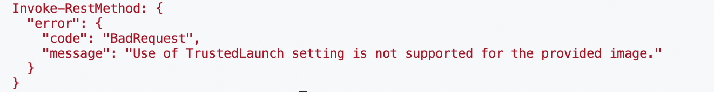
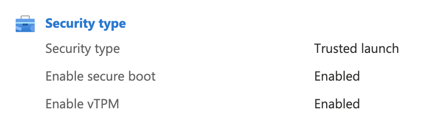
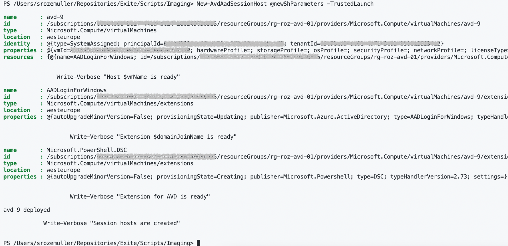

In this blog post I show how to deploy an AVD session host with the Trusted Launch, secure boot and vTPM. This option is now Generally Available. I show how to deploy the AVD session host with the REST API and with the Az.Avd PowerShell module from a Compute Gallery image.



Azure offers trusted launch as a seamless way to improve the security of generation 2 VMs. Trusted launch protects against advanced and persistent attack techniques. A trusted launch comprises several coordinated infrastructure technologies that can be enabled independently. Each technology provides another layer of defense against sophisticated threats.

<code> <i>Attention: Trusted launch requires the creation of new virtual machines. You can’t enable trusted launch on existing virtual machines that were initially created without it. This also means for images in the Azure Compute Gallery.
</i></code>


## Before you start
Make sure you have the following in place before you start.

A Compute Gallery Image definition with a Trusted Launch image. You receive an error like the one below if you haven’t. Updating an image afterward is not possible.



I also planning a blog about how to create an Azure Compute Gallery with the Trusted Launch feature enabled. Because creating a new image with Trusted Launch is not possible through the portal. Expecting the blog in a few weeks.

### Create an AVD session host from Compute Gallery with Trusted Launch
In this chapter, I show two ways how to create a session host from the Azure Compute Gallery and Trusted Launch. First I show how to create a session host with the REST API. In the second part, I show how to deploy a session host (AAD) with the Az.Avd PowerShell module.

#### Starting variables
I created predefined variables because it makes the deployments easier.


```powershell
$azureApiUrl = "https://management.azure.com"
$subscriptionId = "<subscriptionID>"
$location = "westeurope"
$hostpoolName = "Rozemuller-AAD"
$resourceGroupName = "rg-roz-avd-01"
$vmSize = "Standard_D2s_v4"
$imageVersionId = "<enter the image version resourceID>"
$prefix = "avd"
$subnetId = "<enter the subnet resourceID>"
$localAdmin = "<username>"
$localPass = "<password>"
$accesToken = Get-AzAccessToken -ResourceUrl $azureApiUrl
$token = @{
    'Content-Type' = 'application/json'
    Authorization = "{0} {1}" -f $accesToken.Type, $accesToken.Token
}
```


### Deploy AVD session host with the REST API
Deploying a session host with the REST API consists of two main parts. First, we create the VM itself. This is the part where Trusted Launch is enabled. We add the VM as a session host in the second part.

Creating the VM has two sub-parts, deploying the network and the rest. This is because the REST API does not support creating a network and the rest in one request.

Create the rest of the VM with the code below with first the network part.

```powershell
$vmName = "{0}-0" -f $Prefix
$nicName = "{0}-nic" -f $vmName
$nicBody = @{
    "properties" = @{
        "enableAcceleratedNetworking" = $true
        "ipConfigurations"            = @(
            @{
                "name"       = "ipconfig1"
                "properties" = @{
                    "subnet" = @{
                        id = $SubnetId
                    }
                }
            }
        )
    }
    "location"   = $Location
}
$nicJson = $nicBody | ConvertTo-Json -Depth 15
$nicUrl = "{0}/subscriptions/{1}/resourceGroups/{2}/providers/Microsoft.Network/networkInterfaces/{3}?api-version=2021-03-01" -f $azureApiUrl, $subscriptionId, $ResourceGroupName, $nicName
$NIC = Invoke-RestMethod -Method PUT -Uri $nicUrl -Headers $token -Body $nicJson
```

```powershell
$vmBody = @{
    location     = $location
    identity     = @{
        type = "SystemAssigned"
    }
    properties = @{
        licenseType       = "Windows_Client"
        hardwareProfile = @{
            vmSize = $VmSize
        }
        securityProfile = @{
            securityType = "TrustedLaunch"
            uefiSettings = @{
                secureBootEnabled = $true
                vTpmEnabled = $true
              }
        }
        storageProfile  = @{
            imageReference = @{
                id = $ImageVersionId
            }

            osDisk         = @{
                caching      = "ReadWrite"
                name         = "{0}-os" -f $vmName
                createOption = "FromImage"
            }
        }
        osProfile       = @{
            adminUsername = $localAdmin
            computerName  = $vmName
            adminPassword = $localPass
        }
        networkProfile  = @{
            networkInterfaces = @(
                @{
                    id         = $NIC.Id
                    properties = @{
                        primary = $true
                    }
                }
            )
        }
    }
} | ConvertTo-Json -Depth 99
$vmUrl = "{0}/subscriptions/{1}/resourceGroups/{2}/providers/Microsoft.Compute/virtualMachines/{3}?api-version={4}" -f $azureApiUrl, $subscriptionId, $resourceGroupName, $vmName, '2021-11-01'
Invoke-RestMethod -Method PUT -Uri $vmUrl -Headers $token -Body $vmBody
```



About deploying the Azure AD and AVD extensions I would like to refer to this blog article I wrote a while ago about join Azure AD in an automated way.

### Deploy AVD session host with Az.Avd PowerShell module
Using the Az.Avd Powershell module gives you a lot advantages. You don’t have to think about all the separate steps and write a lot of code.

Adding a new session host is done with one single line of code. I turned the need starting variables into a parameter object because it keep my line of code clean.

```powershell
$newShParameters = @{
    location          = "westeurope"
    hostpoolName      = "Rozemuller-AAD"
    resourceGroupName = "rg-roz-avd-01"
    vmSize            = "Standard_D2s_v4"
    imageVersionId    = "<imageversionID>"
    prefix            = "avd"
    subnetId          = "<subnetID>"
    localAdmin        = "<username>"
    localPass         = "<password>"
    initialNumber     = 9
    sessionHostCount  = 1
    disktype          = "Premium_LRS"
}

New-AvdAadSessionHost @newShParameters -TrustedLaunch
```



Az.Avd is available in the official PowerShell Gallery. Install the Az.Avd module with the code below.

```powershell
Install-Module Az.Avd
Import-Module Az.Avd
```

If you have installed the Az.Avd module already, thank you for that 🙏. In that case, just update the module with the command below.

```powershell
Update-Module Az.Avd
```

### Summary
Thank you for reading my blog post about how to deploy an AVD session host with Trusted Launch from a custom image from the Azure Compute Gallery. I show two ways, the REST API and the Az.Avd PowerShell module. The Compute Gallery image must be “trusted-launch-enabled”.

I hope you got a bit inspired.

Enjoy your day and happy automating 👋